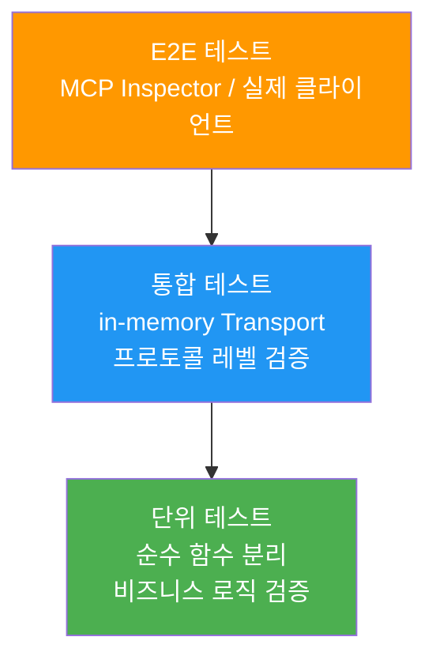
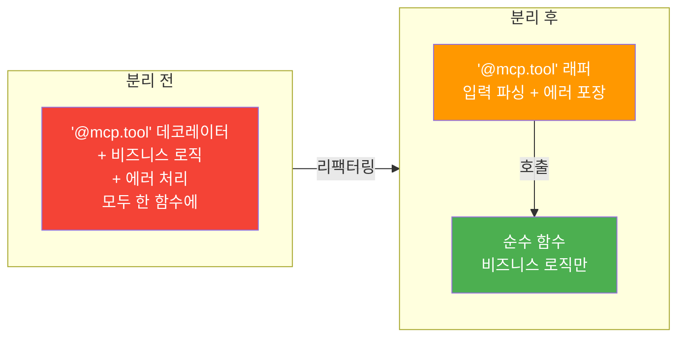
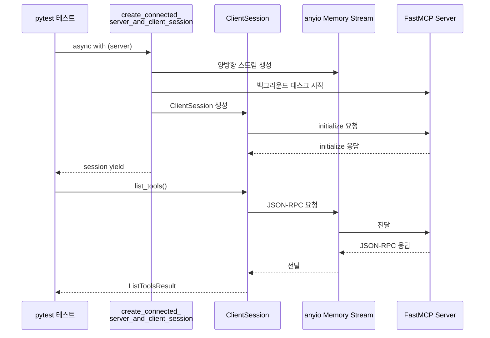
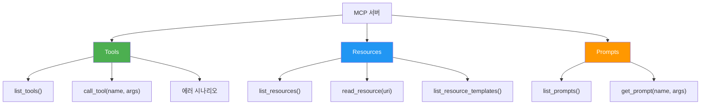
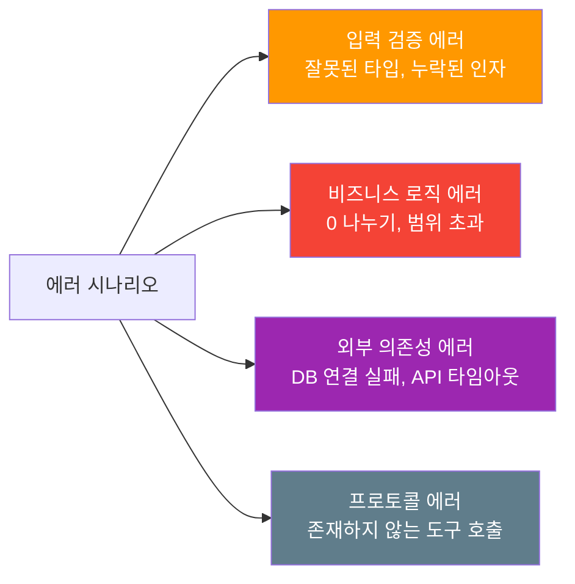

# 단위 테스트와 통합 테스트

> pytest와 in-memory Transport로 MCP 서버를 빈틈없이 검증하는 전략

## 개요

이 섹션에서는 MCP 서버 코드를 **두 가지 레벨**에서 테스트하는 방법을 배웁니다. 먼저 도구 함수의 비즈니스 로직을 순수 함수로 분리하여 단위 테스트하고, 이어서 MCP Python SDK가 제공하는 **in-memory Transport**를 활용해 프로토콜 레벨의 통합 테스트를 작성합니다.

**선수 지식**:
- [MCP 에러 처리 체계](12-ch12-에러-처리-로깅-테스트/01-01-mcp-에러-처리-체계.md)에서 배운 에러 코드와 `McpError`
- [구조화된 로깅과 모니터링](12-ch12-에러-처리-로깅-테스트/02-02-구조화된-로깅과-모니터링.md)에서 다룬 stderr 로깅 원칙
- pytest 기본 사용법과 `async/await` 문법

> ⚠️ **용어 참고**: MCP Python SDK에서 에러 클래스 이름은 `McpError`입니다(대소문자 주의). `MCPError`나 `MCP_Error`가 아닌 **`McpError`**가 정확한 클래스명이니 import 시 확인하세요. `from mcp.types import McpError`로 가져올 수 있습니다.

**학습 목표**:
- 도구 함수의 비즈니스 로직을 순수 함수로 분리하고 단위 테스트할 수 있다
- `create_connected_server_and_client_session`으로 프로토콜 레벨 통합 테스트를 작성할 수 있다
- 에러 시나리오와 경계 조건을 체계적으로 검증할 수 있다
- CI 파이프라인에 MCP 테스트를 통합할 수 있다

## 왜 알아야 할까?

"코드가 잘 돌아가니까 괜찮겠지"라고 생각한 적 있으신가요? MCP 서버는 **LLM이 호출하는 코드**입니다. 사람이 아닌 AI가 사용자이기 때문에, 잘못된 응답이 돌아가면 LLM은 혼란에 빠져 엉뚱한 행동을 하게 됩니다. 디버깅은 악몽이 되죠.

더 심각한 문제가 있습니다. MCP 서버는 데이터베이스 쿼리, 파일 시스템 접근, 외부 API 호출 같은 **사이드 이펙트**를 수행합니다. 테스트 없이 배포하면 LLM이 의도치 않게 데이터를 삭제하거나, 잘못된 API를 호출하는 사고가 발생할 수 있습니다.

자동화된 테스트는 이런 위험을 코드 레벨에서 차단하는 가장 효과적인 방법입니다. 특히 MCP Python SDK가 제공하는 **in-memory Transport**는 실제 프로세스를 띄우지 않고도 프로토콜 전체를 검증할 수 있어서, 테스트가 빠르고 안정적입니다.

## 핵심 개념

### 개념 1: 테스트 피라미드와 MCP 테스트 전략

> 💡 **비유**: 건물 검사를 생각해 보세요. 벽돌 하나하나의 강도를 먼저 테스트하고(단위 테스트), 벽돌을 쌓아 벽이 제대로 서는지 확인하고(통합 테스트), 마지막으로 실제로 사람이 들어가 생활해 보는 것(E2E 테스트)처럼, 테스트에도 계층이 있습니다.

MCP 서버 테스트는 세 가지 레벨로 나뉩니다:

- **단위 테스트**: 도구 함수의 비즈니스 로직만 격리해서 테스트. MCP 프로토콜과 무관하게 순수 함수로 검증
- **통합 테스트**: in-memory Transport로 클라이언트↔서버 간 프로토콜 흐름을 검증. 실제 JSON-RPC 메시지가 오가지만 프로세스는 하나
- **E2E 테스트**: MCP Inspector나 실제 클라이언트로 전체 시스템 검증 (다음 섹션에서 다룸)

> 📊 **그림 1**: MCP 테스트 피라미드



단위 테스트는 가장 많이, 가장 빠르게 실행합니다. 통합 테스트는 프로토콜 정합성을 확인하는 핵심 계층이고, E2E 테스트는 소수의 크리티컬 경로만 검증합니다.

### 개념 2: 순수 함수 분리 — 테스트 가능한 설계

> 💡 **비유**: 요리사(MCP 도구)가 직접 장을 보고, 요리하고, 서빙까지 다 하면 요리 실력만 테스트하기 어렵습니다. "요리"만 별도로 분리하면 재료를 직접 넣어주고 결과만 확인할 수 있죠. 이것이 순수 함수 분리입니다.

MCP 도구 함수(`@mcp.tool()`)는 프로토콜, 컨텍스트, 직렬화 등 여러 책임이 얽혀 있습니다. 테스트하기 좋은 설계의 핵심은 **비즈니스 로직을 순수 함수로 분리**하는 것입니다.

> 📊 **그림 2**: 순수 함수 분리 패턴



**안티 패턴 — 모든 것이 한 함수에**:

```python
from mcp.server.fastmcp import FastMCP

mcp = FastMCP("Analytics")

@mcp.tool()
async def calculate_revenue(
    start_date: str,
    end_date: str,
    category: str | None = None,
) -> dict:
    """매출을 계산합니다."""
    # 날짜 파싱, 유효성 검증, DB 쿼리, 집계 로직이 전부 여기에...
    from datetime import datetime
    start = datetime.fromisoformat(start_date)
    end = datetime.fromisoformat(end_date)
    if start > end:
        raise ValueError("시작 날짜가 종료 날짜보다 큽니다")
    # DB 쿼리... 집계... 포맷팅...
    return {"total": 15000, "currency": "KRW"}
```

**권장 패턴 — 비즈니스 로직 분리**:

```python
# core/revenue.py — 순수 함수, MCP 의존성 없음
from datetime import date
from dataclasses import dataclass

@dataclass
class RevenueResult:
    total: int
    currency: str
    item_count: int

def calculate_revenue_core(
    start: date,
    end: date,
    records: list[dict],
    category: str | None = None,
) -> RevenueResult:
    """매출 집계 — 순수 함수, 테스트 용이"""
    if start > end:
        raise ValueError("시작 날짜가 종료 날짜보다 큽니다")
    
    filtered = records
    if category:
        filtered = [r for r in records if r["category"] == category]
    
    total = sum(r["amount"] for r in filtered)
    return RevenueResult(
        total=total,
        currency="KRW",
        item_count=len(filtered),
    )
```

```python
# server.py — MCP 래퍼, 얇은 레이어
from mcp.server.fastmcp import FastMCP
from core.revenue import calculate_revenue_core

mcp = FastMCP("Analytics")

@mcp.tool()
async def calculate_revenue(
    start_date: str,
    end_date: str,
    category: str | None = None,
) -> dict:
    """주어진 기간의 매출을 계산합니다."""
    from datetime import date
    start = date.fromisoformat(start_date)
    end = date.fromisoformat(end_date)
    records = await fetch_records_from_db(start, end)  # 외부 의존성
    result = calculate_revenue_core(start, end, records, category)
    return {"total": result.total, "currency": result.currency}
```

이렇게 분리하면 `calculate_revenue_core`는 DB 없이, MCP 없이, 순수하게 테스트할 수 있습니다.

### 개념 3: 단위 테스트 작성

> 💡 **비유**: 자동차 공장에서 엔진을 차체에 장착하기 전에 엔진 단독으로 시동을 걸어보는 것과 같습니다. MCP "차체" 없이 비즈니스 로직 "엔진"만 돌려보는 거죠.

분리된 순수 함수의 단위 테스트는 일반적인 pytest 테스트와 동일합니다:

```python
# tests/test_revenue_core.py
import pytest
from datetime import date
from core.revenue import calculate_revenue_core, RevenueResult

# 테스트 데이터 — fixture로 재사용
@pytest.fixture
def sample_records():
    return [
        {"category": "food", "amount": 5000},
        {"category": "food", "amount": 3000},
        {"category": "electronics", "amount": 15000},
        {"category": "food", "amount": 2000},
    ]

class TestCalculateRevenueCore:
    """매출 계산 핵심 로직 테스트"""

    def test_전체_매출_합산(self, sample_records):
        result = calculate_revenue_core(
            start=date(2026, 1, 1),
            end=date(2026, 1, 31),
            records=sample_records,
        )
        assert result.total == 25000
        assert result.item_count == 4

    def test_카테고리_필터링(self, sample_records):
        result = calculate_revenue_core(
            start=date(2026, 1, 1),
            end=date(2026, 1, 31),
            records=sample_records,
            category="food",
        )
        assert result.total == 10000  # 5000 + 3000 + 2000
        assert result.item_count == 3

    def test_빈_레코드(self):
        result = calculate_revenue_core(
            start=date(2026, 1, 1),
            end=date(2026, 1, 31),
            records=[],
        )
        assert result.total == 0
        assert result.item_count == 0

    def test_날짜_역전_에러(self, sample_records):
        with pytest.raises(ValueError, match="시작 날짜"):
            calculate_revenue_core(
                start=date(2026, 3, 1),  # 시작이 더 늦음
                end=date(2026, 1, 1),
                records=sample_records,
            )
```

핵심 포인트: MCP 임포트가 **전혀 없습니다**. 순수 Python 함수를 순수 Python 테스트로 검증합니다. 실행 속도가 빠르고, 디버깅이 쉽습니다.

### 개념 4: in-memory Transport를 활용한 통합 테스트

> 💡 **비유**: 단위 테스트가 부품 검사라면, 통합 테스트는 **조립 후 시운전**입니다. 실제 도로(네트워크)에 나가지 않고 공장 내 테스트 트랙(in-memory Transport)에서 달려보는 거죠.

MCP Python SDK는 테스트를 위한 핵심 유틸리티 `create_connected_server_and_client_session`을 제공합니다. 이 함수는 서버와 클라이언트를 **메모리 내 스트림**으로 연결하고, 초기화(initialize)까지 완료된 `ClientSession`을 돌려줍니다.

> 🔥 **import 경로 확인**: MCP Python SDK v1.26.0 기준, 이 함수는 `mcp.shared.memory` 모듈에 위치합니다. 전체 import 문은 다음과 같습니다:
>
> ```python
> from mcp.shared.memory import create_connected_server_and_client_session
> ```
>
> SDK 버전에 따라 모듈 위치가 달라질 수 있으니, 설치된 SDK 버전의 `mcp.shared.memory`에 해당 함수가 존재하는지 확인하세요. `pip show mcp`로 설치된 버전을 확인할 수 있습니다.

> 📊 **그림 3**: in-memory Transport 테스트 구조



실제 테스트 코드를 보겠습니다. 가장 먼저 필요한 import 문을 확인하세요:

```python
# tests/test_server_integration.py
import pytest

# MCP SDK 핵심 import — 통합 테스트에 필요한 모든 것
from mcp.server.fastmcp import FastMCP          # MCP 서버 생성
from mcp.client.session import ClientSession     # 클라이언트 세션 타입
from mcp.shared.memory import (                  # ← 정확한 모듈 경로
    create_connected_server_and_client_session,
)
from mcp.types import TextContent, McpError      # 응답/에러 타입

# ── 테스트 대상 서버 정의 ──
mcp = FastMCP("TestCalculator")

@mcp.tool()
def add(a: int, b: int) -> int:
    """두 수를 더합니다."""
    return a + b

@mcp.tool()
def divide(a: float, b: float) -> float:
    """a를 b로 나눕니다."""
    if b == 0:
        raise ValueError("0으로 나눌 수 없습니다")
    return a / b

# ── pytest 설정 ──
@pytest.fixture
def anyio_backend():
    return "asyncio"

@pytest.fixture
async def session():
    """in-memory Transport로 연결된 ClientSession"""
    async with create_connected_server_and_client_session(
        mcp,
        raise_exceptions=True,  # 서버 에러를 테스트에서 바로 확인
    ) as client_session:
        yield client_session

# ── 통합 테스트 ──
@pytest.mark.anyio
async def test_도구_목록_조회(session: ClientSession):
    result = await session.list_tools()
    tool_names = {t.name for t in result.tools}
    assert "add" in tool_names
    assert "divide" in tool_names

@pytest.mark.anyio
async def test_add_도구_호출(session: ClientSession):
    result = await session.call_tool("add", {"a": 3, "b": 7})
    # FastMCP는 반환값을 TextContent로 직렬화
    assert len(result.content) == 1
    assert isinstance(result.content[0], TextContent)
    assert result.content[0].text == "10"

@pytest.mark.anyio
async def test_divide_정상_호출(session: ClientSession):
    result = await session.call_tool("divide", {"a": 10.0, "b": 3.0})
    value = float(result.content[0].text)
    assert abs(value - 3.333) < 0.01

@pytest.mark.anyio
async def test_divide_0_에러(session: ClientSession):
    result = await session.call_tool("divide", {"a": 10.0, "b": 0.0})
    assert result.isError is True
```

```run:python
# 테스트 실행 명령어 시뮬레이션
commands = [
    "pytest tests/test_revenue_core.py -v",
    "pytest tests/test_server_integration.py -v --tb=short",
    "pytest tests/ -v --co  # 테스트 목록만 수집",
]
for cmd in commands:
    print(f"$ {cmd}")
```

```output
$ pytest tests/test_revenue_core.py -v
$ pytest tests/test_server_integration.py -v --tb=short
$ pytest tests/ -v --co  # 테스트 목록만 수집
```

### 개념 5: 리소스와 프롬프트 통합 테스트

도구(Tool)만 테스트하는 게 아닙니다. MCP 서버가 노출하는 **리소스**와 **프롬프트**도 동일한 in-memory Transport로 검증할 수 있습니다.

> 📊 **그림 4**: MCP 프리미티브별 테스트 포인트



```python
# tests/test_resources_and_prompts.py
import pytest
from mcp.server.fastmcp import FastMCP
from mcp.client.session import ClientSession
from mcp.shared.memory import create_connected_server_and_client_session
from mcp.types import TextContent

# ── 서버 정의 ──
mcp = FastMCP("DocServer")

@mcp.resource("docs://readme")
def get_readme() -> str:
    """프로젝트 README를 반환합니다."""
    return "# My Project\n프로젝트 설명입니다."

@mcp.resource("docs://users/{user_id}")
def get_user_doc(user_id: str) -> str:
    """사용자 문서를 반환합니다."""
    return f"# User {user_id}\n사용자 정보입니다."

@mcp.prompt()
def summarize(text: str) -> str:
    """텍스트를 요약하는 프롬프트입니다."""
    return f"다음 텍스트를 3줄로 요약해 주세요:\n\n{text}"

# ── 테스트 ──
@pytest.fixture
def anyio_backend():
    return "asyncio"

@pytest.fixture
async def session():
    async with create_connected_server_and_client_session(
        mcp, raise_exceptions=True
    ) as s:
        yield s

@pytest.mark.anyio
async def test_정적_리소스_읽기(session: ClientSession):
    result = await session.read_resource("docs://readme")
    text = result.contents[0].text
    assert "My Project" in text

@pytest.mark.anyio
async def test_동적_리소스_URI_템플릿(session: ClientSession):
    result = await session.read_resource("docs://users/alice")
    assert "User alice" in result.contents[0].text

@pytest.mark.anyio
async def test_프롬프트_조회(session: ClientSession):
    result = await session.list_prompts()
    prompt_names = {p.name for p in result.prompts}
    assert "summarize" in prompt_names

@pytest.mark.anyio
async def test_프롬프트_렌더링(session: ClientSession):
    result = await session.get_prompt(
        "summarize",
        arguments={"text": "MCP는 LLM을 위한 표준 프로토콜입니다."},
    )
    assert len(result.messages) > 0
    assert "요약" in result.messages[0].content.text
```

### 개념 6: 에러 시나리오 체계적 테스트

> 💡 **비유**: 소방 훈련은 불이 안 났을 때 해야 합니다. 에러 테스트도 마찬가지 — 프로덕션에서 장애가 터지기 전에, 모든 예외 경로를 미리 확인해 두는 것이 핵심입니다.

MCP 서버에서 테스트해야 할 에러 시나리오는 크게 네 가지입니다:

> 📊 **그림 5**: 에러 시나리오 분류



```python
# tests/test_error_scenarios.py
import pytest
from mcp.server.fastmcp import FastMCP
from mcp.client.session import ClientSession
from mcp.shared.memory import create_connected_server_and_client_session
from mcp.types import McpError  # ← 정확한 클래스명: McpError (대소문자 주의)

mcp = FastMCP("ErrorTest")

@mcp.tool()
def process_order(order_id: int, quantity: int) -> str:
    """주문을 처리합니다. quantity는 1~100 사이여야 합니다."""
    if quantity < 1 or quantity > 100:
        raise ValueError(f"수량은 1~100 사이여야 합니다: {quantity}")
    return f"주문 {order_id}: {quantity}개 처리 완료"

@pytest.fixture
def anyio_backend():
    return "asyncio"

@pytest.fixture
async def session():
    async with create_connected_server_and_client_session(
        mcp, raise_exceptions=True
    ) as s:
        yield s

# 1. 비즈니스 로직 에러 — isError 플래그 확인
@pytest.mark.anyio
async def test_수량_범위_초과(session: ClientSession):
    result = await session.call_tool(
        "process_order", {"order_id": 1, "quantity": 999}
    )
    assert result.isError is True
    # 에러 메시지에 원인이 포함되어야 함
    error_text = result.content[0].text
    assert "1~100" in error_text

# 2. 정상 호출 확인
@pytest.mark.anyio
async def test_정상_주문_처리(session: ClientSession):
    result = await session.call_tool(
        "process_order", {"order_id": 42, "quantity": 5}
    )
    assert result.isError is not True
    assert "42" in result.content[0].text
    assert "5개" in result.content[0].text

# 3. 존재하지 않는 도구 호출 — McpError 발생
@pytest.mark.anyio
async def test_존재하지_않는_도구(session: ClientSession):
    with pytest.raises(McpError):
        await session.call_tool("nonexistent_tool", {})

# 4. 잘못된 인자 타입
@pytest.mark.anyio
async def test_잘못된_인자_타입(session: ClientSession):
    result = await session.call_tool(
        "process_order", {"order_id": "not_a_number", "quantity": 5}
    )
    # FastMCP의 Pydantic 검증이 에러를 반환
    assert result.isError is True
```

> ⚠️ **흔한 오해**: `raise_exceptions=True`를 설정하면 **모든** 에러가 예외로 올라온다고 생각하기 쉽습니다. 실제로 이 옵션은 **서버 내부의 예상치 못한 예외**(unhandled exception)를 테스트 쪽에서 볼 수 있게 합니다. 도구 함수에서 의도적으로 `raise`한 에러는 `isError=True`인 정상 응답으로 돌아옵니다.

## 실습: 직접 해보기

실전에 가까운 "할 일 관리(Todo)" MCP 서버를 만들고, 단위 테스트와 통합 테스트를 모두 작성해 봅시다.

### 1단계: 프로젝트 구조

```
todo-mcp/
├── core/
│   └── todo_service.py    # 순수 비즈니스 로직
├── server.py              # MCP 서버 (얇은 래퍼)
├── tests/
│   ├── conftest.py        # 공통 fixture
│   ├── test_todo_core.py  # 단위 테스트
│   └── test_todo_server.py # 통합 테스트
└── pyproject.toml
```

### 2단계: pyproject.toml 설정

```toml
[project]
name = "todo-mcp"
version = "0.1.0"
requires-python = ">=3.10"
dependencies = ["mcp>=1.26.0"]

[project.optional-dependencies]
dev = ["pytest>=8.0", "anyio[trio]", "pytest-timeout"]

[tool.pytest.ini_options]
# anyio 기반 비동기 테스트 사용
timeout = 30
```

### 3단계: 비즈니스 로직 — `core/todo_service.py`

```python
# core/todo_service.py — MCP 의존성 제로
from dataclasses import dataclass, field
from datetime import datetime

@dataclass
class TodoItem:
    id: int
    title: str
    done: bool = False
    created_at: str = field(
        default_factory=lambda: datetime.now().isoformat()
    )

class TodoService:
    """할 일 관리 서비스 — 순수 비즈니스 로직"""
    
    def __init__(self):
        self._todos: dict[int, TodoItem] = {}
        self._next_id: int = 1
    
    def add(self, title: str) -> TodoItem:
        """할 일을 추가합니다."""
        if not title.strip():
            raise ValueError("제목은 비어 있을 수 없습니다")
        todo = TodoItem(id=self._next_id, title=title.strip())
        self._todos[self._next_id] = todo
        self._next_id += 1
        return todo
    
    def complete(self, todo_id: int) -> TodoItem:
        """할 일을 완료 처리합니다."""
        if todo_id not in self._todos:
            raise KeyError(f"할 일을 찾을 수 없습니다: {todo_id}")
        todo = self._todos[todo_id]
        if todo.done:
            raise ValueError(f"이미 완료된 할 일입니다: {todo_id}")
        todo.done = True
        return todo
    
    def list_all(self, only_pending: bool = False) -> list[TodoItem]:
        """할 일 목록을 반환합니다."""
        todos = list(self._todos.values())
        if only_pending:
            todos = [t for t in todos if not t.done]
        return todos
    
    def delete(self, todo_id: int) -> TodoItem:
        """할 일을 삭제합니다."""
        if todo_id not in self._todos:
            raise KeyError(f"할 일을 찾을 수 없습니다: {todo_id}")
        return self._todos.pop(todo_id)
```

### 4단계: MCP 서버 — `server.py`

```python
# server.py — 얇은 MCP 래퍼
from mcp.server.fastmcp import FastMCP
from core.todo_service import TodoService

mcp = FastMCP("TodoServer")
service = TodoService()

@mcp.tool()
def add_todo(title: str) -> str:
    """새 할 일을 추가합니다."""
    todo = service.add(title)
    return f"할 일 #{todo.id} 추가됨: {todo.title}"

@mcp.tool()
def complete_todo(todo_id: int) -> str:
    """할 일을 완료 처리합니다."""
    todo = service.complete(todo_id)
    return f"할 일 #{todo.id} 완료: {todo.title}"

@mcp.tool()
def list_todos(only_pending: bool = False) -> str:
    """할 일 목록을 조회합니다."""
    todos = service.list_all(only_pending)
    if not todos:
        return "할 일이 없습니다."
    lines = []
    for t in todos:
        status = "V" if t.done else " "
        lines.append(f"[{status}] #{t.id} {t.title}")
    return "\n".join(lines)

@mcp.tool()
def delete_todo(todo_id: int) -> str:
    """할 일을 삭제합니다."""
    todo = service.delete(todo_id)
    return f"할 일 #{todo.id} 삭제됨: {todo.title}"

@mcp.resource("todos://list")
def todo_resource() -> str:
    """현재 할 일 목록을 리소스로 제공합니다."""
    todos = service.list_all()
    if not todos:
        return "할 일이 없습니다."
    lines = [f"{'V' if t.done else ' '} | #{t.id} | {t.title}" for t in todos]
    return "\n".join(lines)
```

### 5단계: 공통 Fixture — `tests/conftest.py`

```python
# tests/conftest.py
import pytest
from core.todo_service import TodoService

@pytest.fixture
def anyio_backend():
    """anyio 기반 비동기 테스트 — asyncio 백엔드 사용"""
    return "asyncio"

@pytest.fixture
def service():
    """매 테스트마다 새로운 TodoService 인스턴스"""
    return TodoService()

@pytest.fixture
def populated_service(service):
    """미리 데이터가 채워진 TodoService"""
    service.add("장보기")
    service.add("코드 리뷰")
    service.add("MCP 테스트 작성")
    service.complete(1)  # "장보기" 완료
    return service
```

### 6단계: 단위 테스트 — `tests/test_todo_core.py`

```python
# tests/test_todo_core.py
import pytest
from core.todo_service import TodoService

class TestTodoAdd:
    def test_할일_추가(self, service):
        todo = service.add("새로운 할 일")
        assert todo.id == 1
        assert todo.title == "새로운 할 일"
        assert todo.done is False

    def test_자동_증가_id(self, service):
        t1 = service.add("첫 번째")
        t2 = service.add("두 번째")
        assert t2.id == t1.id + 1

    def test_빈_제목_거부(self, service):
        with pytest.raises(ValueError, match="비어 있을 수 없습니다"):
            service.add("   ")

    def test_제목_공백_트리밍(self, service):
        todo = service.add("  양쪽 공백  ")
        assert todo.title == "양쪽 공백"

class TestTodoComplete:
    def test_할일_완료(self, populated_service):
        todo = populated_service.complete(2)  # "코드 리뷰"
        assert todo.done is True

    def test_이미_완료된_할일(self, populated_service):
        with pytest.raises(ValueError, match="이미 완료"):
            populated_service.complete(1)  # 이미 완료됨

    def test_존재하지_않는_할일(self, service):
        with pytest.raises(KeyError, match="찾을 수 없습니다"):
            service.complete(999)

class TestTodoList:
    def test_전체_목록(self, populated_service):
        todos = populated_service.list_all()
        assert len(todos) == 3

    def test_미완료_필터링(self, populated_service):
        pending = populated_service.list_all(only_pending=True)
        assert len(pending) == 2
        assert all(not t.done for t in pending)

class TestTodoDelete:
    def test_할일_삭제(self, populated_service):
        deleted = populated_service.delete(2)
        assert deleted.title == "코드 리뷰"
        assert len(populated_service.list_all()) == 2
```

### 7단계: 통합 테스트 — `tests/test_todo_server.py`

```python
# tests/test_todo_server.py
import pytest
from mcp.client.session import ClientSession
from mcp.shared.memory import (  # ← mcp.shared.memory가 정확한 경로
    create_connected_server_and_client_session,
)
from mcp.types import McpError

# 중요: 통합 테스트마다 서버 상태를 초기화
from mcp.server.fastmcp import FastMCP
from core.todo_service import TodoService

@pytest.fixture
def anyio_backend():
    return "asyncio"

def create_test_server() -> tuple[FastMCP, TodoService]:
    """매 테스트마다 독립적인 서버+서비스 생성"""
    svc = TodoService()
    app = FastMCP("TodoTest")

    @app.tool()
    def add_todo(title: str) -> str:
        """새 할 일을 추가합니다."""
        todo = svc.add(title)
        return f"할 일 #{todo.id} 추가됨: {todo.title}"

    @app.tool()
    def complete_todo(todo_id: int) -> str:
        """할 일을 완료 처리합니다."""
        todo = svc.complete(todo_id)
        return f"할 일 #{todo.id} 완료: {todo.title}"

    @app.tool()
    def list_todos(only_pending: bool = False) -> str:
        """할 일 목록을 조회합니다."""
        todos = svc.list_all(only_pending)
        if not todos:
            return "할 일이 없습니다."
        lines = []
        for t in todos:
            status = "V" if t.done else " "
            lines.append(f"[{status}] #{t.id} {t.title}")
        return "\n".join(lines)

    @app.resource("todos://list")
    def todo_resource() -> str:
        """현재 할 일 목록 리소스"""
        todos = svc.list_all()
        if not todos:
            return "비어 있음"
        return "\n".join(f"#{t.id} {t.title}" for t in todos)

    return app, svc

@pytest.fixture
async def env():
    """테스트 환경: session + service"""
    app, svc = create_test_server()
    async with create_connected_server_and_client_session(
        app, raise_exceptions=True
    ) as session:
        yield session, svc

# ── 도구 조회 테스트 ──
@pytest.mark.anyio
async def test_도구_목록_등록_확인(env):
    session, _ = env
    result = await session.list_tools()
    names = {t.name for t in result.tools}
    assert names == {"add_todo", "complete_todo", "list_todos"}

@pytest.mark.anyio
async def test_도구_스키마_포함(env):
    session, _ = env
    result = await session.list_tools()
    add_tool = next(t for t in result.tools if t.name == "add_todo")
    # inputSchema에 title 파라미터가 있는지 확인
    assert "title" in add_tool.inputSchema["properties"]

# ── 도구 호출 통합 테스트 ──
@pytest.mark.anyio
async def test_할일_추가_후_목록_확인(env):
    session, _ = env
    # 추가
    r1 = await session.call_tool("add_todo", {"title": "통합 테스트 작성"})
    assert "추가됨" in r1.content[0].text
    
    # 목록 확인
    r2 = await session.call_tool("list_todos", {})
    assert "통합 테스트 작성" in r2.content[0].text

@pytest.mark.anyio
async def test_할일_완료_워크플로(env):
    session, _ = env
    await session.call_tool("add_todo", {"title": "완료할 일"})
    
    result = await session.call_tool("complete_todo", {"todo_id": 1})
    assert "완료" in result.content[0].text
    
    # 미완료 목록에서 사라졌는지 확인
    r = await session.call_tool("list_todos", {"only_pending": True})
    assert "할 일이 없습니다" in r.content[0].text

# ── 리소스 통합 테스트 ──
@pytest.mark.anyio
async def test_리소스_읽기(env):
    session, svc = env
    svc.add("리소스 테스트")  # 서비스에 직접 데이터 추가
    
    result = await session.read_resource("todos://list")
    assert "리소스 테스트" in result.contents[0].text

# ── 에러 시나리오 ──
@pytest.mark.anyio
async def test_빈_제목_에러(env):
    session, _ = env
    result = await session.call_tool("add_todo", {"title": "   "})
    assert result.isError is True

@pytest.mark.anyio
async def test_없는_할일_완료_에러(env):
    session, _ = env
    result = await session.call_tool("complete_todo", {"todo_id": 999})
    assert result.isError is True
    assert "찾을 수 없습니다" in result.content[0].text
```

### 8단계: 테스트 실행

```run:python
# 테스트 실행 결과 시뮬레이션
print("$ pytest tests/ -v --tb=short")
print()
print("tests/test_todo_core.py::TestTodoAdd::test_할일_추가 PASSED")
print("tests/test_todo_core.py::TestTodoAdd::test_자동_증가_id PASSED")
print("tests/test_todo_core.py::TestTodoAdd::test_빈_제목_거부 PASSED")
print("tests/test_todo_core.py::TestTodoAdd::test_제목_공백_트리밍 PASSED")
print("tests/test_todo_core.py::TestTodoComplete::test_할일_완료 PASSED")
print("tests/test_todo_core.py::TestTodoComplete::test_이미_완료된_할일 PASSED")
print("tests/test_todo_core.py::TestTodoComplete::test_존재하지_않는_할일 PASSED")
print("tests/test_todo_core.py::TestTodoList::test_전체_목록 PASSED")
print("tests/test_todo_core.py::TestTodoList::test_미완료_필터링 PASSED")
print("tests/test_todo_core.py::TestTodoDelete::test_할일_삭제 PASSED")
print("tests/test_todo_server.py::test_도구_목록_등록_확인 PASSED")
print("tests/test_todo_server.py::test_도구_스키마_포함 PASSED")
print("tests/test_todo_server.py::test_할일_추가_후_목록_확인 PASSED")
print("tests/test_todo_server.py::test_할일_완료_워크플로 PASSED")
print("tests/test_todo_server.py::test_리소스_읽기 PASSED")
print("tests/test_todo_server.py::test_빈_제목_에러 PASSED")
print("tests/test_todo_server.py::test_없는_할일_완료_에러 PASSED")
print()
print("=============== 17 passed in 1.42s ===============")
```

```output
$ pytest tests/ -v --tb=short

tests/test_todo_core.py::TestTodoAdd::test_할일_추가 PASSED
tests/test_todo_core.py::TestTodoAdd::test_자동_증가_id PASSED
tests/test_todo_core.py::TestTodoAdd::test_빈_제목_거부 PASSED
tests/test_todo_core.py::TestTodoAdd::test_제목_공백_트리밍 PASSED
tests/test_todo_core.py::TestTodoComplete::test_할일_완료 PASSED
tests/test_todo_core.py::TestTodoComplete::test_이미_완료된_할일 PASSED
tests/test_todo_core.py::TestTodoComplete::test_존재하지_않는_할일 PASSED
tests/test_todo_core.py::TestTodoList::test_전체_목록 PASSED
tests/test_todo_core.py::TestTodoList::test_미완료_필터링 PASSED
tests/test_todo_core.py::TestTodoDelete::test_할일_삭제 PASSED
tests/test_todo_server.py::test_도구_목록_등록_확인 PASSED
tests/test_todo_server.py::test_도구_스키마_포함 PASSED
tests/test_todo_server.py::test_할일_추가_후_목록_확인 PASSED
tests/test_todo_server.py::test_할일_완료_워크플로 PASSED
tests/test_todo_server.py::test_리소스_읽기 PASSED
tests/test_todo_server.py::test_빈_제목_에러 PASSED
tests/test_todo_server.py::test_없는_할일_완료_에러 PASSED

=============== 17 passed in 1.42s ===============
```

### 9단계: CI 파이프라인 통합

```yaml
# .github/workflows/mcp-test.yml
name: MCP Server Tests

on:
  push:
    branches: [main]
  pull_request:
    branches: [main]

jobs:
  test:
    runs-on: ubuntu-latest
    strategy:
      matrix:
        python-version: ["3.11", "3.12"]

    steps:
      - uses: actions/checkout@v4
      
      - name: Set up Python ${{ matrix.python-version }}
        uses: actions/setup-python@v5
        with:
          python-version: ${{ matrix.python-version }}
      
      - name: Install dependencies
        run: |
          pip install -e ".[dev]"
      
      - name: Run unit tests
        run: pytest tests/test_todo_core.py -v --tb=short
      
      - name: Run integration tests
        run: pytest tests/test_todo_server.py -v --tb=short --timeout=30
      
      - name: Run all tests with coverage
        run: |
          pip install pytest-cov
          pytest tests/ --cov=core --cov=server --cov-report=term-missing
```

## 더 깊이 알아보기

### 테스트 격리의 역사 — "모킹 vs 진짜"

소프트웨어 테스팅에서 "어디까지 격리할 것인가"는 오래된 논쟁입니다. 2000년대 초, Martin Fowler가 **"Mocks Aren't Stubs"** (2004)라는 글에서 모킹(mocking)과 스터빙(stubbing)의 차이를 명확히 정리하면서, 테스트 커뮤니티에 큰 영향을 끼쳤습니다.

MCP SDK 팀이 `create_connected_server_and_client_session`을 설계할 때도 이 철학이 반영되었습니다. 이 유틸리티는 네트워크를 **모킹하지 않습니다**. 대신 실제 JSON-RPC 메시지를 메모리 스트림으로 교환합니다. 서버 코드는 진짜 프로토콜 핸들러를 타고, 클라이언트는 진짜 `ClientSession` API를 사용합니다. "가짜"인 것은 **전송 매체**(네트워크 → 메모리)뿐입니다.

이런 접근법의 이점은 명확합니다. 직렬화/역직렬화 버그, 프로토콜 핸드셰이크 문제, capability negotiation 오류 같은 **실제 장애의 대부분**을 프로세스 하나에서, 밀리초 단위로 잡아낼 수 있습니다.

### anyio vs pytest-asyncio

MCP Python SDK의 공식 테스트는 `anyio`를 사용합니다. anyio는 asyncio와 trio 두 가지 백엔드를 모두 지원하는 추상화 레이어인데요, SDK 내부가 anyio 위에 구축되어 있기 때문입니다. `@pytest.mark.anyio`와 `anyio_backend` fixture가 공식 패턴이지만, 여러분의 프로젝트에서 `pytest-asyncio`를 이미 쓰고 있다면 `asyncio_mode = "auto"` 설정으로도 대부분 호환됩니다.

## 흔한 오해와 팁

> ⚠️ **흔한 오해**: "통합 테스트에서 서버를 별도 프로세스로 띄워야 한다"고 생각하기 쉽습니다. MCP Python SDK의 in-memory Transport를 사용하면 프로세스 하나에서 서버와 클라이언트가 동시에 돌아갑니다. subprocess를 띄우는 것은 E2E 테스트 단계에서만 필요합니다.

> 💡 **알고 계셨나요?**: `raise_exceptions=True` 옵션은 디버깅의 핵심 도구입니다. 이 옵션 없이 테스트하면 서버 내부에서 발생한 예상치 못한 예외가 단순히 에러 응답으로 변환되어, 원인 파악이 어려워집니다. 테스트 환경에서는 항상 켜두세요.

> 🔥 **실무 팁**: 통합 테스트에서 서버 상태 공유 문제에 주의하세요. 실습에서 보여드린 것처럼 `create_test_server()` 팩토리 함수로 매 테스트마다 **독립적인 서버 인스턴스**를 만드는 것이 안전합니다. 전역 `mcp` 인스턴스를 공유하면 테스트 순서에 따라 결과가 달라지는 "깨지기 쉬운 테스트(flaky test)"가 됩니다.

> 🔥 **실무 팁**: CI에서 비동기 테스트가 행(hang)하는 경우, `pytest-timeout` 플러그인으로 테스트별 제한 시간을 설정하세요. `@pytest.mark.timeout(10)` 데코레이터나 `pyproject.toml`의 `timeout = 30` 전역 설정이 유용합니다. in-memory Transport 테스트는 보통 1초 이내에 끝나므로, 30초면 충분합니다.

## 핵심 정리

| 개념 | 설명 |
|------|------|
| **순수 함수 분리** | 비즈니스 로직을 MCP 의존성 없는 순수 함수로 분리. 빠르고 간단한 단위 테스트 가능 |
| **in-memory Transport** | `create_connected_server_and_client_session`(`mcp.shared.memory`)으로 서버↔클라이언트를 메모리 내 연결. 프로세스 하나에서 프로토콜 전체 검증 |
| **`raise_exceptions=True`** | 서버 내부의 예상치 못한 예외를 테스트에서 즉시 확인. 디버깅 필수 옵션 |
| **테스트 격리** | 매 테스트마다 독립적인 서버+서비스 인스턴스 생성. 상태 공유로 인한 flaky test 방지 |
| **anyio 패턴** | `@pytest.mark.anyio` + `anyio_backend` fixture. MCP SDK 공식 테스트 패턴 |
| **에러 시나리오** | 입력 검증, 비즈니스 로직, 외부 의존성, 프로토콜 에러 4가지 분류로 체계적 검증 |
| **McpError** | SDK의 에러 클래스. `from mcp.types import McpError`로 import (대소문자 주의) |
| **CI 통합** | GitHub Actions에서 단위→통합 순서로 실행. `pytest-timeout`으로 행 방지 |

## 다음 섹션 미리보기

다음 섹션 [MCP Inspector 자동화와 E2E 테스트](12-ch12-에러-처리-로깅-테스트/04-04-mcp-inspector-자동화와-e2e-테스트.md)에서는 테스트 피라미드의 꼭대기인 E2E 테스트를 다룹니다. MCP Inspector를 활용해 실제 프로세스 간 통신을 검증하고, Inspector의 자동화 가능성을 탐색합니다. 이번 섹션에서 작성한 단위/통합 테스트 위에 E2E 레이어를 얹어, 완전한 테스트 전략을 완성하게 됩니다.

## 참고 자료

- [MCP Python SDK — GitHub Repository](https://github.com/modelcontextprotocol/python-sdk) - in-memory Transport 소스 코드와 공식 테스트 예제 확인. `src/mcp/shared/memory.py`에서 `create_connected_server_and_client_session` 구현 확인 가능
- [FastMCP Testing Guide](https://gofastmcp.com/servers/testing) - FastMCP의 테스트 패턴과 Client 클래스 사용법 설명
- [Model Context Protocol — Official Documentation](https://modelcontextprotocol.io/) - MCP 프로토콜 스펙과 아키텍처 이해를 위한 공식 문서
- [pytest-asyncio Documentation](https://pytest-asyncio.readthedocs.io/) - pytest에서 비동기 테스트를 설정하는 방법
- [Martin Fowler — Mocks Aren't Stubs](https://martinfowler.com/articles/mocksArentStubs.html) - 테스트 격리 전략의 고전. 모킹 vs 스터빙 개념 이해

---
### 🔗 Related Sessions
- [iserror](04-ch4-tools-함수-호출-프리미티브/01-01-tool-프리미티브-이해.md) (prerequisite)
