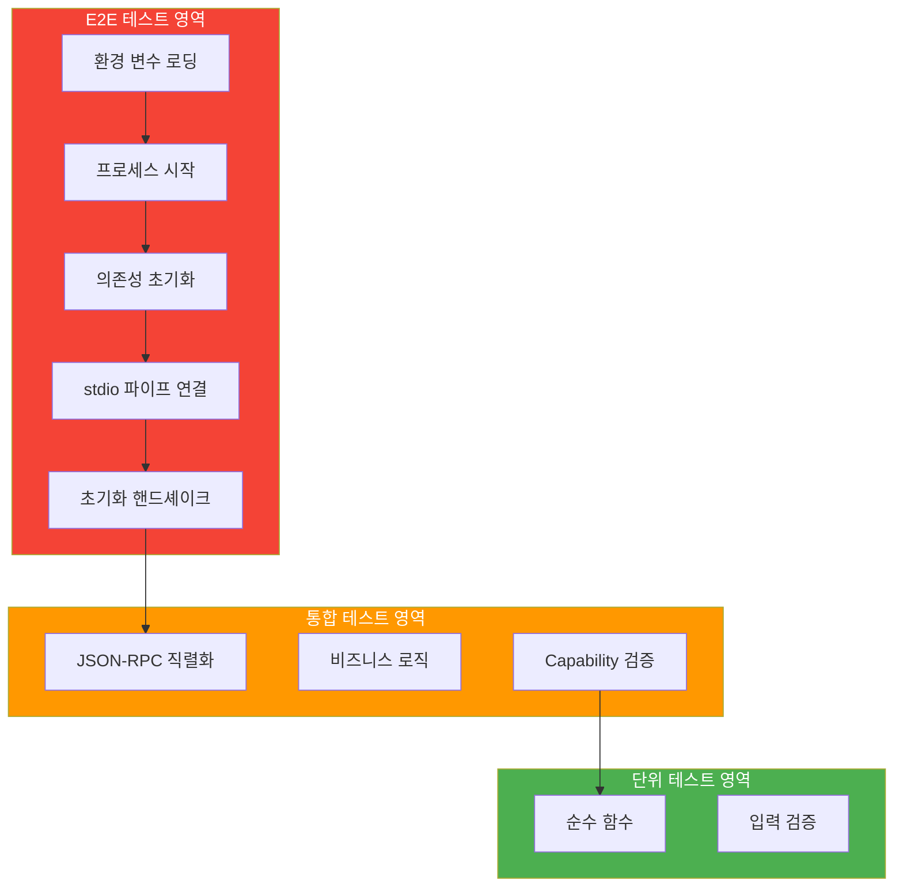
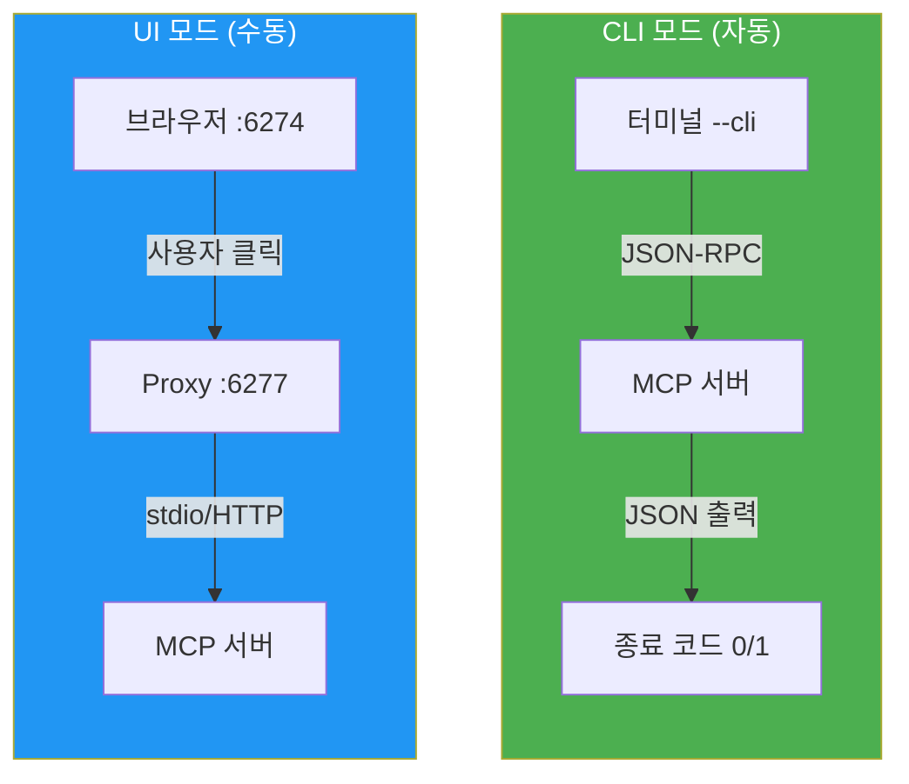
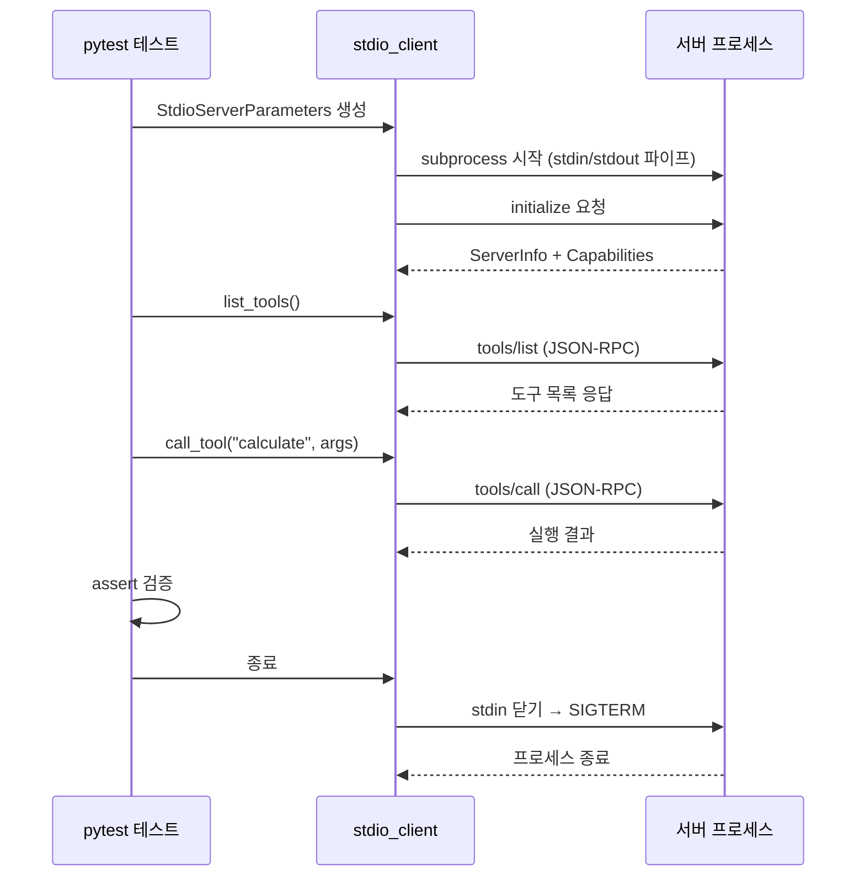
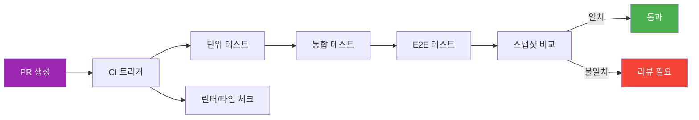
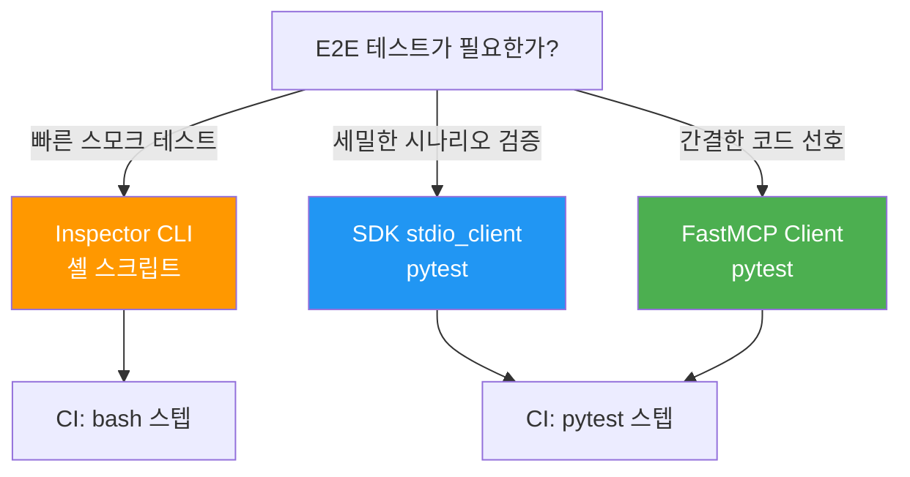

# 04. MCP Inspector 자동화와 E2E 테스트

> MCP Inspector의 CLI 모드와 프로세스 기반 E2E 테스트로 서버 품질을 자동으로 검증합니다

## 개요

이 섹션에서는 MCP 서버의 최종 품질 관문인 E2E(End-to-End) 테스트를 다룹니다. [이전 섹션](12-ch12-에러-처리-로깅-테스트/03-03-단위-테스트와-통합-테스트.md)에서 in-memory Transport 기반의 단위/통합 테스트를 배웠다면, 이번에는 **실제 프로세스를 띄우고 진짜 통신**하는 E2E 테스트를 구축합니다.

**선수 지식**:
- [단위 테스트와 통합 테스트](12-ch12-에러-처리-로깅-테스트/03-03-단위-테스트와-통합-테스트.md)의 pytest-anyio, `create_connected_server_and_client_session` 패턴
- [MCP Inspector와 디버깅](03-ch3-개발-환경-설정과-첫-mcp-서버/04-04-mcp-inspector와-디버깅.md)의 Inspector 기본 사용법
- [Transport 계층 — stdio](02-ch2-mcp-아키텍처와-프로토콜-구조/02-02-transport-계층-stdio.md)의 stdio 통신 원리

**학습 목표**:
- MCP Inspector의 CLI 모드를 활용하여 CI 파이프라인에서 서버를 자동 검증할 수 있다
- `stdio_client`로 실제 서버 프로세스를 띄워 E2E 테스트를 작성할 수 있다
- 회귀 테스트 스위트를 구성하여 서버 변경 시 기존 기능이 깨지지 않음을 보장할 수 있다

## 왜 알아야 할까?

단위 테스트와 통합 테스트를 모두 통과했는데, 실제 배포하니 서버가 안 뜨는 경험 해보셨나요? in-memory Transport는 프로세스 시작, 환경 변수 로딩, 의존성 초기화 같은 **실제 환경의 복잡성을 건너뛰거든요**.

E2E 테스트는 "사용자가 실제로 경험하는 것과 동일한 경로"를 검증합니다. Claude Desktop이나 VS Code가 여러분의 MCP 서버에 연결하는 것과 **완전히 같은 방식**으로 프로세스를 띄우고, 초기화하고, 도구를 호출하죠. 여기서 통과하면 실제 환경에서도 동작한다고 자신 있게 말할 수 있습니다.

특히 MCP Inspector의 CLI 모드는 CI/CD 파이프라인에서 **브라우저 없이** JSON 출력과 종료 코드만으로 서버를 검증할 수 있어서, 배포 전 자동 게이트키퍼 역할을 합니다.

## 핵심 개념

### 개념 1: 테스트 피라미드에서 E2E의 위치

> 💡 **비유**: 자동차를 만든다고 생각해보세요. 단위 테스트는 볼트 하나하나의 강도를 시험하는 것이고, 통합 테스트는 엔진을 조립해서 시동이 걸리는지 보는 겁니다. E2E 테스트는? **실제로 도로에 나가서 달려보는 것**이죠. 볼트와 엔진이 완벽해도 타이어가 빠져있으면 달릴 수 없으니까요.

MCP 서버 테스트도 이 피라미드를 따릅니다. [이전 섹션](12-ch12-에러-처리-로깅-테스트/03-03-단위-테스트와-통합-테스트.md)에서 테스트 피라미드의 기본 구조와 아래 두 계층(단위/통합)을 완성했습니다. 이번에는 꼭대기 계층인 **E2E 테스트**에 초점을 맞춰, 각 단계에서 실제로 어떤 환경 요소가 검증되는지 자세히 살펴보겠습니다.

> 📊 **그림 1**: E2E 테스트가 검증하는 환경 요소 — 통합 테스트와의 차이



E2E 테스트가 검증하는 영역은 통합 테스트가 커버하지 못하는 부분입니다:

| 검증 항목 | 통합 테스트 | E2E 테스트 |
|-----------|:-----------:|:----------:|
| 비즈니스 로직 | O | O |
| JSON-RPC 직렬화 | O | O |
| 프로세스 시작/종료 | X | O |
| 환경 변수 로딩 | X | O |
| Transport 실제 통신 | X | O |
| 의존성 초기화 | 부분적 | O |
| 시그널 핸들링 | X | O |

### 개념 2: MCP Inspector CLI 모드

> 💡 **비유**: MCP Inspector의 웹 UI가 맛집을 직접 방문해서 메뉴판을 보며 주문하는 거라면, CLI 모드는 **배달 앱으로 자동 주문**하는 겁니다. 사람이 안 봐도 되고, 주문 결과를 영수증(JSON)으로 받아서 자동 검증할 수 있죠.

[Ch3에서 배운 MCP Inspector](03-ch3-개발-환경-설정과-첫-mcp-서버/04-04-mcp-inspector와-디버깅.md)는 웹 UI를 통한 수동 테스트가 주 용도였습니다. 하지만 CLI 플래그를 사용하면 **헤드리스 모드**로 전환되어, 브라우저 없이 터미널에서 JSON 결과를 받을 수 있습니다.

> ⚠️ **흔한 오해**: MCP Inspector는 활발히 개발 중인 도구입니다. 이 섹션에서 사용하는 `--cli` 플래그는 특정 버전 기준이며, 버전에 따라 `--mode cli` 등 다른 형식일 수 있습니다. 실제 사용 전에 **반드시 `npx @modelcontextprotocol/inspector --help`로 현재 설치된 버전의 정확한 플래그를 확인**하세요. [Inspector GitHub 저장소](https://github.com/modelcontextprotocol/inspector)의 README와 CHANGELOG에서 최신 CLI 인터페이스를 확인할 수 있습니다.

> 📊 **그림 2**: MCP Inspector — UI 모드 vs CLI 모드



CLI 모드의 핵심 명령어들을 살펴보겠습니다:

```bash
# 먼저 현재 버전의 CLI 옵션 확인 (버전마다 플래그가 다를 수 있음)
npx @modelcontextprotocol/inspector --help

# 도구 목록 조회 — JSON으로 출력
npx @modelcontextprotocol/inspector --cli \
  python server.py \
  --method tools/list

# 특정 도구 호출 — 인자 전달
npx @modelcontextprotocol/inspector --cli \
  python server.py \
  --method tools/call \
  --tool-name calculate \
  --tool-arg expression="2+3" \
  --tool-arg precision="2"

# 리소스 목록 조회
npx @modelcontextprotocol/inspector --cli \
  python server.py \
  --method resources/list

# 프롬프트 목록 조회
npx @modelcontextprotocol/inspector --cli \
  python server.py \
  --method prompts/list

# 원격 서버 (Streamable HTTP)
npx @modelcontextprotocol/inspector --cli \
  https://my-server.example.com \
  --transport http \
  --method tools/list \
  --header "Authorization: Bearer TOKEN"
```

CLI 모드는 **종료 코드**로 성공/실패를 알려주기 때문에, CI 스크립트에서 `&&`로 체이닝하거나 GitHub Actions의 `run` 스텝에 바로 넣을 수 있습니다.

> 🔥 **실무 팁**: Inspector CLI에서 `MCP_AUTO_OPEN_ENABLED=false` 환경 변수를 설정하면 브라우저 자동 열림을 방지할 수 있습니다. CI 환경에서는 필수입니다.

### 개념 3: subprocess 기반 E2E 테스트

> 💡 **비유**: Inspector CLI가 "검수 로봇"이라면, subprocess 기반 E2E 테스트는 **자체 검수 라인을 구축**하는 겁니다. 외부 도구에 의존하지 않고, pytest 안에서 직접 서버를 띄우고 테스트하죠.

Python MCP SDK는 `stdio_client`를 제공하여, 테스트 코드 안에서 서버 프로세스를 띄우고 실제 stdio Transport로 통신할 수 있게 해줍니다. 이게 진짜 E2E입니다 — Claude Desktop이 하는 것과 완전히 동일한 방식이거든요.

> 📊 **그림 3**: subprocess 기반 E2E 테스트 흐름



핵심 패턴을 코드로 보겠습니다:

```python
import pytest
from mcp import ClientSession, StdioServerParameters
from mcp.client.stdio import stdio_client


@pytest.fixture
def server_params():
    """E2E 테스트용 서버 파라미터"""
    return StdioServerParameters(
        command="python",
        args=["server.py"],
        env={
            "DATABASE_URL": "sqlite:///test.db",
            "LOG_LEVEL": "DEBUG",
        },
    )


@pytest.mark.anyio
async def test_server_initialization(server_params):
    """서버가 정상적으로 시작되고 초기화되는지 검증"""
    async with stdio_client(server_params) as (read, write):
        async with ClientSession(read, write) as session:
            result = await session.initialize()
            
            # 서버 정보 검증
            assert result.server_info.name == "my-mcp-server"
            
            # Capability 검증
            assert result.capabilities.tools is not None
            assert result.capabilities.resources is not None
```

### 개념 4: FastMCP Client를 활용한 간편 E2E

MCP Python SDK에 통합된 FastMCP의 `Client` 클래스는 E2E 테스트를 훨씬 간결하게 만들어줍니다. 파일 경로만 넘기면 자동으로 subprocess를 띄워주거든요.

```python
from fastmcp import Client

# 파일 경로만 전달하면 자동으로 subprocess 시작
client = Client("server.py")

async with client:
    # 도구 목록 조회
    tools = await client.list_tools()
    
    # 도구 호출
    result = await client.call_tool("greet", {"name": "MCP"})
```

in-memory 테스트와 subprocess E2E 테스트를 비교하면 이렇습니다:

| 항목 | in-memory (통합) | subprocess (E2E) |
|------|:----------------:|:----------------:|
| 속도 | ~10ms | ~500ms-2s |
| 프로세스 격리 | X | O |
| 환경 변수 검증 | X | O |
| 실제 Transport | X | O |
| 디버깅 용이성 | 높음 | 중간 |
| CI 안정성 | 높음 | 중간 (타임아웃 주의) |

### 개념 5: 회귀 테스트 전략

> 💡 **비유**: 회귀 테스트는 집 리모델링할 때 **기존 수도관과 전기가 여전히 작동하는지** 확인하는 겁니다. 주방을 바꿨는데 화장실 수도가 안 나오면 곤란하잖아요.

MCP 서버의 회귀 테스트에서는 **스냅샷 기반 검증**이 특히 유용합니다. 도구의 스키마, 리소스 목록, 프롬프트 구조가 의도치 않게 변경되면 잡아낼 수 있거든요.

> 📊 **그림 4**: 회귀 테스트 파이프라인



스냅샷 기반 회귀 테스트의 핵심 아이디어는 이렇습니다:

```python
import json
from pathlib import Path

SNAPSHOT_DIR = Path("tests/snapshots")


async def capture_server_snapshot(session: ClientSession) -> dict:
    """서버의 현재 상태를 스냅샷으로 캡처"""
    tools = await session.list_tools()
    resources = await session.list_resources()
    prompts = await session.list_prompts()
    
    return {
        "tools": [
            {
                "name": t.name,
                "description": t.description,
                "input_schema": t.inputSchema,
            }
            for t in tools.tools
        ],
        "resources": [
            {
                "uri": str(r.uri),
                "name": r.name,
                "mime_type": r.mimeType,
            }
            for r in resources.resources
        ],
        "prompts": [
            {
                "name": p.name,
                "description": p.description,
                "arguments": [
                    {"name": a.name, "required": a.required}
                    for a in (p.arguments or [])
                ],
            }
            for p in prompts.prompts
        ],
    }


def assert_snapshot_match(snapshot: dict, name: str):
    """스냅샷 파일과 비교, 없으면 새로 생성"""
    snapshot_file = SNAPSHOT_DIR / f"{name}.json"
    
    if snapshot_file.exists():
        expected = json.loads(snapshot_file.read_text())
        assert snapshot == expected, (
            f"스냅샷 불일치! 의도한 변경이라면 "
            f"'{snapshot_file}'을 삭제 후 재실행하세요."
        )
    else:
        # 최초 실행: 스냅샷 생성
        snapshot_file.parent.mkdir(parents=True, exist_ok=True)
        snapshot_file.write_text(
            json.dumps(snapshot, indent=2, ensure_ascii=False)
        )
```

## 실습: 직접 해보기

완전한 E2E 테스트 스위트를 단계별로 구축해보겠습니다. 먼저 테스트 대상 서버를 만들고, Inspector CLI 테스트와 pytest E2E 테스트를 차례로 작성합니다.

### 1단계: 테스트 대상 서버

```python
# server.py — 테스트 대상 MCP 서버
from mcp.server.fastmcp import FastMCP

mcp = FastMCP("todo-server")

# 인메모리 저장소
_todos: dict[int, dict] = {}
_next_id: int = 1


@mcp.tool()
def add_todo(title: str, priority: str = "medium") -> dict:
    """할 일을 추가합니다.

    Args:
        title: 할 일 제목
        priority: 우선순위 (low, medium, high)
    """
    global _next_id
    if priority not in ("low", "medium", "high"):
        raise ValueError(f"유효하지 않은 우선순위: {priority}")

    todo = {"id": _next_id, "title": title, "priority": priority, "done": False}
    _todos[_next_id] = todo
    _next_id += 1
    return todo


@mcp.tool()
def list_todos() -> list[dict]:
    """모든 할 일 목록을 반환합니다."""
    return list(_todos.values())


@mcp.tool()
def complete_todo(todo_id: int) -> dict:
    """할 일을 완료 처리합니다.

    Args:
        todo_id: 완료할 할 일의 ID
    """
    if todo_id not in _todos:
        raise ValueError(f"ID {todo_id}인 할 일을 찾을 수 없습니다")
    _todos[todo_id]["done"] = True
    return _todos[todo_id]


@mcp.resource("todo://summary")
def get_summary() -> str:
    """할 일 요약 통계를 반환합니다."""
    total = len(_todos)
    done = sum(1 for t in _todos.values() if t["done"])
    return f"전체: {total}, 완료: {done}, 미완료: {total - done}"


if __name__ == "__main__":
    mcp.run()
```

### 2단계: Inspector CLI 기반 스모크 테스트

셸 스크립트로 CI에서 바로 실행할 수 있는 스모크 테스트를 만듭니다. Inspector의 CLI 플래그는 버전에 따라 달라질 수 있으므로, 스크립트 상단에서 변수로 관리하는 것이 좋습니다:

```bash
#!/bin/bash
# test_inspector.sh — Inspector CLI 기반 스모크 테스트
set -euo pipefail

SERVER_CMD="python server.py"
INSPECTOR="npx @modelcontextprotocol/inspector"

# Inspector CLI 플래그 — 버전에 따라 --cli, --mode cli 등 다를 수 있음
# 최신 플래그는: npx @modelcontextprotocol/inspector --help 로 확인
CLI_FLAG="--cli"

echo "=== MCP Inspector 스모크 테스트 ==="
echo "Inspector 버전 확인..."
$INSPECTOR --version 2>/dev/null || echo "(버전 확인 불가 — 계속 진행)"

# 1. 도구 목록 검증
echo "[1/3] 도구 목록 조회..."
TOOLS=$($INSPECTOR $CLI_FLAG $SERVER_CMD --method tools/list 2>/dev/null)
echo "$TOOLS" | python -c "
import sys, json
data = json.load(sys.stdin)
tools = [t['name'] for t in data['tools']]
assert 'add_todo' in tools, 'add_todo 도구 누락'
assert 'list_todos' in tools, 'list_todos 도구 누락'
assert 'complete_todo' in tools, 'complete_todo 도구 누락'
print(f'  도구 {len(tools)}개 확인: {tools}')
"

# 2. 도구 호출 검증
echo "[2/3] add_todo 도구 호출..."
RESULT=$($INSPECTOR $CLI_FLAG $SERVER_CMD \
  --method tools/call \
  --tool-name add_todo \
  --tool-arg title="Inspector 테스트" \
  --tool-arg priority="high" 2>/dev/null)
echo "$RESULT" | python -c "
import sys, json
data = json.load(sys.stdin)
print(f'  결과: {data}')
"

# 3. 리소스 목록 검증
echo "[3/3] 리소스 목록 조회..."
RESOURCES=$($INSPECTOR $CLI_FLAG $SERVER_CMD --method resources/list 2>/dev/null)
echo "$RESOURCES" | python -c "
import sys, json
data = json.load(sys.stdin)
resources = [r['uri'] for r in data['resources']]
assert 'todo://summary' in resources, 'summary 리소스 누락'
print(f'  리소스 {len(resources)}개 확인')
"

echo "=== 모든 스모크 테스트 통과! ==="
```

### 3단계: pytest E2E 테스트 스위트

```python
# tests/test_e2e.py — 완전한 E2E 테스트 스위트
import json
import pytest
from pathlib import Path

from mcp import ClientSession, StdioServerParameters
from mcp.client.stdio import stdio_client

# --- Fixtures ---

SERVER_PATH = str(Path(__file__).parent.parent / "server.py")
SNAPSHOT_DIR = Path(__file__).parent / "snapshots"


@pytest.fixture
def server_params():
    """서버 실행 파라미터"""
    return StdioServerParameters(
        command="python",
        args=[SERVER_PATH],
    )


# --- 헬퍼 함수 ---

async def connect_and_init(server_params):
    """서버에 연결하고 초기화된 세션을 반환하는 컨텍스트 매니저"""
    # stdio_client와 ClientSession은 중첩 async with로 사용
    read_cm = stdio_client(server_params)
    read, write = await read_cm.__aenter__()
    session_cm = ClientSession(read, write)
    session = await session_cm.__aenter__()
    await session.initialize()
    return session, session_cm, read_cm


# --- 초기화 테스트 ---

@pytest.mark.anyio
async def test_server_starts_and_initializes(server_params):
    """서버 프로세스가 정상 시작되고 초기화 응답을 반환하는지 검증"""
    async with stdio_client(server_params) as (read, write):
        async with ClientSession(read, write) as session:
            result = await session.initialize()

            # 서버 이름과 capability 검증
            assert result.server_info.name == "todo-server"
            assert result.capabilities.tools is not None


# --- 도구 테스트 ---

@pytest.mark.anyio
async def test_tool_discovery(server_params):
    """등록된 도구가 모두 발견되는지 검증"""
    async with stdio_client(server_params) as (read, write):
        async with ClientSession(read, write) as session:
            await session.initialize()
            tools_result = await session.list_tools()

            tool_names = {t.name for t in tools_result.tools}
            assert tool_names == {"add_todo", "list_todos", "complete_todo"}


@pytest.mark.anyio
async def test_add_and_list_workflow(server_params):
    """할 일 추가 → 목록 조회 워크플로 E2E 검증"""
    async with stdio_client(server_params) as (read, write):
        async with ClientSession(read, write) as session:
            await session.initialize()

            # 할 일 추가
            add_result = await session.call_tool(
                "add_todo",
                {"title": "E2E 테스트 항목", "priority": "high"},
            )
            # call_tool은 content 리스트를 반환
            added = json.loads(add_result.content[0].text)
            assert added["title"] == "E2E 테스트 항목"
            assert added["priority"] == "high"
            assert added["done"] is False
            todo_id = added["id"]

            # 목록 조회
            list_result = await session.call_tool("list_todos", {})
            todos = json.loads(list_result.content[0].text)
            assert len(todos) == 1
            assert todos[0]["id"] == todo_id

            # 완료 처리
            complete_result = await session.call_tool(
                "complete_todo", {"todo_id": todo_id}
            )
            completed = json.loads(complete_result.content[0].text)
            assert completed["done"] is True


# --- 에러 시나리오 ---

@pytest.mark.anyio
async def test_invalid_priority_returns_error(server_params):
    """유효하지 않은 우선순위가 에러를 반환하는지 검증"""
    async with stdio_client(server_params) as (read, write):
        async with ClientSession(read, write) as session:
            await session.initialize()

            result = await session.call_tool(
                "add_todo",
                {"title": "테스트", "priority": "urgent"},  # 잘못된 값
            )
            # isError 플래그 또는 에러 메시지 확인
            assert result.isError or "유효하지 않은" in result.content[0].text


@pytest.mark.anyio
async def test_complete_nonexistent_todo(server_params):
    """존재하지 않는 할 일 완료 시 에러를 반환하는지 검증"""
    async with stdio_client(server_params) as (read, write):
        async with ClientSession(read, write) as session:
            await session.initialize()

            result = await session.call_tool(
                "complete_todo", {"todo_id": 9999}
            )
            assert result.isError or "찾을 수 없습니다" in result.content[0].text


# --- 리소스 테스트 ---

@pytest.mark.anyio
async def test_summary_resource(server_params):
    """요약 리소스가 정상 데이터를 반환하는지 검증"""
    async with stdio_client(server_params) as (read, write):
        async with ClientSession(read, write) as session:
            await session.initialize()

            # 리소스 목록에 summary 존재 확인
            resources = await session.list_resources()
            uris = [str(r.uri) for r in resources.resources]
            assert "todo://summary" in uris

            # 리소스 읽기
            content = await session.read_resource("todo://summary")
            text = content.contents[0].text
            assert "전체:" in text


# --- 스냅샷 회귀 테스트 ---

@pytest.mark.anyio
async def test_tool_schema_snapshot(server_params):
    """도구 스키마가 이전 스냅샷과 일치하는지 검증"""
    async with stdio_client(server_params) as (read, write):
        async with ClientSession(read, write) as session:
            await session.initialize()

            tools_result = await session.list_tools()
            snapshot = {
                "tools": sorted(
                    [
                        {
                            "name": t.name,
                            "description": t.description,
                            "input_schema": t.inputSchema,
                        }
                        for t in tools_result.tools
                    ],
                    key=lambda x: x["name"],
                )
            }

            snapshot_file = SNAPSHOT_DIR / "tool_schema.json"
            if snapshot_file.exists():
                expected = json.loads(snapshot_file.read_text())
                assert snapshot == expected, (
                    "도구 스키마 변경 감지! 의도한 변경이라면 "
                    f"'{snapshot_file}'을 삭제 후 재실행하세요."
                )
            else:
                snapshot_file.parent.mkdir(parents=True, exist_ok=True)
                snapshot_file.write_text(
                    json.dumps(snapshot, indent=2, ensure_ascii=False)
                )
```

### 4단계: GitHub Actions CI 통합

```yaml
# .github/workflows/mcp-test.yml
name: MCP Server Tests

on:
  push:
    branches: [main]
  pull_request:

jobs:
  test:
    runs-on: ubuntu-latest
    steps:
      - uses: actions/checkout@v4

      - name: Python 설정
        uses: actions/setup-python@v5
        with:
          python-version: "3.12"

      - name: Node.js 설정 (Inspector용)
        uses: actions/setup-node@v4
        with:
          node-version: "22"

      - name: 의존성 설치
        run: |
          pip install mcp pytest pytest-anyio
          
      - name: 단위 + 통합 테스트
        run: pytest tests/ -k "not e2e" -v

      - name: E2E 테스트
        run: pytest tests/test_e2e.py -v --timeout=30

      - name: Inspector 스모크 테스트
        run: bash test_inspector.sh
```

실행 결과는 이렇게 나옵니다:

```run:python
# E2E 테스트 실행 결과 시뮬레이션
test_results = [
    ("test_server_starts_and_initializes", "PASSED", "1.2s"),
    ("test_tool_discovery", "PASSED", "1.1s"),
    ("test_add_and_list_workflow", "PASSED", "1.4s"),
    ("test_invalid_priority_returns_error", "PASSED", "1.1s"),
    ("test_complete_nonexistent_todo", "PASSED", "1.0s"),
    ("test_summary_resource", "PASSED", "1.2s"),
    ("test_tool_schema_snapshot", "PASSED", "1.3s"),
]

print("tests/test_e2e.py")
for name, status, duration in test_results:
    print(f"  {name} — {status} ({duration})")
print(f"\n{len(test_results)} passed in 8.3s")
```

```output
tests/test_e2e.py
  test_server_starts_and_initializes — PASSED (1.2s)
  test_tool_discovery — PASSED (1.1s)
  test_add_and_list_workflow — PASSED (1.4s)
  test_invalid_priority_returns_error — PASSED (1.1s)
  test_complete_nonexistent_todo — PASSED (1.0s)
  test_summary_resource — PASSED (1.2s)
  test_tool_schema_snapshot — PASSED (1.3s)

7 passed in 8.3s
```

### 5단계: FastMCP Client로 간결한 E2E

위의 `stdio_client` + `ClientSession` 패턴이 다소 장황하다면, FastMCP `Client`로 더 깔끔하게 작성할 수 있습니다:

```python
# tests/test_e2e_fastmcp.py — FastMCP Client 기반 E2E
import json
import pytest
from pathlib import Path
from fastmcp import Client

SERVER_PATH = str(Path(__file__).parent.parent / "server.py")


@pytest.fixture
def client():
    """FastMCP Client — 파일 경로만으로 subprocess 자동 관리"""
    return Client(SERVER_PATH)


@pytest.mark.anyio
async def test_full_workflow(client):
    """추가 → 조회 → 완료 전체 워크플로"""
    async with client:
        # 도구 확인
        tools = await client.list_tools()
        assert len(tools) == 3

        # 할 일 추가
        result = await client.call_tool(
            "add_todo",
            {"title": "FastMCP E2E", "priority": "high"},
        )
        added = json.loads(result[0].text)
        assert added["id"] == 1

        # 완료 처리
        result = await client.call_tool(
            "complete_todo", {"todo_id": 1}
        )
        completed = json.loads(result[0].text)
        assert completed["done"] is True
```

> 📊 **그림 5**: E2E 테스트 도구 선택 가이드



## 더 깊이 알아보기

### MCP Inspector의 탄생 이야기

MCP Inspector는 Anthropic의 내부 MCP 개발 과정에서 자연스럽게 탄생했습니다. 2024년 11월 MCP가 오픈소스로 공개될 때, 개발팀은 서버 제작자들이 가장 먼저 부딪히는 문제가 **"내 서버가 제대로 동작하는지 어떻게 확인하지?"**라는 것을 알고 있었거든요. Claude Desktop에 연결해서 테스트하면 LLM의 비결정적 특성 때문에 디버깅이 어렵고, curl로 JSON-RPC를 직접 보내기엔 초기화 핸드셰이크가 복잡했죠.

그래서 Inspector는 처음부터 **"MCP의 Postman"**을 목표로 설계되었습니다. React UI(포트 6274)와 Node.js 프록시(포트 6277)의 2컴포넌트 아키텍처를 채택한 이유도 흥미로운데요 — 브라우저에서 직접 stdio 프로세스를 띄울 수 없기 때문에 중간에 프록시를 둔 겁니다. 이후 커뮤니티의 요청으로 CLI 모드가 추가되면서 CI/CD 파이프라인 통합이 가능해졌고, 지금은 MCP 개발의 필수 도구로 자리 잡았습니다.

### E2E 테스트 철학의 진화

소프트웨어 테스트의 역사에서 E2E 테스트는 오랫동안 "필요악"으로 여겨졌습니다. 느리고, 불안정하고, 유지보수가 어렵다는 이유로요. Google의 테스트 엔지니어링 팀이 제안한 "테스트 피라미드"도 E2E를 꼭대기에 놓고 최소화하라고 권했죠.

하지만 MCP처럼 **프로세스 간 통신이 핵심**인 시스템에서는 E2E의 가치가 달라집니다. in-memory 테스트에서 통과한 코드가 실제 stdio 파이프에서 실패하는 경우가 드물지 않거든요 — 환경 변수 누락, 프로세스 시작 타이밍, 시그널 핸들링 같은 문제는 프로세스를 실제로 띄워봐야만 잡을 수 있습니다.

## 흔한 오해와 팁

> ⚠️ **흔한 오해**: "Inspector CLI로 다 테스트할 수 있으니 pytest E2E는 필요 없다"라고 생각하기 쉽습니다. Inspector CLI는 **개별 메서드 호출**을 검증하는 데 훌륭하지만, "할 일 추가 → 완료 처리 → 요약 리소스 확인" 같은 **다단계 워크플로** 검증에는 한계가 있습니다. Inspector는 매 호출마다 새 프로세스를 띄우기 때문에 상태가 유지되지 않거든요. 워크플로 테스트에는 pytest + `stdio_client`가 적합합니다.

> 💡 **알고 계셨나요?**: MCP Python SDK의 내부 테스트 코드(`tests/client/test_stdio.py`)에는 서버 프로세스가 실제로 살아있는지 확인하기 위해 **TCP 소켓 기반 liveness probe**를 사용합니다. `time.sleep()`으로 "대충 기다리는" 대신, 서버가 테스트 소유의 TCP 리스너에 `b'alive'` 바이트를 전송하는 방식이죠. 프로덕션 수준의 테스트 안정성을 위한 영감을 얻을 수 있는 코드입니다.

> 🔥 **실무 팁**: E2E 테스트에서 가장 흔한 실패 원인은 **타임아웃**입니다. CI 환경은 로컬보다 느리므로, `pytest --timeout=30` 같은 넉넉한 타임아웃을 설정하세요. 또한 `StdioServerParameters`의 `env` 파라미터에 **필요한 환경 변수를 명시적으로 전달**해야 합니다. `os.environ`을 상속하지 않으므로, 서버가 필요로 하는 `DATABASE_URL`, `API_KEY` 등을 빠뜨리면 프로세스가 시작 직후 크래시합니다.

> 🔥 **실무 팁**: 스냅샷 테스트가 실패했을 때, **diff를 꼼꼼히 확인**한 뒤 의도한 변경이면 스냅샷 파일을 삭제하고 테스트를 재실행하세요. pytest-snapshot이나 syrupy 같은 라이브러리를 사용하면 `--snapshot-update` 플래그로 더 편하게 갱신할 수 있습니다.

## 핵심 정리

| 개념 | 설명 |
|------|------|
| E2E 테스트 | 실제 서버 프로세스를 띄우고 실제 Transport로 통신하여 전체 경로를 검증 |
| Inspector CLI | 브라우저 없이 터미널에서 MCP 서버를 검증. JSON 출력 + 종료 코드로 CI 통합 가능. CLI 플래그는 버전마다 다를 수 있으므로 `--help` 확인 필수 |
| `stdio_client` | SDK 제공 유틸리티. subprocess를 띄우고 stdin/stdout 파이프로 JSON-RPC 통신 |
| FastMCP `Client` | 파일 경로만 넘기면 subprocess 관리를 자동화. 간결한 E2E 테스트 작성 가능 |
| 스냅샷 회귀 테스트 | 도구 스키마, 리소스 목록 등을 JSON 스냅샷으로 저장 → 변경 시 자동 감지 |
| 테스트 피라미드 | 단위(많이, 빠르게) → 통합(중간) → E2E(적게, 현실적) 계층 구조 |
| CI 통합 | pytest E2E + Inspector CLI를 GitHub Actions에 통합하여 배포 전 자동 검증 |

## 다음 섹션 미리보기

이것으로 Chapter 12의 에러 처리, 로깅, 테스트 여정을 마칩니다. 프로덕션 수준의 MCP 서버를 만들기 위한 품질 인프라가 완성되었죠. 다음 챕터(Ch13)에서는 이렇게 검증된 서버를 **Docker 컨테이너로 패키징하고 클라우드에 배포**하는 방법을 다룹니다. [Ch13. 배포와 운영](13-ch13-배포와-운영/01-01-docker-컨테이너화.md)에서 테스트를 통과한 코드를 실제 사용자에게 전달하는 마지막 단계를 시작합니다.

## 참고 자료

- [MCP Inspector — 공식 문서](https://modelcontextprotocol.io/docs/tools/inspector) - Inspector의 설치, 사용법, CLI 모드를 포함한 공식 가이드
- [MCP Inspector GitHub 저장소](https://github.com/modelcontextprotocol/inspector) - Inspector 소스 코드와 최신 릴리스 노트, CLI 옵션 상세 설명. **CLI 플래그 변경 사항은 여기서 확인**
- [MCP Python SDK GitHub](https://github.com/modelcontextprotocol/python-sdk) - `stdio_client`, `ClientSession` 등 테스트에 사용하는 SDK 소스 코드와 내부 테스트 패턴
- [FastMCP Client 문서](https://gofastmcp.com/clients/client) - FastMCP Client의 in-memory/subprocess 모드 사용법
- [MCP E2E Testing Example](https://github.com/mkusaka/mcp-server-e2e-testing-example) - 프로세스 스폰 + SDK 기반 E2E 테스트 패턴 예제 저장소
- [Real Python — Build a Python MCP Client](https://realpython.com/python-mcp-client/) - `stdio_client`를 활용한 클라이언트 구축 튜토리얼

---
### 🔗 Related Sessions
- [stdio transport](02-ch2-mcp-아키텍처와-프로토콜-구조/02-02-transport-계층-stdio.md) (prerequisite)
- [create_connected_server_and_client_session](12-ch12-에러-처리-로깅-테스트/03-03-단위-테스트와-통합-테스트.md) (prerequisite)
