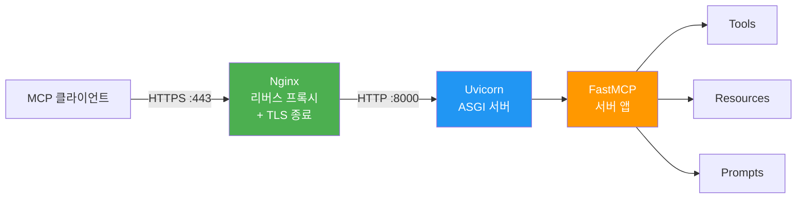
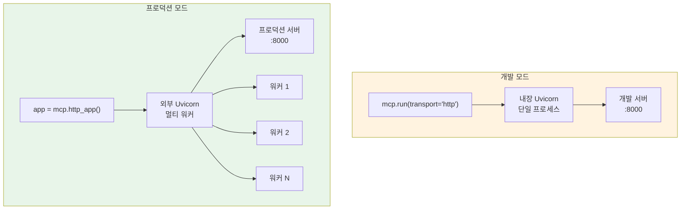
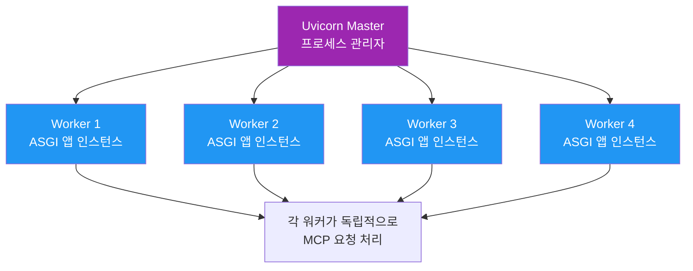
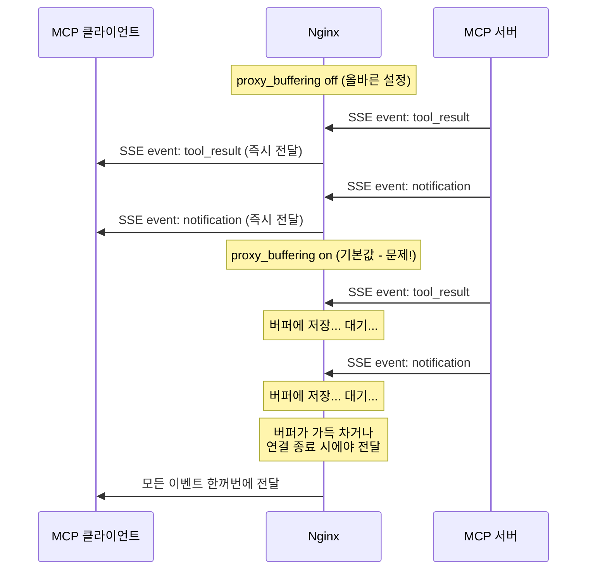
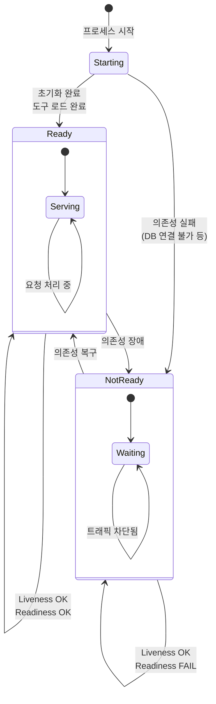

# Streamable HTTP 서버 배포

> Docker 컨테이너 안의 MCP 서버를 프로덕션 HTTP 서버로 올리고, 리버스 프록시와 TLS를 입혀 안전하게 외부에 노출하기

## 개요

이 섹션에서는 [이전 섹션](13-ch13-배포와-운영/01-01-docker-컨테이너화.md)에서 Docker로 패키징한 MCP 서버를 **실제 프로덕션 환경에 배포 가능한 HTTP 서버**로 구성하는 방법을 다룹니다. ASGI 서버(Uvicorn)로 서비스하고, Nginx 리버스 프록시로 TLS를 입히며, 헬스 체크 엔드포인트로 서버 상태를 모니터링하는 전체 과정을 실습합니다.

**선수 지식**: [Docker 컨테이너화](13-ch13-배포와-운영/01-01-docker-컨테이너화.md)에서 배운 Dockerfile 작성과 `mcp.run(transport="http")`, [Streamable HTTP Transport](02-ch2-mcp-아키텍처와-프로토콜-구조/03-03-transport-계층-streamable-http.md)의 프로토콜 구조

**학습 목표**:
- Uvicorn ASGI 서버로 MCP 서버를 프로덕션 모드로 실행할 수 있다
- Nginx 리버스 프록시에서 SSE 스트리밍이 깨지지 않도록 구성할 수 있다
- TLS/HTTPS를 적용하여 안전한 MCP 엔드포인트를 제공할 수 있다
- Liveness/Readiness 헬스 체크를 구현하여 운영 안정성을 확보할 수 있다

## 왜 알아야 할까?

`mcp.run(transport="http")`으로 서버를 띄우면 개발은 편하지만, 이것만으로 프로덕션에 나갈 수는 없습니다. 왜 그럴까요?

**첫째**, 단일 프로세스로는 동시 요청을 감당할 수 없습니다. LLM 에이전트 여러 개가 동시에 도구를 호출하면 서버가 병목이 됩니다. **둘째**, TLS 없이 HTTP 평문으로 통신하면 도구 호출 파라미터와 응답 데이터가 네트워크에 그대로 노출됩니다. **셋째**, 서버가 살아있는지, 요청을 받을 준비가 됐는지를 외부에서 확인할 방법이 없으면 장애 대응이 늦어집니다.

이 섹션에서 구성하는 **Uvicorn + Nginx + TLS + 헬스 체크** 스택은 프로덕션 MCP 서버의 표준 배포 패턴입니다.

> 📊 **그림 1**: 프로덕션 MCP 서버 배포 스택



클라이언트는 HTTPS로 Nginx에 접속하고, Nginx가 TLS를 벗겨낸 뒤 내부 Uvicorn으로 전달합니다. 이 구조가 왜 좋은지, 하나씩 살펴보겠습니다.

## 핵심 개념

### 개념 1: ASGI 앱으로 변환 — `http_app()` 패턴

> 💡 **비유**: `mcp.run()`이 집에서 혼자 요리하는 것이라면, `http_app()`은 레시피를 프로 셰프(Uvicorn)에게 넘기는 것입니다. 셰프는 여러 테이블의 주문을 동시에 처리할 수 있죠.

FastMCP는 `http_app()` 메서드로 **ASGI 호환 애플리케이션**을 반환합니다. 이 앱을 Uvicorn이나 다른 ASGI 서버에 넘기면, MCP 서버가 프로덕션급 HTTP 서버로 동작합니다.

```python
# server.py — 프로덕션용 MCP 서버
import os
from fastmcp import FastMCP

def create_app():
    """ASGI 앱 팩토리 — Uvicorn이 이 함수의 반환값을 서빙합니다."""
    mcp = FastMCP(
        name="production-server",
        stateless_http=True,   # 수평 확장을 위한 무상태 모드
        json_response=True,    # SSE 대신 JSON 응답 (단순 요청-응답)
    )

    @mcp.tool()
    def get_server_info() -> dict:
        """서버 상태 정보를 반환합니다."""
        return {
            "name": mcp.name,
            "environment": os.getenv("MCP_ENV", "development"),
            "version": "1.0.0",
        }

    # ASGI 앱 반환 — Uvicorn이 이것을 서빙
    return mcp.http_app()

# Uvicorn 진입점
app = create_app()
```

여기서 두 가지 핵심 옵션에 주목하세요:

- **`stateless_http=True`**: 서버가 세션 상태를 메모리에 보관하지 않습니다. 로드 밸런서 뒤에서 여러 워커가 돌아도 세션 고정(sticky session) 없이 동작합니다. [스케일링과 운영 패턴](13-ch13-배포와-운영/04-04-스케일링과-운영-패턴.md)에서 자세히 다룹니다.
- **`json_response=True`**: 단순한 요청-응답 패턴에서 SSE 스트림 대신 JSON으로 응답합니다. 디버깅이 쉽고, 프록시 설정이 간단해집니다.

> 📊 **그림 2**: `mcp.run()` vs `http_app()` 실행 경로 비교



개발할 때는 `mcp.run()`으로 빠르게 확인하고, 배포할 때는 `http_app()`으로 ASGI 앱을 꺼내 Uvicorn에게 맡기는 겁니다.

### 개념 2: Uvicorn 프로덕션 설정

> 💡 **비유**: Uvicorn의 워커(worker)는 식당의 웨이터입니다. 웨이터가 한 명이면 손님이 많을 때 대기가 길어지고, 여러 명이면 동시에 주문을 처리할 수 있죠. 워커 수는 CPU 코어에 비례해서 늘립니다.

Uvicorn은 Python 생태계에서 가장 널리 쓰이는 ASGI 서버입니다. MCP 서버를 프로덕션으로 올릴 때 필수적인 설정을 살펴보겠습니다.

**개발 모드 vs 프로덕션 모드:**

```bash
# 개발 — 코드 변경 시 자동 재시작
uvicorn server:app --reload --host 127.0.0.1 --port 8000

# 프로덕션 — 멀티 워커, 외부 접근 허용
uvicorn server:app --host 0.0.0.0 --port 8000 --workers 4
```

> ⚠️ **흔한 오해**: `--reload`와 `--workers`는 동시에 사용할 수 없습니다. 개발 모드에서만 `--reload`를, 프로덕션에서만 `--workers`를 사용하세요.

워커 수의 일반적인 공식은 다음과 같습니다:

$$
W = 2 \times C + 1
$$

- $W$: 워커 수
- $C$: CPU 코어 수

4코어 서버라면 `--workers 9`가 기본 출발점입니다. 하지만 이 공식은 **CPU-bound** 워크로드를 기준으로 한 것입니다.

**MCP 서버는 대부분 I/O-bound입니다.** 도구가 실행하는 작업을 생각해 보세요 — LLM API 호출, 데이터베이스 쿼리, 외부 REST API 요청 등 대부분의 시간을 **네트워크 응답을 기다리는 데** 사용합니다. CPU가 실제로 연산하는 시간은 극히 짧죠. 이런 I/O-bound 워크로드에서는 워커가 응답을 기다리는 동안 CPU가 놀고 있으므로, 코어 수보다 훨씬 많은 워커를 띄워도 괜찮습니다.

```run:python
# I/O-bound vs CPU-bound 워커 계산 비교
import multiprocessing
cores = multiprocessing.cpu_count()

# CPU-bound 공식 (웹 프레임워크 일반)
cpu_bound_workers = (cores * 2) + 1

# I/O-bound 공식 (MCP 서버 권장)
io_bound_workers = (cores * 4) + 1

print(f"CPU 코어 수: {cores}")
print(f"CPU-bound 권장 워커: {cpu_bound_workers}  (코어 × 2 + 1)")
print(f"I/O-bound 권장 워커: {io_bound_workers}  (코어 × 4 + 1)")
print(f"\nMCP 서버 대부분의 도구:")
print(f"  - LLM API 호출 → 네트워크 I/O 대기")
print(f"  - DB 쿼리 → 네트워크 I/O 대기")
print(f"  - 외부 API 요청 → 네트워크 I/O 대기")
print(f"  → I/O-bound 공식 사용이 적절!")
```

```output
CPU 코어 수: 4
CPU-bound 권장 워커: 9  (코어 × 2 + 1)
I/O-bound 권장 워커: 17  (코어 × 4 + 1)

MCP 서버 대부분의 도구:
  - LLM API 호출 → 네트워크 I/O 대기
  - DB 쿼리 → 네트워크 I/O 대기
  - 외부 API 요청 → 네트워크 I/O 대기
  → I/O-bound 공식 사용이 적절!
```

> 🔥 **실무 팁**: 워커 수 튜닝은 결국 **부하 테스트가 정답**입니다. I/O-bound 공식(코어 × 4 + 1)을 출발점으로 삼되, `locust`나 `k6` 같은 도구로 실제 트래픽 패턴을 시뮬레이션하면서 조정하세요. 도구 중에 이미지 처리, 데이터 변환 등 CPU를 많이 쓰는 것이 있다면 코어 × 2 + 1 쪽으로 낮추는 것이 안전합니다.

**프로덕션 설정 파일로 관리하기:**

```python
# uvicorn_config.py — 설정을 코드로 관리
import multiprocessing
import os

# 환경에 따른 설정 분기
env = os.getenv("MCP_ENV", "development")

bind = "0.0.0.0:8000"

# MCP 서버는 I/O-bound이므로 코어 × 4 + 1 기본, 환경변수로 오버라이드 가능
workers = int(os.getenv(
    "MCP_WORKERS",
    (multiprocessing.cpu_count() * 4) + 1
))
worker_class = "uvicorn.workers.UvicornWorker"

# 타임아웃: MCP 도구 실행이 오래 걸릴 수 있으므로 넉넉하게
timeout = 300  # 5분

# 로깅
accesslog = "-"  # stdout으로 출력
loglevel = "info" if env == "production" else "debug"
```

> 📊 **그림 3**: Uvicorn 워커 아키텍처



각 워커는 독립적인 프로세스이므로, 한 워커가 느린 도구 실행에 묶여도 다른 워커가 새 요청을 처리합니다. `stateless_http=True`를 설정했기 때문에 어떤 워커에 요청이 도착해도 동일하게 처리됩니다.

**systemd로 서비스 등록:**

MCP 서버가 서버 재부팅 후에도 자동으로 시작되려면 systemd 유닛 파일이 필요합니다.

```ini
# /etc/systemd/system/mcp-server.service
[Unit]
Description=MCP Production Server
After=network.target

[Service]
Type=exec
User=mcp
Group=mcp
WorkingDirectory=/opt/mcp-server
ExecStart=/opt/mcp-server/.venv/bin/uvicorn server:app \
    --host 127.0.0.1 \
    --port 8000 \
    --workers 4
Restart=always
RestartSec=5
Environment=MCP_ENV=production
Environment=PYTHONUNBUFFERED=1

[Install]
WantedBy=multi-user.target
```

```bash
# 서비스 등록 및 시작
sudo systemctl daemon-reload
sudo systemctl enable mcp-server
sudo systemctl start mcp-server
```

### 개념 3: Nginx 리버스 프록시 — SSE를 살리는 설정

> 💡 **비유**: Nginx는 고급 호텔의 프론트 데스크입니다. 외부 손님(클라이언트)의 신원을 확인하고(TLS), 적절한 객실(백엔드 워커)로 안내하죠. 하지만 MCP에는 특별한 손님이 있습니다 — SSE 스트리밍 연결은 "체크인 후 로비에서 계속 대기하는 손님"과 같아서, 프론트 데스크가 이 손님을 중간에 끊지 않도록 특별한 설정이 필요합니다.

Streamable HTTP Transport의 `/mcp` 엔드포인트는 세 가지 HTTP 메서드를 처리합니다:

| 메서드 | 용도 | 특징 |
|--------|------|------|
| `POST /mcp` | 클라이언트 → 서버 메시지 전송 | 일반 HTTP 요청-응답 |
| `GET /mcp` | SSE 스트림 열기 | **장시간 연결 유지** |
| `DELETE /mcp` | 세션 종료 | 일반 HTTP 요청-응답 |

문제는 `GET /mcp`입니다. Nginx의 기본 설정은 응답을 **버퍼링**합니다. SSE 이벤트가 서버에서 발생해도 버퍼가 가득 차기 전까지 클라이언트에 전달되지 않습니다. 이것이 MCP 배포에서 가장 흔한 장애 원인입니다.

```nginx
# /etc/nginx/sites-available/mcp-server
server {
    listen 80;
    server_name mcp.example.com;

    # HTTP → HTTPS 리다이렉트
    return 301 https://$server_name$request_uri;
}

server {
    listen 443 ssl http2;
    server_name mcp.example.com;

    # TLS 인증서 (Let's Encrypt)
    ssl_certificate     /etc/letsencrypt/live/mcp.example.com/fullchain.pem;
    ssl_certificate_key /etc/letsencrypt/live/mcp.example.com/privkey.pem;
    ssl_protocols       TLSv1.2 TLSv1.3;

    # MCP 엔드포인트
    location /mcp {
        proxy_pass http://127.0.0.1:8000;
        proxy_http_version 1.1;

        # 헤더 전달
        proxy_set_header Host $host;
        proxy_set_header X-Real-IP $remote_addr;
        proxy_set_header X-Forwarded-For $proxy_add_x_forwarded_for;
        proxy_set_header X-Forwarded-Proto $scheme;

        # ⭐ SSE 스트리밍을 위한 핵심 설정
        proxy_buffering off;        # 버퍼링 비활성화 — SSE 필수!
        proxy_cache off;            # 캐시 비활성화
        proxy_set_header Connection '';  # keep-alive 활성화

        # MCP 도구 실행 시간을 고려한 타임아웃
        proxy_read_timeout 300s;
        proxy_send_timeout 300s;
    }

    # 헬스 체크는 별도 location으로 분리
    location /health {
        proxy_pass http://127.0.0.1:8000;
        proxy_read_timeout 5s;   # 헬스 체크는 빠르게 응답해야
    }
}
```

이 설정에서 절대 빼먹으면 안 되는 세 줄을 강조합니다:

```nginx
proxy_buffering off;           # 1. SSE 이벤트 즉시 전달
proxy_set_header Connection '';  # 2. keep-alive로 연결 유지
proxy_read_timeout 300s;       # 3. 긴 도구 실행 대기
```

> 🔥 **실무 팁**: `proxy_buffering off`는 **Nginx에서 SSE를 사용할 때 가장 중요한 단일 설정**입니다. 이 한 줄이 없으면 SSE 스트림이 완전히 깨집니다. MCP 서버 배포 후 "클라이언트가 응답을 못 받는다"는 문제의 90%는 이 설정 누락입니다.

> 📊 **그림 4**: Nginx SSE 버퍼링 on/off 비교



`proxy_http_version 1.1`과 `Connection ''`의 조합도 중요합니다. HTTP/1.0은 기본적으로 `Connection: close`를 보내는데, 이러면 SSE 스트림이 열리자마자 닫힙니다. HTTP/1.1 + 빈 Connection 헤더로 keep-alive를 강제해야 합니다.

### 개념 4: TLS/HTTPS — Let's Encrypt로 무료 인증서

> 💡 **비유**: TLS는 편지를 봉투에 넣어 밀봉하는 것과 같습니다. 편지(MCP 메시지)의 내용을 배달원(네트워크)이 들여다볼 수 없게 만들죠. Let's Encrypt는 이 봉투를 무료로 제공하는 우체국입니다.

MCP 서버가 도구 호출 파라미터로 민감한 데이터(DB 쿼리, API 키, 사용자 정보)를 주고받기 때문에, 프로덕션에서는 반드시 TLS를 적용해야 합니다. [인증과 보안](11-ch11-인증과-보안/01-01-mcp-인증-아키텍처.md) 챕터에서 배운 OAuth 2.1도 TLS를 전제합니다.

```bash
# Certbot으로 Let's Encrypt 인증서 발급
sudo apt install certbot python3-certbot-nginx
sudo certbot --nginx -d mcp.example.com

# 자동 갱신 확인 (cron에 이미 등록됨)
sudo certbot renew --dry-run
```

Certbot은 Nginx 설정에 자동으로 SSL 블록을 추가해 줍니다. 인증서는 90일마다 자동 갱신됩니다.

**TLS를 Nginx에서 종료하는 이유:**

Uvicorn도 `--ssl-certfile`과 `--ssl-keyfile` 옵션으로 직접 TLS를 처리할 수 있습니다. 하지만 프로덕션에서는 Nginx에서 TLS를 종료하는 것이 표준입니다:

| 비교 항목 | Nginx TLS 종료 | Uvicorn 직접 TLS |
|-----------|---------------|-----------------|
| 성능 | OpenSSL 최적화, 하드웨어 가속 | Python 기반, 느림 |
| 인증서 교체 | Nginx reload만으로 완료 | 앱 재시작 필요 |
| 설정 유연성 | TLS 버전/암호화 세밀 제어 | 제한적 |
| 멀티 서비스 | 하나의 Nginx로 여러 서비스 관리 | 서비스마다 각각 설정 |

### 개념 5: 헬스 체크 엔드포인트

> 💡 **비유**: 헬스 체크는 병원의 건강 검진입니다. "살아 있나요?"(liveness)와 "일할 준비가 됐나요?"(readiness)는 다른 질문이죠. 환자가 숨을 쉬고 있어도(liveness OK) 수술 후 회복 중이라면 일을 시킬 수 없습니다(readiness NOT OK).

FastMCP의 `@mcp.custom_route()` 데코레이터로 MCP 프로토콜과 별개인 HTTP 엔드포인트를 추가할 수 있습니다. 프로덕션에서는 **두 종류**의 헬스 체크를 구현하는 것이 표준입니다.

```python
# server.py — 헬스 체크 추가
from starlette.requests import Request
from starlette.responses import JSONResponse, PlainTextResponse
from fastmcp import FastMCP

mcp = FastMCP("production-server", stateless_http=True)

# --- Liveness Probe ---
# "프로세스가 살아있는가?" → 200이면 살아있음
@mcp.custom_route("/health", methods=["GET"])
async def liveness(request: Request) -> PlainTextResponse:
    return PlainTextResponse("OK")

# --- Readiness Probe ---
# "요청을 받을 준비가 됐는가?" → 의존성까지 확인
@mcp.custom_route("/health/ready", methods=["GET"])
async def readiness(request: Request) -> JSONResponse:
    checks = {
        "server_initialized": True,
        "tools_registered": len(mcp._tool_manager.tools) > 0,
    }
    all_healthy = all(checks.values())
    return JSONResponse(
        {"ready": all_healthy, "checks": checks},
        status_code=200 if all_healthy else 503,
    )

app = mcp.http_app()
```

```run:python
# 헬스 체크 응답 시뮬레이션
checks = {
    "server_initialized": True,
    "tools_registered": True,
}
all_healthy = all(checks.values())
status_code = 200 if all_healthy else 503

print(f"Readiness: {'READY' if all_healthy else 'NOT READY'}")
print(f"Status Code: {status_code}")
print(f"Checks: {checks}")
```

```output
Readiness: READY
Status Code: 200
Checks: {'server_initialized': True, 'tools_registered': True}
```

헬스 체크 엔드포인트는 **인증 없이** 접근할 수 있어야 합니다. Kubernetes의 kubelet이나 로드 밸런서가 주기적으로 호출하는데, 이들은 OAuth 토큰을 가지고 있지 않거든요.

> 📊 **그림 5**: Liveness vs Readiness 프로브 동작



| 프로브 | 경로 | 실패 시 동작 | 체크 주기 |
|--------|------|-------------|----------|
| Liveness | `/health` | 컨테이너 재시작 | 10-30초 |
| Readiness | `/health/ready` | 트래픽 라우팅 중단 (재시작 X) | 5-10초 |

## 실습: 직접 해보기

프로덕션 배포 가능한 MCP 서버를 처음부터 끝까지 구성해 봅시다. Docker Compose로 **MCP 서버 + Nginx + 자동 TLS**를 한 번에 올립니다.

**Step 1: MCP 서버 코드**

```python
# server.py — 프로덕션 MCP 서버 전체 코드
import os
from fastmcp import FastMCP
from starlette.requests import Request
from starlette.responses import JSONResponse, PlainTextResponse

def create_app():
    mcp = FastMCP(
        name=os.getenv("MCP_SERVER_NAME", "prod-mcp"),
        stateless_http=True,
        json_response=True,
    )

    # --- 도구 정의 ---
    @mcp.tool()
    def echo(message: str) -> str:
        """메시지를 그대로 반환합니다. 연결 테스트용."""
        return f"Echo: {message}"

    @mcp.tool()
    def server_status() -> dict:
        """서버 환경 정보를 반환합니다."""
        return {
            "name": mcp.name,
            "env": os.getenv("MCP_ENV", "unknown"),
            "workers": os.getenv("MCP_WORKERS", "1"),
        }

    # --- 헬스 체크 ---
    @mcp.custom_route("/health", methods=["GET"])
    async def liveness(request: Request) -> PlainTextResponse:
        return PlainTextResponse("OK")

    @mcp.custom_route("/health/ready", methods=["GET"])
    async def readiness(request: Request) -> JSONResponse:
        checks = {
            "initialized": True,
            "tools_loaded": len(mcp._tool_manager.tools) > 0,
        }
        ok = all(checks.values())
        return JSONResponse(
            {"ready": ok, "checks": checks},
            status_code=200 if ok else 503,
        )

    return mcp.http_app()

app = create_app()
```

**Step 2: Dockerfile**

```dockerfile
# Dockerfile — 멀티 스테이지 빌드
FROM python:3.12-slim AS builder
WORKDIR /build
COPY requirements.txt .
RUN pip install --no-cache-dir --target=/build/deps -r requirements.txt

FROM python:3.12-slim
WORKDIR /app
ENV PYTHONUNBUFFERED=1 \
    PYTHONPATH=/app/deps \
    MCP_ENV=production

# non-root 사용자
RUN useradd -r -s /bin/false mcp
COPY --from=builder /build/deps /app/deps
COPY server.py .

USER mcp
EXPOSE 8000

# Uvicorn으로 프로덕션 실행
CMD ["python", "-m", "uvicorn", "server:app", \
     "--host", "0.0.0.0", "--port", "8000", "--workers", "4"]
```

**Step 3: Nginx 설정**

```nginx
# nginx/mcp.conf
upstream mcp_backend {
    server mcp-server:8000;
}

server {
    listen 80;
    server_name _;

    # 개발 환경용 (프로덕션에서는 443으로 리다이렉트)
    location /mcp {
        proxy_pass http://mcp_backend;
        proxy_http_version 1.1;

        proxy_set_header Host $host;
        proxy_set_header X-Real-IP $remote_addr;
        proxy_set_header X-Forwarded-For $proxy_add_x_forwarded_for;
        proxy_set_header X-Forwarded-Proto $scheme;
        proxy_set_header Connection '';

        # SSE 필수 설정
        proxy_buffering off;
        proxy_cache off;

        # MCP 도구 실행 타임아웃
        proxy_read_timeout 300s;
        proxy_send_timeout 300s;
    }

    location /health {
        proxy_pass http://mcp_backend;
        proxy_read_timeout 5s;
    }
}
```

**Step 4: Docker Compose**

```yaml
# docker-compose.yml
services:
  mcp-server:
    build: .
    environment:
      - MCP_ENV=production
      - MCP_SERVER_NAME=my-mcp
      - MCP_WORKERS=4
    healthcheck:
      test: ["CMD", "python", "-c",
             "import urllib.request; urllib.request.urlopen('http://localhost:8000/health')"]
      interval: 10s
      timeout: 5s
      retries: 3
    deploy:
      resources:
        limits:
          cpus: "2"
          memory: 1G

  nginx:
    image: nginx:alpine
    ports:
      - "80:80"
      - "443:443"
    volumes:
      - ./nginx/mcp.conf:/etc/nginx/conf.d/default.conf:ro
    depends_on:
      mcp-server:
        condition: service_healthy
```

**Step 5: 실행 및 테스트**

```bash
# 서비스 시작
docker compose up -d

# 헬스 체크 확인
curl http://localhost/health
curl http://localhost/health/ready
```

```run:python
# MCP 클라이언트로 연결 테스트하는 코드
import asyncio

async def test_connection():
    """Streamable HTTP로 MCP 서버에 연결합니다."""
    from mcp import ClientSession
    from mcp.client.streamable_http import StreamableHTTPClientTransport

    transport = StreamableHTTPClientTransport(
        url="http://localhost/mcp"  # Nginx를 통해 접속
    )

    async with transport.connect() as (read, write):
        async with ClientSession(read, write) as session:
            await session.initialize()

            # 도구 목록 조회
            tools = await session.list_tools()
            print(f"사용 가능한 도구: {len(tools.tools)}개")
            for tool in tools.tools:
                print(f"  - {tool.name}: {tool.description}")

            # echo 도구 호출
            result = await session.call_tool("echo", {"message": "Hello, Production!"})
            print(f"\necho 결과: {result.content[0].text}")

# asyncio.run(test_connection())
print("MCP 클라이언트 연결 코드 준비 완료")
print("asyncio.run(test_connection())으로 실행하세요")
```

```output
MCP 클라이언트 연결 코드 준비 완료
asyncio.run(test_connection())으로 실행하세요
```

## 더 깊이 알아보기

### SSE에서 Streamable HTTP로 — Transport의 진화

MCP의 원격 Transport는 처음부터 Streamable HTTP가 아니었습니다. 초기 MCP 스펙(2024년 11월)은 **SSE(Server-Sent Events) Transport**를 사용했는데, 두 개의 엔드포인트(`GET /sse` + `POST /messages`)로 나뉘어 있었습니다. 이 구조는 몇 가지 문제가 있었습니다:

1. **인프라 호환성**: 많은 CDN과 로드 밸런서가 SSE 장시간 연결을 중간에 끊었습니다
2. **재연결 복잡성**: SSE 연결이 끊기면 진행 중이던 도구 실행 결과를 받을 방법이 없었습니다
3. **상태 관리**: SSE 연결과 POST 요청을 같은 세션으로 묶기가 어려웠습니다

2025년 3월, MCP 스펙은 **Streamable HTTP**로 전환합니다. 단일 `/mcp` 엔드포인트에서 POST(메시지), GET(SSE 스트림), DELETE(세션 종료)를 모두 처리하는 구조로, 기존 HTTP 인프라와의 호환성이 크게 개선되었습니다. 특히 `json_response=True` 옵션을 사용하면 SSE 없이 순수 HTTP 요청-응답만으로 통신할 수 있어서, 기존 웹 인프라를 그대로 활용할 수 있게 되었죠.

> 💡 **알고 계셨나요?**: SSE Transport는 2025년 5월부터 공식적으로 **deprecated** 상태입니다. 신규 MCP 서버는 반드시 Streamable HTTP를 사용해야 하며, Python SDK의 `SseServerTransport`는 호환성을 위해 유지되지만 새로운 기능은 추가되지 않습니다. 자세한 내용은 [Transport 계층 — Streamable HTTP](02-ch2-mcp-아키텍처와-프로토콜-구조/03-03-transport-계층-streamable-http.md)에서 확인하세요.

### ASGI의 탄생과 Python 웹의 진화

ASGI(Asynchronous Server Gateway Interface)는 Django 핵심 개발자인 Andrew Godwin이 2016년에 제안했습니다. 기존 WSGI(Web Server Gateway Interface)는 동기 방식이라 WebSocket이나 SSE 같은 장시간 연결을 처리할 수 없었거든요. "웹은 더 이상 요청-응답만이 아니다"라는 인식에서 ASGI가 탄생했고, 이것이 Uvicorn과 FastAPI의 기반이 되었습니다. MCP의 Streamable HTTP Transport가 ASGI 위에서 자연스럽게 동작하는 것도 바로 이 비동기 설계 덕분입니다.

## 흔한 오해와 팁

> ⚠️ **흔한 오해**: "Uvicorn에 `--workers`만 늘리면 성능이 무한히 올라간다"
> 워커 수를 무작정 늘리면 컨텍스트 스위칭 오버헤드로 성능이 **떨어집니다**. 핵심은 워크로드 특성을 파악하는 것입니다. MCP 서버는 대부분 I/O-bound이므로 CPU-bound 공식(코어 × 2 + 1)보다 높게 잡아도 괜찮지만, 메모리 사용량도 함께 모니터링해야 합니다 — 워커마다 별도 프로세스이므로 메모리가 워커 수에 비례해서 늘어납니다. 또한 `stateless_http=True`가 아닌 상태에서 워커를 늘리면 세션 상태가 워커 간에 공유되지 않아 요청이 실패합니다.

> 💡 **알고 계셨나요?**: Nginx의 `proxy_read_timeout` 기본값은 **60초**입니다. 대형 DB를 검색하거나 외부 API를 여러 번 호출하는 MCP 도구는 60초를 쉽게 초과할 수 있습니다. 타임아웃이 발생하면 Nginx가 `502 Bad Gateway`를 반환하는데, 서버 로그에는 아무 에러도 남지 않아서 원인 파악이 어렵습니다.

> 🔥 **실무 팁**: 배포 후 SSE 스트리밍이 동작하는지 빠르게 확인하는 방법이 있습니다. `curl`로 GET 요청을 보내 SSE 스트림이 열리는지 확인하세요:
> ```bash
> curl -N -H "Accept: text/event-stream" https://mcp.example.com/mcp
> ```
> `-N` 플래그는 curl의 버퍼링을 끕니다. SSE 이벤트가 실시간으로 출력되면 Nginx 설정이 올바른 것입니다. 아무 출력도 없이 멈추면 `proxy_buffering off`를 확인하세요.

## 핵심 정리

| 개념 | 설명 |
|------|------|
| `http_app()` | FastMCP 서버를 ASGI 앱으로 변환. Uvicorn 등 외부 서버에서 서빙 가능 |
| `stateless_http=True` | 세션 상태를 메모리에 보관하지 않음. 수평 확장(멀티 워커/인스턴스)의 전제 조건 |
| `json_response=True` | SSE 대신 JSON 응답. 프록시 설정 단순화, 디버깅 용이 |
| Uvicorn `--workers` | 멀티 프로세스로 동시 요청 처리. I/O-bound 기준: 코어 × 4 + 1, CPU-bound 기준: 코어 × 2 + 1 |
| `proxy_buffering off` | Nginx에서 SSE 스트리밍을 위한 **필수** 설정. 누락 시 SSE 완전 차단 |
| `proxy_read_timeout` | 기본 60초. MCP 도구 실행 시간을 고려해 300초 이상으로 설정 |
| TLS 종료 | Nginx에서 HTTPS를 처리하고 내부는 HTTP 통신. 인증서 교체가 앱 재시작 없이 가능 |
| Liveness 프로브 | `/health` — 프로세스 생존 확인. 실패 시 컨테이너 재시작 |
| Readiness 프로브 | `/health/ready` — 의존성 포함 준비 상태 확인. 실패 시 트래픽 차단 |
| `@mcp.custom_route()` | MCP 프로토콜 외부의 커스텀 HTTP 엔드포인트 추가 데코레이터 |

## 다음 섹션 미리보기

지금까지 단일 서버에 Uvicorn + Nginx를 올리는 방법을 다뤘습니다. 하지만 실제 서비스는 클라우드에 배포해야 하죠. [다음 섹션](13-ch13-배포와-운영/03-03-클라우드-배포-패턴.md)에서는 **AWS, GCP, Azure** 등 주요 클라우드에 MCP 서버를 배포하는 패턴을 다룹니다. 컨테이너 오케스트레이션(ECS, Cloud Run, ACA), 서버리스 배포, 그리고 클라우드별 특화 설정을 비교합니다.

## 참고 자료

- [MCP Python SDK — Streamable HTTP Transport](https://github.com/modelcontextprotocol/python-sdk) - Python SDK의 Streamable HTTP 구현과 `http_app()` API 레퍼런스
- [FastMCP HTTP Deployment Guide](https://gofastmcp.com/deployment/http) - FastMCP의 HTTP 배포 가이드. `stateless_http`, `json_response`, `custom_route` 등 프로덕션 옵션 상세 설명
- [MCP Transport Scalability: Production Migration Guide](https://www.elegantsoftwaresolutions.com/blog/mcp-transport-scalability-production-migration-guide-2026) - SSE에서 Streamable HTTP로의 마이그레이션과 프로덕션 스케일링 전략
- [Uvicorn Deployment Documentation](https://www.uvicorn.org/deployment/) - Uvicorn 프로덕션 배포 가이드. 워커 설정, systemd 통합, Gunicorn 연동
- [MCP Specification — Streamable HTTP Transport](https://modelcontextprotocol.io/specification/2025-11-25/basic/transports#streamable-http) - Streamable HTTP Transport 공식 스펙. POST/GET/DELETE 엔드포인트 동작 정의