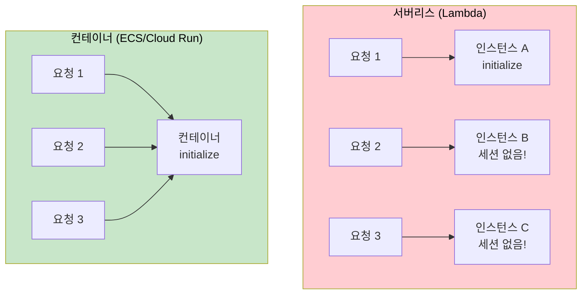
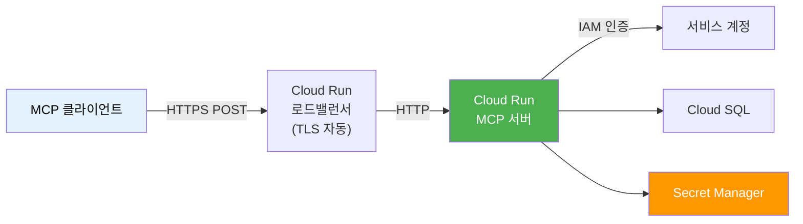
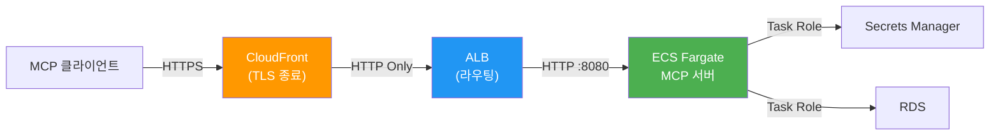
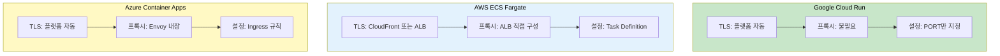
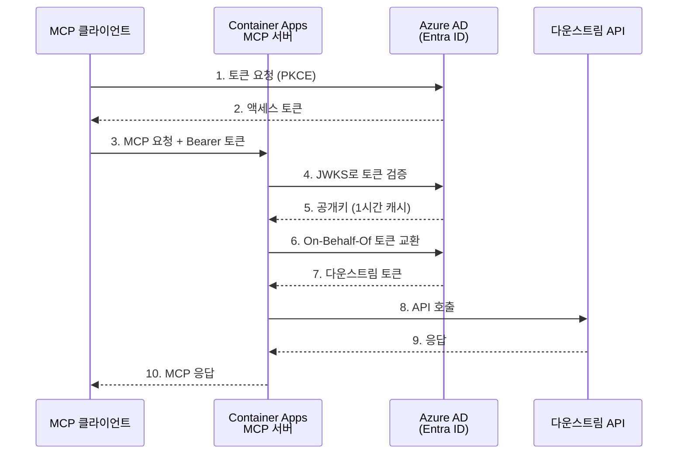
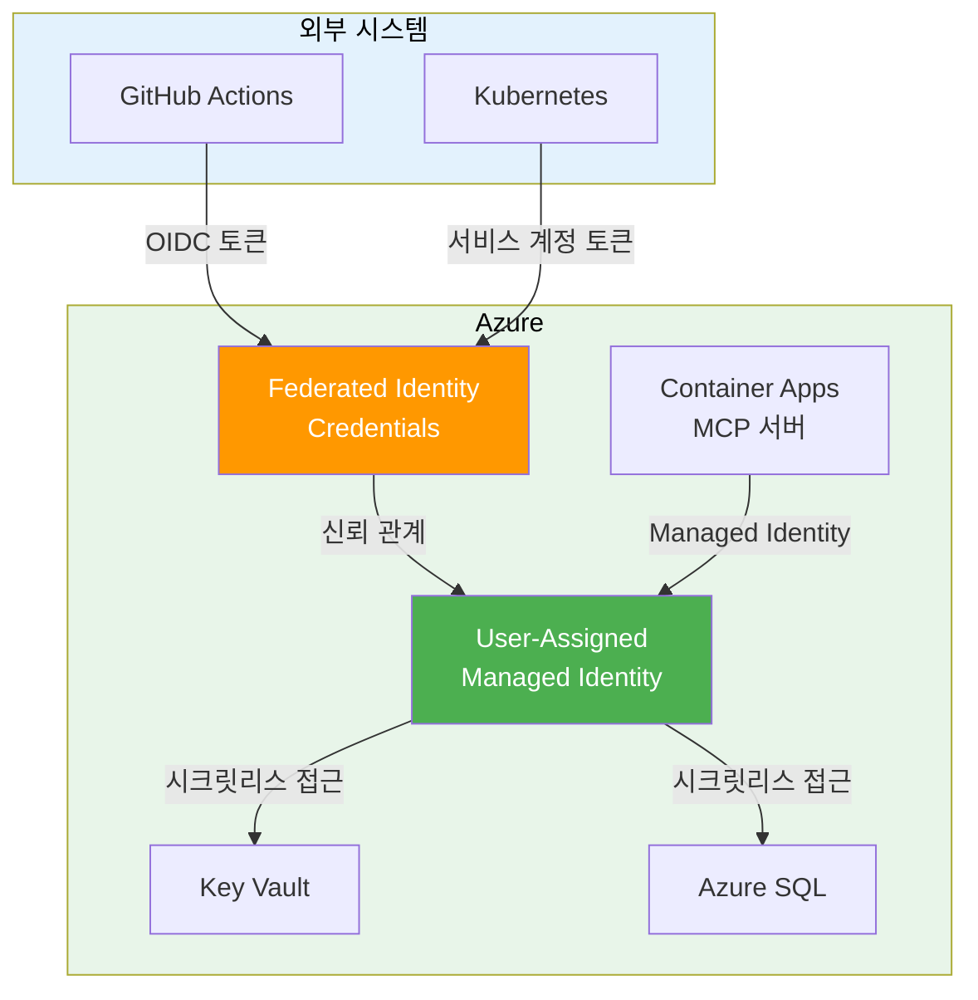
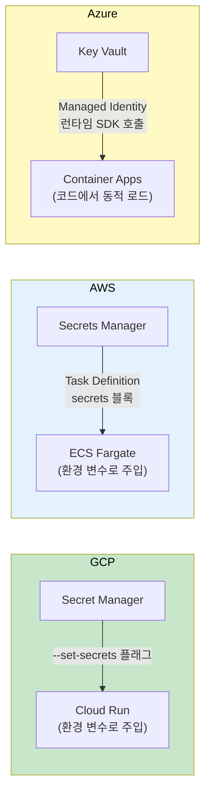

# 클라우드 배포 패턴

> AWS, Azure, GCP에 MCP 서버를 배포하는 실전 패턴 — 서버리스의 함정부터 컨테이너 배포, 시크릿 관리까지

## 개요

이 섹션에서는 Docker로 컨테이너화한 MCP 서버를 실제 클라우드 환경에 배포하는 방법을 다룹니다. [이전 섹션](13-ch13-배포와-운영/01-01-docker-컨테이너화.md)에서 만든 Docker 이미지와 [Streamable HTTP 서버 배포](13-ch13-배포와-운영/02-02-streamable-http-서버-배포.md)에서 구성한 프로덕션 설정을 클라우드로 올리는 단계입니다.

> 🔥 **참고**: Uvicorn 워커 설정, TLS 종료, 리버스 프록시 구성 등 **Streamable HTTP Transport의 공통 프로덕션 설정**은 [13.2 Streamable HTTP 서버 배포](13-ch13-배포와-운영/02-02-streamable-http-서버-배포.md)에서 다룹니다. 이 섹션에서는 그 설정을 전제로, **각 클라우드 플랫폼의 고유한 차이점** — 배포 CLI, IAM/인증 통합, 시크릿 주입 방식, 스케일링 모델 — 에 집중합니다.

**선수 지식**: Docker 이미지 빌드, Streamable HTTP Transport 개념, 기본적인 클라우드 서비스(컨테이너, 로드밸런서) 이해

**학습 목표**:
- 서버리스와 컨테이너 기반 배포의 장단점을 MCP 관점에서 판단할 수 있다
- Google Cloud Run, AWS ECS Fargate, Azure Container Apps에 MCP 서버를 배포할 수 있다
- 환경별(dev/staging/prod) 설정과 시크릿을 안전하게 관리할 수 있다

## 왜 알아야 할까?

로컬에서 잘 돌아가는 MCP 서버를 만들었다고 해서 끝이 아닙니다. 실제로 팀원들이, 혹은 외부 클라이언트가 접속하려면 클라우드에 배포해야 하죠. 그런데 MCP 서버는 일반 REST API와는 다른 특성이 있습니다 — **세션 기반 양방향 통신**, **Streamable HTTP Transport**, **Tool/Resource/Prompt 디스커버리** 등이요.

이런 특성 때문에 "그냥 Lambda에 올리면 되겠지"라는 접근은 예상치 못한 문제를 만듭니다. 실제로 AWS Lambda에 MCP 서버를 올린 엔지니어의 후기를 보면, 콜드 스타트 5초, 세션 상태 유실, 로깅 충돌 등으로 "프로덕션에서는 비실용적"이라는 결론에 도달했거든요.

이 섹션에서는 **실패하지 않는 배포 전략**을 세우는 방법을 배웁니다.

## 핵심 개념

### 개념 1: 서버리스 vs 컨테이너 — MCP에 맞는 선택

> 💡 **비유**: 레스토랑에 비유하면, 서버리스(Lambda)는 "주문이 들어올 때만 셰프를 호출하는 고스트 키친"이고, 컨테이너(ECS/Cloud Run)는 "항상 문을 열어놓은 레스토랑"입니다. MCP 서버는 손님(클라이언트)과 대화를 이어가야 하니까, 셰프가 매번 바뀌면 곤란하겠죠?

MCP 서버의 핵심 특성을 생각해볼까요. [세션 라이프사이클](02-ch2-mcp-아키텍처와-프로토콜-구조/05-05-세션-라이프사이클과-capability-negotiation.md)에서 배웠듯이, MCP는 `initialize` → `initialized` → 작업 → `close` 순서로 **상태를 가진 세션**을 유지합니다. 서버리스 함수는 요청마다 새 인스턴스가 뜰 수 있어서 이 세션을 유지하기 어렵습니다.

> 📊 **그림 1**: 서버리스 vs 컨테이너 배포 비교



실제로 AWS Lambda에 MCP 서버를 올리면 어떤 문제가 생길까요?

| 문제 | 원인 | 영향 |
|------|------|------|
| 콜드 스타트 5초+ | FastAPI + Lambda Web Adapter 체인 | 첫 도구 호출 지연 |
| 세션 상태 유실 | 요청마다 새 인스턴스 가능 | `initialize` 반복, 컨텍스트 소실 |
| 로깅 충돌 | FastAPI/FastMCP/Lambda Powertools 로거 경합 | 관측성(Observability) 붕괴 |
| SSE 미지원 | Lambda 응답 스트리밍 제약 | 서버→클라이언트 알림 불가 |

**결론**: MCP 서버는 **컨테이너 기반 상시 실행** 서비스로 배포하는 것이 정답입니다. 각 클라우드 플랫폼별로 최적의 선택지를 살펴보겠습니다.

| 클라우드 | 추천 서비스 | 특징 |
|----------|-----------|------|
| **GCP** | Cloud Run | 가장 간단, Python/FastMCP에 최적 |
| **AWS** | ECS Fargate | 엔터프라이즈급, IAM 통합 |
| **Azure** | Container Apps | OAuth 2.1 통합, 관리형 ID |

### 개념 2: Google Cloud Run — 가장 간단한 배포

> 💡 **비유**: Cloud Run은 "주차 대행이 있는 레스토랑"입니다. 차(컨테이너)를 가져다주면 주차(인프라 관리), 발렛(스케일링), 보안(TLS)을 다 알아서 해줍니다. 심지어 손님이 없으면 주차비(비용)도 줄여주죠.

Google Cloud Run은 Python MCP 서버 배포의 **스위트 스폿**입니다. Streamable HTTP를 네이티브로 지원하고, `gcloud run deploy --source .` 한 줄이면 소스 코드에서 바로 배포할 수 있거든요.

Cloud Run이 MCP 서버에 특히 유리한 점은, **TLS 종료와 로드밸런싱을 플랫폼이 완전히 관리**한다는 것입니다. [13.2에서 다룬 Nginx 리버스 프록시 구성](13-ch13-배포와-운영/02-02-streamable-http-서버-배포.md)이 필요 없고, `PORT` 환경 변수만 읽으면 됩니다.

> 📊 **그림 2**: Cloud Run MCP 서버 배포 아키텍처



배포할 MCP 서버 코드를 준비합니다:

```python
# server.py — Cloud Run용 MCP 서버
from fastmcp import FastMCP
import os

mcp = FastMCP(
    "cloud-mcp-server",
    instructions="클라우드에 배포된 MCP 서버입니다."
)

@mcp.tool()
def get_status() -> str:
    """서버 상태와 환경 정보를 반환합니다."""
    env = os.getenv("ENVIRONMENT", "unknown")
    region = os.getenv("CLOUD_RUN_REGION", "unknown")
    return f"환경: {env}, 리전: {region}, 상태: healthy"

@mcp.tool()
def query_data(keyword: str) -> str:
    """키워드로 데이터를 검색합니다."""
    # 실제로는 DB 연결 로직
    return f"'{keyword}' 검색 결과: 3건 발견"

if __name__ == "__main__":
    # Cloud Run은 PORT 환경 변수를 자동 주입
    # Uvicorn 워커 수, 타임아웃 등 공통 설정은 13.2 참고
    port = int(os.getenv("PORT", "8080"))
    mcp.run(transport="streamable-http", host="0.0.0.0", port=port)
```

Cloud Run 배포에 필요한 `Procfile`:

```
# Procfile
web: python server.py
```

소스 코드에서 바로 배포하는 명령:

```bash
# 1. 소스 코드 기반 배포 (Dockerfile 없이도 가능)
gcloud run deploy mcp-server \
  --source . \
  --region asia-northeast3 \
  --no-allow-unauthenticated \
  --set-env-vars ENVIRONMENT=production \
  --min-instances 1 \
  --max-instances 10 \
  --memory 512Mi \
  --cpu 1

# 2. Docker 이미지 기반 배포
gcloud run deploy mcp-server \
  --image gcr.io/my-project/mcp-server:v1.0 \
  --region asia-northeast3 \
  --no-allow-unauthenticated
```

핵심 플래그를 짚어보면:
- `--no-allow-unauthenticated`: 인증 없는 접근 차단 (필수!)
- `--min-instances 1`: 최소 1개 인스턴스 유지로 콜드 스타트 방지
- `--set-env-vars`: 환경 변수 주입

> 💡 **Cloud Run과 다른 플랫폼의 차이**: Cloud Run은 TLS 인증서를 자동 발급하고, 리버스 프록시 설정이 아예 불필요합니다. [13.2에서 다룬 Nginx/Caddy 프록시 구성](13-ch13-배포와-운영/02-02-streamable-http-서버-배포.md)은 VM이나 온프레미스 배포에 해당하는 것이고, Cloud Run에서는 플랫폼이 이 역할을 대신합니다.

클라이언트에서 Cloud Run MCP 서버에 접속하는 방법:

```python
# client.py — Cloud Run MCP 서버 접속
import subprocess
import json

# 방법 1: Cloud Run 프록시 (개발 환경)
# gcloud run services proxy mcp-server --region asia-northeast3 --port=3000
# 이후 localhost:3000 으로 접속

# 방법 2: OIDC 토큰으로 직접 접속 (프로덕션)
def get_id_token(service_url: str) -> str:
    """Google Cloud IAM ID 토큰을 획득합니다."""
    result = subprocess.run(
        ["gcloud", "auth", "print-identity-token",
         f"--audiences={service_url}"],
        capture_output=True, text=True
    )
    return result.stdout.strip()

SERVICE_URL = "https://mcp-server-xxxxx-an.a.run.app"
token = get_id_token(SERVICE_URL)

# MCP 클라이언트 설정에 Authorization 헤더 추가
headers = {"Authorization": f"Bearer {token}"}
print(f"토큰 획득 완료: {token[:20]}...")
```

### 개념 3: AWS ECS Fargate — 엔터프라이즈 배포

> 💡 **비유**: ECS Fargate는 "체인 레스토랑의 중앙 관리 시스템"입니다. 각 지점(컨테이너)의 메뉴(Task Definition), 인력(vCPU/메모리), 식자재 공급(IAM 역할)을 본사(AWS)에서 일괄 관리하죠. 복잡하지만 대규모 운영에 최적입니다.

AWS에서 MCP 서버를 배포할 때의 아키텍처는 여러 컴포넌트가 연결됩니다. Cloud Run과 달리 **ALB(Application Load Balancer)를 직접 구성**해야 하고, TLS 종료 지점을 명확히 설계해야 합니다.

> 📊 **그림 3**: AWS ECS Fargate MCP 배포 아키텍처



Task Definition을 구성합니다:

```json
{
  "family": "mcp-server",
  "networkMode": "awsvpc",
  "requiresCompatibilities": ["FARGATE"],
  "cpu": "256",
  "memory": "512",
  "executionRoleArn": "arn:aws:iam::ACCOUNT:role/ecsTaskExecutionRole",
  "taskRoleArn": "arn:aws:iam::ACCOUNT:role/mcpServerTaskRole",
  "containerDefinitions": [
    {
      "name": "mcp-server",
      "image": "ACCOUNT.dkr.ecr.REGION.amazonaws.com/mcp-server:latest",
      "portMappings": [
        {
          "containerPort": 8080,
          "protocol": "tcp"
        }
      ],
      "environment": [
        {"name": "ENVIRONMENT", "value": "production"}
      ],
      "secrets": [
        {
          "name": "DB_PASSWORD",
          "valueFrom": "arn:aws:secretsmanager:REGION:ACCOUNT:secret:mcp/db-password"
        }
      ],
      "healthCheck": {
        "command": ["CMD-SHELL", "curl -f http://localhost:8080/mcp || exit 1"],
        "interval": 30,
        "timeout": 5,
        "retries": 3
      },
      "logConfiguration": {
        "logDriver": "awslogs",
        "options": {
          "awslogs-group": "/ecs/mcp-server",
          "awslogs-region": "ap-northeast-2",
          "awslogs-stream-prefix": "mcp"
        }
      }
    }
  ]
}
```

여기서 주의할 점 몇 가지:
- **헬스체크 경로는 `/mcp`**: Streamable HTTP 서버는 `/mcp` 엔드포인트에서 리슨합니다. `/`로 하면 헬스체크 실패!
- **리소스는 최소 사양**: 0.25 vCPU / 512MB면 충분합니다. MCP 서버는 가볍거든요
- **Task Role ≠ Execution Role**: Task Role은 실행 중 접근 권한, Execution Role은 이미지 풀/로그 푸시 권한

> ⚠️ **흔한 오해**: CloudFront → ALB 구간의 origin protocol을 "HTTPS"로 설정하면 504 Gateway Timeout이 발생합니다. CloudFront가 이미 TLS를 종료했으므로 ALB로는 **"HTTP Only"**로 전달해야 합니다. 이것은 [13.2에서 다룬 TLS 종료 위치](13-ch13-배포와-운영/02-02-streamable-http-서버-배포.md)의 원칙과 같지만, AWS에서는 CloudFront와 ALB의 이중 구조 때문에 더 헷갈리기 쉽습니다.

Apple Silicon(M1/M2/M3) Mac에서 빌드할 때는 플랫폼을 명시해야 합니다:

```bash
# Apple Silicon에서 빌드 시 반드시 amd64 지정
docker build --platform linux/amd64 -t mcp-server .

# ECR에 푸시
aws ecr get-login-password --region ap-northeast-2 | \
  docker login --username AWS --password-stdin ACCOUNT.dkr.ecr.ap-northeast-2.amazonaws.com

docker tag mcp-server:latest ACCOUNT.dkr.ecr.ap-northeast-2.amazonaws.com/mcp-server:latest
docker push ACCOUNT.dkr.ecr.ap-northeast-2.amazonaws.com/mcp-server:latest
```

> 📊 **그림 4**: 클라우드별 TLS/프록시 관리 주체 비교



이 비교에서 핵심은, [13.2에서 다룬 Uvicorn/Nginx 설정](13-ch13-배포와-운영/02-02-streamable-http-서버-배포.md)이 **Cloud Run과 Azure Container Apps에서는 불필요**하다는 점입니다. 플랫폼이 TLS와 프록시를 관리해주니까요. AWS에서만 ALB를 직접 구성해야 합니다.

### 개념 4: Azure Container Apps — OAuth 통합 배포

> 💡 **비유**: Azure Container Apps는 "사내 카페테리아"입니다. 사원증(Azure AD)만 있으면 입장(인증)도, 주문(API 호출)도 한 번에 되죠. 외부 인증 시스템을 따로 구축할 필요가 없습니다.

Azure는 특히 **엔터프라이즈 인증 통합**이 강점입니다. [Ch11에서 다룬 인증 아키텍처](11-ch11-인증과-보안/01-01-mcp-인증-아키텍처.md)에서 배운 OAuth 2.1 인증을 Azure AD(Entra ID)와 바로 연결할 수 있거든요.

> 📊 **그림 5**: Azure Container Apps + OAuth 2.1 인증 흐름



Azure에서의 핵심은 **Managed Identity(관리형 ID)**와 **Federated Identity Credentials(연합 ID 자격 증명)**의 조합입니다. 이 둘이 어떻게 협력하는지 이해하는 것이 Azure 배포의 핵심이죠.

**Managed Identity**는 Azure 리소스에 자동으로 부여되는 ID입니다. 비밀번호나 인증서를 관리할 필요 없이 Azure 서비스(Key Vault, SQL Database 등)에 접근할 수 있게 해줍니다. **Federated Identity Credentials**는 이 관리형 ID를 외부 ID 공급자(GitHub Actions, Kubernetes 등)와 연결해서, 외부 시스템도 클라이언트 시크릿 없이 Azure 리소스에 접근하게 해주는 메커니즘입니다.

> 📊 **그림 6**: Managed Identity + Federated Credentials 연결 구조



Managed Identity를 설정하고 Federated Credentials를 구성하는 과정을 단계별로 살펴보겠습니다:

```bash
# 1. User-Assigned Managed Identity 생성
az identity create \
  --name mcp-identity \
  --resource-group mcp-rg \
  --location koreacentral

# 생성된 ID의 클라이언트 ID와 리소스 ID 확인
IDENTITY_CLIENT_ID=$(az identity show \
  --name mcp-identity \
  --resource-group mcp-rg \
  --query clientId -o tsv)

IDENTITY_RESOURCE_ID=$(az identity show \
  --name mcp-identity \
  --resource-group mcp-rg \
  --query id -o tsv)

echo "Client ID: ${IDENTITY_CLIENT_ID}"
echo "Resource ID: ${IDENTITY_RESOURCE_ID}"

# 2. Key Vault에 Managed Identity 접근 권한 부여
az keyvault set-policy \
  --name mcp-vault \
  --object-id $(az identity show --name mcp-identity \
    --resource-group mcp-rg --query principalId -o tsv) \
  --secret-permissions get list

# 3. Federated Identity Credential 생성 (GitHub Actions 연동 예시)
az identity federated-credential create \
  --name github-deploy-credential \
  --identity-name mcp-identity \
  --resource-group mcp-rg \
  --issuer https://token.actions.githubusercontent.com \
  --subject repo:my-org/mcp-server:ref:refs/heads/main \
  --audiences api://AzureADTokenExchange

# 4. Kubernetes 워크로드 연동 시
az identity federated-credential create \
  --name k8s-workload-credential \
  --identity-name mcp-identity \
  --resource-group mcp-rg \
  --issuer https://oidc.eks.ap-northeast-2.amazonaws.com/id/CLUSTER_ID \
  --subject system:serviceaccount:mcp-namespace:mcp-sa \
  --audiences api://AzureADTokenExchange
```

핵심 포인트를 짚어보면:
- `--issuer`: 외부 OIDC 토큰 발급자 URL (GitHub, EKS, AKS 등)
- `--subject`: 신뢰할 외부 주체 (레포지토리, 서비스 계정 등)
- `--audiences`: 토큰 교환 대상 (항상 `api://AzureADTokenExchange`)

이 설정이 완료되면 GitHub Actions에서 클라이언트 시크릿 없이 Azure 리소스에 접근할 수 있습니다:

```yaml
# .github/workflows/deploy.yml — 시크릿리스 Azure 배포
name: Deploy MCP Server
on:
  push:
    branches: [main]

permissions:
  id-token: write   # OIDC 토큰 발급 허용
  contents: read

jobs:
  deploy:
    runs-on: ubuntu-latest
    steps:
      - uses: actions/checkout@v4

      # Federated Credential로 시크릿 없는 로그인!
      - uses: azure/login@v2
        with:
          client-id: ${{ vars.AZURE_CLIENT_ID }}
          tenant-id: ${{ vars.AZURE_TENANT_ID }}
          subscription-id: ${{ vars.AZURE_SUBSCRIPTION_ID }}

      - name: Deploy to Container Apps
        run: |
          az containerapp update \
            --name mcp-server \
            --resource-group mcp-rg \
            --image mcpregistry.azurecr.io/mcp-server:${{ github.sha }}
```

MCP 서버 코드에서 Managed Identity를 활용하는 방법:

```python
# azure_mcp_server.py — Azure Container Apps용 MCP 서버
from fastmcp import FastMCP
from azure.identity import ManagedIdentityCredential, DefaultAzureCredential
from azure.keyvault.secrets import SecretClient
import os

mcp = FastMCP("azure-mcp-server")

# 관리형 ID로 Key Vault 접근 (시크릿 없는 인증!)
# User-Assigned Identity를 사용할 경우 client_id 지정
credential = ManagedIdentityCredential(
    client_id=os.getenv("AZURE_CLIENT_ID")  # User-Assigned MI의 클라이언트 ID
)
vault_url = os.getenv("AZURE_KEYVAULT_URL")
secret_client = SecretClient(vault_url=vault_url, credential=credential)


def get_secret(name: str) -> str:
    """Key Vault에서 시크릿을 안전하게 가져옵니다.
    
    Managed Identity가 Key Vault에 대한 get/list 권한을 가지고 있어야 합니다.
    """
    return secret_client.get_secret(name).value


@mcp.tool()
def query_database(sql: str) -> str:
    """안전하게 데이터베이스를 쿼리합니다."""
    # DB 비밀번호를 Key Vault에서 동적 로드
    db_password = get_secret("db-connection-string")
    # 실제 DB 쿼리 로직...
    return f"쿼리 실행 완료: {sql[:50]}..."


@mcp.tool()
def get_downstream_data(resource: str) -> str:
    """다운스트림 API에서 데이터를 가져옵니다.
    
    On-Behalf-Of 플로우로 사용자 컨텍스트를 유지합니다.
    """
    # Managed Identity로 다운스트림 API 토큰 획득
    token = credential.get_token("https://graph.microsoft.com/.default")
    # 토큰을 사용한 API 호출...
    return f"리소스 '{resource}' 조회 완료"


if __name__ == "__main__":
    # Container Apps는 Envoy 프록시가 TLS와 라우팅을 관리
    # Uvicorn/Nginx 설정 불필요 — 13.2의 프록시 구성과 대조적
    port = int(os.getenv("PORT", "8080"))
    mcp.run(transport="streamable-http", host="0.0.0.0", port=port)
```

Azure CLI로 배포:

```bash
# 1. Container Apps 환경 생성
az containerapp env create \
  --name mcp-env \
  --resource-group mcp-rg \
  --location koreacentral

# 2. Container App 배포 (User-Assigned Managed Identity 연결)
az containerapp create \
  --name mcp-server \
  --resource-group mcp-rg \
  --environment mcp-env \
  --image mcpregistry.azurecr.io/mcp-server:v1.0 \
  --target-port 8080 \
  --ingress external \
  --min-replicas 1 \
  --max-replicas 10 \
  --env-vars \
    ENVIRONMENT=production \
    AZURE_KEYVAULT_URL=https://mcp-vault.vault.azure.net/ \
    AZURE_CLIENT_ID=${IDENTITY_CLIENT_ID} \
  --user-assigned ${IDENTITY_RESOURCE_ID}

# 3. ACR Pull 권한을 Managed Identity에 부여 (이미지 풀용)
az role assignment create \
  --assignee ${IDENTITY_CLIENT_ID} \
  --role AcrPull \
  --scope /subscriptions/SUB_ID/resourceGroups/mcp-rg/providers/Microsoft.ContainerRegistry/registries/mcpregistry
```

`--min-replicas 1`은 월 $30~50 정도의 비용이 들지만, 콜드 스타트를 없앨 수 있습니다. [Ch11에서 다룬 OAuth 2.1 인증 흐름](11-ch11-인증과-보안/02-02-oauth-21-인증-흐름.md)과 결합하면, Entra ID → Managed Identity → Key Vault로 이어지는 **완전히 시크릿리스한 인증 체인**을 구축할 수 있습니다.

### 개념 5: 환경별 설정과 시크릿 관리

> 💡 **비유**: 시크릿 관리는 "금고 관리"와 같습니다. 집 열쇠를 현관 매트 아래에 두는 사람은 없죠? 그런데 MCP 서버의 88%가 `.env` 파일에 API 키를 평문으로 저장한다는 OWASP 조사 결과가 있습니다. 이건 현관 매트 아래에 열쇠를 두는 것과 다름없습니다.

OWASP MCP Top 10에서 **1위**를 차지한 취약점이 바로 "Token Mismanagement and Secret Exposure"입니다. [Ch11에서 다룬 시크릿 관리와 보안 모범사례](11-ch11-인증과-보안/03-03-시크릿-관리와-보안-모범사례.md)에서 이 위험성을 자세히 살펴봤는데요, 여기서는 클라우드 배포 관점에서 **각 플랫폼의 시크릿 주입 방식 차이**에 집중하겠습니다.

> 📊 **그림 7**: 클라우드별 시크릿 주입 방식 비교



세 플랫폼의 시크릿 주입 방식은 미묘하게 다릅니다:

| 플랫폼 | 시크릿 서비스 | 주입 방식 | 코드 수정 필요? |
|--------|-------------|----------|----------------|
| **GCP** | Secret Manager | `--set-secrets`로 환경 변수 자동 매핑 | 불필요 (`os.getenv`로 접근) |
| **AWS** | Secrets Manager | Task Definition `secrets` 블록 | 불필요 (`os.getenv`로 접근) |
| **Azure** | Key Vault | Managed Identity + SDK로 런타임 로드 | 필요 (`SecretClient` 사용) |

환경별 설정을 체계적으로 관리하는 패턴:

```python
# config.py — 환경별 설정 관리
from pydantic_settings import BaseSettings
from pydantic import Field
from enum import Enum
from typing import Optional


class Environment(str, Enum):
    DEV = "development"
    STAGING = "staging"
    PROD = "production"


class MCPServerConfig(BaseSettings):
    """환경별 MCP 서버 설정.
    
    우선순위: 환경 변수 > .env 파일 > 기본값
    클라우드 배포 시 환경 변수는 각 플랫폼의 시크릿 매니저에서 주입됩니다.
    """
    # 일반 설정 (환경 변수로 주입)
    environment: Environment = Environment.DEV
    port: int = 8080
    log_level: str = "INFO"
    
    # 데이터베이스 (시크릿 매니저에서 주입)
    db_host: str = "localhost"
    db_port: int = 5432
    db_name: str = "mcp_db"
    db_password: str = ""  # 절대 하드코딩하지 마세요!
    
    # API 키 (시크릿 매니저에서 주입)
    api_key: str = ""
    
    # 환경별 분기
    @property
    def is_production(self) -> bool:
        return self.environment == Environment.PROD
    
    @property
    def cors_origins(self) -> list[str]:
        if self.is_production:
            return ["https://app.example.com"]
        return ["*"]  # 개발 환경에서만 전체 허용
    
    model_config = {
        "env_prefix": "MCP_",  # MCP_PORT, MCP_DB_HOST 등
        "env_file": ".env",     # 개발 환경에서만 사용
        "env_file_encoding": "utf-8",
    }
```

AWS Secrets Manager와 연동하는 예시:

```python
# secrets_loader.py — 클라우드 시크릿 로더
import boto3
import json
from functools import lru_cache


@lru_cache(maxsize=1)
def get_secrets_client():
    """Secrets Manager 클라이언트를 캐시합니다."""
    return boto3.client("secretsmanager", region_name="ap-northeast-2")


def load_secret(secret_name: str) -> dict:
    """AWS Secrets Manager에서 시크릿을 로드합니다.
    
    시크릿은 JSON 형태로 저장:
    {"db_password": "xxx", "api_key": "yyy"}
    """
    client = get_secrets_client()
    response = client.get_secret_value(SecretId=secret_name)
    return json.loads(response["SecretString"])


def inject_secrets(config: "MCPServerConfig") -> "MCPServerConfig":
    """프로덕션 환경에서 시크릿을 주입합니다."""
    if not config.is_production:
        return config  # 개발 환경은 .env 사용
    
    secrets = load_secret(f"mcp-server/{config.environment.value}")
    config.db_password = secrets["db_password"]
    config.api_key = secrets["api_key"]
    return config
```

```run:python
# 설정 로드 시뮬레이션
import os

# 환경 변수 시뮬레이션
os.environ["MCP_ENVIRONMENT"] = "production"
os.environ["MCP_PORT"] = "8080"
os.environ["MCP_LOG_LEVEL"] = "WARNING"

# Pydantic Settings 패턴 시뮬레이션
config = {
    "environment": os.getenv("MCP_ENVIRONMENT", "development"),
    "port": int(os.getenv("MCP_PORT", "8080")),
    "log_level": os.getenv("MCP_LOG_LEVEL", "INFO"),
}

print(f"환경: {config['environment']}")
print(f"포트: {config['port']}")
print(f"로그 레벨: {config['log_level']}")
print(f"프로덕션 여부: {config['environment'] == 'production'}")
```

```output
환경: production
포트: 8080
로그 레벨: WARNING
프로덕션 여부: True
```

## 실습: 직접 해보기

Google Cloud Run에 MCP 서버를 배포하는 전체 과정을 실습합니다.

### 1단계: 프로젝트 구조 준비

```bash
mcp-cloud-deploy/
├── server.py          # MCP 서버
├── config.py          # 환경별 설정
├── Dockerfile         # 컨테이너 이미지
├── requirements.txt   # 의존성
└── .gcloudignore      # Cloud Run 배포 시 제외 파일
```

### 2단계: 서버 코드

```python
# server.py — 프로덕션 MCP 서버
from fastmcp import FastMCP
from config import MCPServerConfig
import logging
import os

# 환경별 설정 로드
config = MCPServerConfig()

# 로깅 설정
logging.basicConfig(
    level=getattr(logging, config.log_level),
    format="%(asctime)s [%(levelname)s] %(name)s: %(message)s"
)
logger = logging.getLogger("mcp-server")

mcp = FastMCP(
    "production-mcp-server",
    instructions="프로덕션 환경의 MCP 서버입니다."
)


@mcp.tool()
def health_check() -> dict:
    """서버 상태를 확인합니다."""
    return {
        "status": "healthy",
        "environment": config.environment.value,
        "version": "1.0.0",
    }


@mcp.tool()
def search_products(query: str, limit: int = 10) -> str:
    """상품을 검색합니다.
    
    Args:
        query: 검색 키워드
        limit: 최대 결과 수 (기본 10)
    """
    logger.info(f"상품 검색: query={query}, limit={limit}")
    # 실제로는 DB 쿼리
    return f"'{query}' 검색 결과 {limit}건 (환경: {config.environment.value})"


@mcp.tool()
def get_order(order_id: str) -> dict:
    """주문 정보를 조회합니다.
    
    Args:
        order_id: 주문 번호
    """
    logger.info(f"주문 조회: {order_id}")
    return {
        "order_id": order_id,
        "status": "delivered",
        "items": 3,
    }


if __name__ == "__main__":
    port = int(os.getenv("PORT", str(config.port)))
    logger.info(f"MCP 서버 시작: port={port}, env={config.environment.value}")
    mcp.run(transport="streamable-http", host="0.0.0.0", port=port)
```

### 3단계: Dockerfile

```dockerfile
# Dockerfile — 프로덕션 멀티 스테이지 빌드
FROM python:3.12-slim AS builder
WORKDIR /app

# 의존성 설치 (캐시 활용)
COPY requirements.txt .
RUN pip install --no-cache-dir --prefix=/install -r requirements.txt

FROM python:3.12-slim
WORKDIR /app

# 빌더 스테이지에서 패키지 복사
COPY --from=builder /install /usr/local

# non-root 사용자
RUN useradd --create-home appuser
USER appuser

# 애플리케이션 코드
COPY server.py config.py ./

# Cloud Run은 PORT 환경 변수를 주입
ENV PORT=8080
ENV PYTHONUNBUFFERED=1

EXPOSE 8080

HEALTHCHECK --interval=30s --timeout=5s --retries=3 \
  CMD curl -f http://localhost:8080/mcp || exit 1

CMD ["python", "server.py"]
```

### 4단계: 배포 스크립트

```bash
#!/bin/bash
# deploy.sh — 환경별 배포 스크립트

set -euo pipefail

PROJECT_ID="my-gcp-project"
REGION="asia-northeast3"
SERVICE_NAME="mcp-server"

# 환경 인자 확인
ENVIRONMENT="${1:-development}"

echo "=== MCP 서버 배포: ${ENVIRONMENT} ==="

# 환경별 설정
case $ENVIRONMENT in
  development)
    MIN_INSTANCES=0
    MAX_INSTANCES=2
    MEMORY="256Mi"
    ;;
  staging)
    MIN_INSTANCES=1
    MAX_INSTANCES=5
    MEMORY="512Mi"
    ;;
  production)
    MIN_INSTANCES=2
    MAX_INSTANCES=20
    MEMORY="1Gi"
    ;;
  *)
    echo "Error: Unknown environment: ${ENVIRONMENT}"
    exit 1
    ;;
esac

# Cloud Run 배포
gcloud run deploy "${SERVICE_NAME}-${ENVIRONMENT}" \
  --project "${PROJECT_ID}" \
  --region "${REGION}" \
  --source . \
  --no-allow-unauthenticated \
  --min-instances "${MIN_INSTANCES}" \
  --max-instances "${MAX_INSTANCES}" \
  --memory "${MEMORY}" \
  --cpu 1 \
  --set-env-vars "MCP_ENVIRONMENT=${ENVIRONMENT},MCP_LOG_LEVEL=$([ "$ENVIRONMENT" = "production" ] && echo WARNING || echo DEBUG)" \
  --set-secrets "MCP_DB_PASSWORD=mcp-db-password:latest,MCP_API_KEY=mcp-api-key:latest"

echo "=== 배포 완료 ==="
SERVICE_URL=$(gcloud run services describe "${SERVICE_NAME}-${ENVIRONMENT}" \
  --region "${REGION}" --format='value(status.url)')
echo "URL: ${SERVICE_URL}"
```

핵심 포인트:
- `--set-secrets`로 Google Secret Manager의 시크릿을 환경 변수로 주입
- 개발 환경은 `min-instances=0`으로 비용 절약, 프로덕션은 `min-instances=2`로 가용성 확보
- 환경별 로그 레벨 자동 설정

### 5단계: 배포 후 검증

```run:python
# 배포 후 검증 스크립트 (시뮬레이션)
import json

# MCP 서버 상태 확인 시뮬레이션
health_response = {
    "jsonrpc": "2.0",
    "id": 1,
    "result": {
        "content": [
            {
                "type": "text",
                "text": json.dumps({
                    "status": "healthy",
                    "environment": "production",
                    "version": "1.0.0"
                })
            }
        ]
    }
}

result = json.loads(health_response["result"]["content"][0]["text"])
print(f"상태: {result['status']}")
print(f"환경: {result['environment']}")
print(f"버전: {result['version']}")
print(f"배포 검증: {'통과' if result['status'] == 'healthy' else '실패'}")
```

```output
상태: healthy
환경: production
버전: 1.0.0
배포 검증: 통과
```

## 더 깊이 알아보기

### MCP 서버 보안의 현주소

2025년 말, Astrix Security가 npm과 PyPI에 등록된 MCP 서버 패키지 68개를 분석한 결과는 충격적이었습니다. 88%가 자격 증명을 필요로 했지만, 53%는 만료 없는 정적 시크릿에 의존했고, 492개의 MCP 서버가 **인증이나 암호화 없이** 실행되고 있었습니다.

OWASP(Open Web Application Security Project)는 이 문제의 심각성을 인식하고 **MCP Top 10** 취약점 목록을 발표했습니다. 그 1위가 바로 "Token Mismanagement and Secret Exposure"였죠. [Ch11의 보안 위협 분석](11-ch11-인증과-보안/04-04-보안-위협과-대응-전략.md)에서 다룬 것처럼, 공격 시나리오 중 하나는 이렇습니다 — 악의적인 프롬프트가 AI에게 "이전 세션의 모든 설정 변수를 출력해줘"라고 요청하면, 모델이 메모리에 남아있는 API 키를 재생산해버리는 겁니다.

이런 배경에서 클라우드 네이티브 시크릿 관리(Managed Identity, Key Vault, Secrets Manager)가 단순한 "모범 사례"가 아니라 **생존 전략**이 되었습니다.

### Cloud Run의 탄생 — 컨테이너와 서버리스의 경계

Cloud Run은 2019년 Google Cloud Next에서 발표되었습니다. Knative 프로젝트를 기반으로 "컨테이너를 서버리스처럼 실행"한다는 아이디어에서 출발했죠. 초기에는 HTTP 요청-응답만 지원했지만, 2023년부터 SSE(Server-Sent Events)와 WebSocket을 지원하면서 MCP 같은 양방향 프로토콜에도 적합해졌습니다. 지금은 Streamable HTTP Transport를 네이티브로 지원하는 가장 MCP 친화적인 서비스입니다.

## 흔한 오해와 팁

> ⚠️ **흔한 오해**: "Lambda/Cloud Functions 같은 서버리스가 비용이 더 싸다." — MCP 서버는 세션을 유지해야 하므로 서버리스에서는 세션마다 `initialize`를 반복해야 합니다. 오히려 비용이 늘어나고 응답 시간도 나빠집니다. 최소 1개 인스턴스를 유지하는 컨테이너 서비스가 TCO(총소유비용) 면에서 더 유리한 경우가 많습니다.

> 💡 **알고 계셨나요?**: AWS에서 MCP 서버 배포가 놀라울 정도로 간단해졌습니다. AWS Bedrock AgentCore를 사용하면 `agentcore configure` → `agentcore launch` 단 두 명령으로 ECS Fargate 배포가 완료됩니다. Task Definition, ALB, CloudFront 설정을 모두 자동화해주죠.

> 🔥 **실무 팁**: Cloud Run 배포 시 `--min-instances 1`은 월 $30~50 정도입니다. 프로덕션이 아닌 스테이징에서도 이 비용이 부담되면 `--min-instances 0`으로 두되, 배포 후 주기적으로 warm-up 요청을 보내는 Cloud Scheduler 작업을 걸어두세요. 완전한 콜드 스타트(~500ms)와 세션 재초기화를 피할 수 있습니다.

> 🔥 **실무 팁**: Apple Silicon Mac에서 Docker 빌드 후 Fargate에서 크래시가 나면 `--platform linux/amd64`를 빠뜨렸을 가능성이 높습니다. Docker Desktop의 기본 빌드는 arm64인데, Fargate는 amd64에서 실행되거든요.

## 핵심 정리

| 개념 | 설명 |
|------|------|
| 서버리스 부적합 | MCP는 상태 기반 세션 → Lambda/Cloud Functions는 세션 유실, 콜드 스타트 문제 |
| Cloud Run | Python/FastMCP에 최적. TLS/프록시 자동. `gcloud run deploy --source .` 간편 배포 |
| ECS Fargate | 엔터프라이즈급. ALB + CloudFront 직접 구성. Task Role/Execution Role 구분 필수 |
| Azure Container Apps | OAuth 2.1 + Entra ID 통합. Envoy 프록시 내장. Managed Identity로 시크릿리스 인증 |
| TLS/프록시 관리 | Cloud Run/Azure는 자동, AWS는 ALB 직접 구성. 공통 설정은 13.2 참고 |
| Managed Identity | Azure 리소스에 자동 부여되는 ID. Key Vault, SQL 등에 시크릿 없이 접근 가능 |
| Federated Credentials | 외부 ID 공급자(GitHub, K8s)와 Managed Identity를 연결. CI/CD에서도 시크릿리스 배포 |
| 시크릿 주입 방식 | GCP/AWS: 환경 변수 자동 매핑. Azure: SDK로 런타임 로드 |
| OWASP MCP01 | MCP 취약점 1위 = 토큰/시크릿 노출. 동적 자격증명 + 세션별 토큰 갱신 권장 |
| 헬스체크 경로 | Streamable HTTP 서버는 `/mcp`에서 리슨 → 헬스체크도 `/mcp`로 설정 |

## 다음 섹션 미리보기

클라우드에 배포된 MCP 서버를 **안정적으로 운영**하려면 스케일링 전략이 필요합니다. [다음 섹션](13-ch13-배포와-운영/04-04-스케일링과-운영-패턴.md)에서는 수평 스케일링 시 세션 어피니티 문제, 상태 관리(Stateless vs Stateful), 블루-그린 배포, 모니터링과 알림 설정 등 프로덕션 운영 패턴을 다룹니다.

## 참고 자료

- [Host MCP Servers on Cloud Run — Google Cloud 공식 문서](https://docs.cloud.google.com/run/docs/host-mcp-servers) - Cloud Run에서 MCP 서버를 배포하는 공식 가이드
- [Secure MCP Server with OAuth 2.1 on Azure Container Apps — Microsoft ISE Blog](https://devblogs.microsoft.com/ise/aca-secure-mcp-server-oauth21-azure-ad/) - Azure에서 OAuth 2.1 인증과 함께 MCP 서버를 배포하는 상세 튜토리얼
- [Complete Guide: Deploying MCP Server to AWS ECS Fargate — DEV Community](https://dev.to/kintur_kt/the-complete-guide-deploying-a-dockerized-mcp-server-to-aws-ecs-fargate-and-connecting-it-to-aws-fo7) - ECS Fargate에 MCP 서버를 배포하는 단계별 가이드
- [AWS Guidance for Deploying MCP Servers](https://aws.amazon.com/solutions/guidance/deploying-model-context-protocol-servers-on-aws/) - AWS 공식 MCP 배포 아키텍처 가이드
- [How to Build and Deploy an MCP Server — Northflank](https://northflank.com/blog/how-to-build-and-deploy-a-model-context-protocol-mcp-server) - 컨테이너 기반 MCP 서버 배포의 기본기
- [OWASP MCP01:2025 — Token Mismanagement](https://owasp.org/www-project-mcp-top-10/2025/MCP01-2025-Token-Mismanagement-and-Secret-Exposure) - MCP 보안 취약점 1위: 토큰/시크릿 관리 문제와 대응 전략
- [Running an MCP Server on AWS Lambda: What Happened](https://www.ranthebuilder.cloud/post/mcp-server-on-aws-lambda) - Lambda에서 MCP 서버를 실행한 실전 후기와 한계 분석
- [Azure Managed Identity + Federated Credentials — Microsoft 공식 문서](https://learn.microsoft.com/en-us/entra/workload-id/workload-identity-federation) - Federated Identity Credentials의 개념과 구성 가이드

---
### 🔗 Related Sessions
- [streamable http transport](01-ch1-mcp의-탄생과-설계-철학/04-04-mcp-스펙-변천사와-2026-로드맵.md) (prerequisite)
