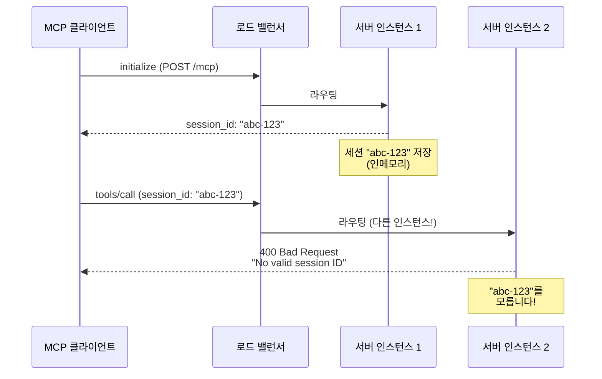
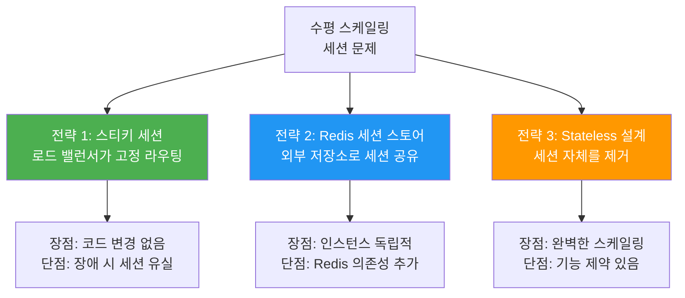
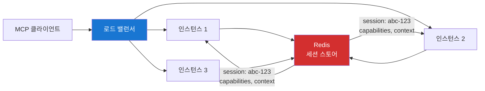
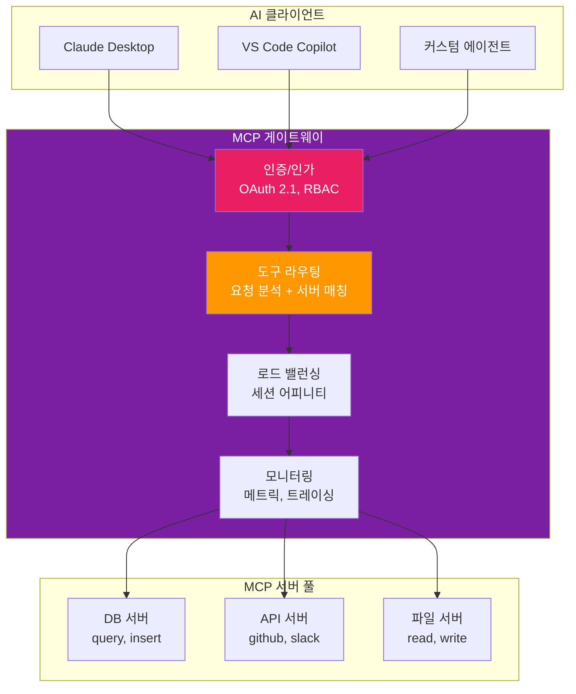
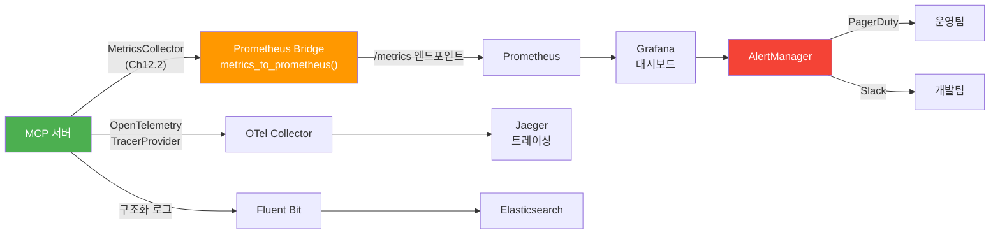
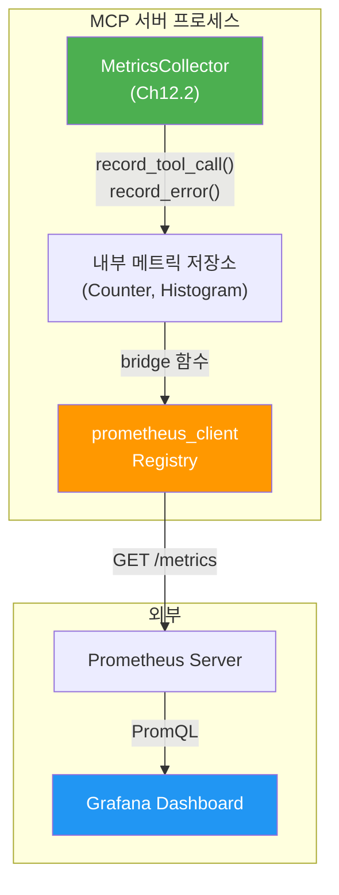
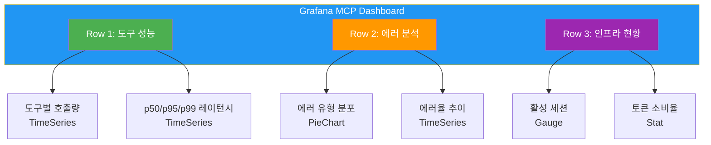
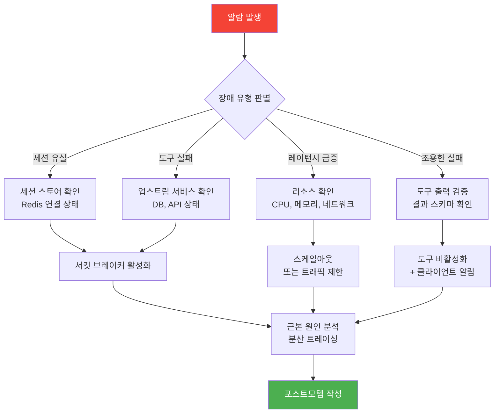

# 스케일링과 운영 패턴

> 수평 스케일링 시 세션 상태 관리, 로드 밸런싱, MCP 게이트웨이 패턴, 그리고 프로덕션 모니터링과 인시던트 대응까지

## 개요

이 섹션에서는 [클라우드에 배포한 MCP 서버](13-ch13-배포와-운영/03-03-클라우드-배포-패턴.md)를 **프로덕션 수준으로 운영**하는 방법을 다룹니다. 단일 인스턴스로는 트래픽을 감당할 수 없을 때 수평 스케일링이 필요한데, MCP의 세션 기반 프로토콜 특성 때문에 단순히 인스턴스를 늘리는 것만으로는 부족합니다.

**선수 지식**: [Docker 컨테이너화](13-ch13-배포와-운영/01-01-docker-컨테이너화.md), [Streamable HTTP 서버 배포](13-ch13-배포와-운영/02-02-streamable-http-서버-배포.md), [클라우드 배포 패턴](13-ch13-배포와-운영/03-03-클라우드-배포-패턴.md), [구조화된 로깅과 모니터링](12-ch12-에러-처리-로깅-테스트/02-02-구조화된-로깅과-모니터링.md)

**학습 목표**:
- 수평 스케일링 시 MCP 세션 상태 관리 전략(Stateless vs Redis)을 설계할 수 있다
- 로드 밸런서의 스티키 세션과 세션 어피니티를 구성할 수 있다
- MCP 게이트웨이 패턴의 구조와 역할을 이해하고 적용할 수 있다
- Ch12.2의 MetricsCollector를 Prometheus exporter로 통합하고 Grafana로 시각화할 수 있다
- 프로덕션 인시던트의 주요 유형과 대응 방법을 실행할 수 있다

## 왜 알아야 할까?

[이전 섹션](13-ch13-배포와-운영/03-03-클라우드-배포-패턴.md)에서 Cloud Run이나 ECS Fargate에 MCP 서버를 배포했다고 해봅시다. 처음에는 잘 동작합니다. 그런데 사용자가 늘어나면 어떻게 될까요?

Cloud Run이 자동으로 인스턴스를 3개로 늘렸습니다. 클라이언트 A가 인스턴스 1에서 `initialize`를 완료하고 세션을 열었는데, 다음 Tool 호출이 인스턴스 2로 라우팅되면? **"Bad Request: No valid session ID provided"** — 세션이 날아갔습니다.

이건 이론적인 문제가 아닙니다. Python MCP SDK의 `StreamableHTTPSessionManager`는 세션 정보를 **인메모리 딕셔너리**에 저장하거든요. 인스턴스가 바뀌면 당연히 세션을 찾을 수 없습니다. 실제로 GitHub 이슈([python-sdk #880](https://github.com/modelcontextprotocol/python-sdk/issues/880))에서 이 문제가 보고되었는데, 핵심 내용은 `StreamableHTTPSessionManager._sessions`가 프로세스 로컬 딕셔너리이므로 **멀티 인스턴스 환경에서 세션 공유가 불가능**하다는 것입니다. 커뮤니티에서는 Redis 외부화, stateless 모드 전환, 스티키 세션 등 다양한 우회 전략이 논의되고 있습니다.

이 섹션에서는 이 문제를 해결하는 세 가지 전략 — **스티키 세션**, **Redis 세션 스토어**, **Stateless 설계** — 을 배우고, 그 위에 게이트웨이 패턴, 모니터링, 인시던트 대응까지 프로덕션 운영의 전체 그림을 완성합니다.

## 핵심 개념

### 개념 1: 수평 스케일링의 세션 문제

> 💡 **비유**: 은행에 창구가 하나일 때는 문제 없습니다. 담당 직원이 고객의 서류를 보관하고 있으니까요. 그런데 창구를 5개로 늘리면? 고객이 2번 창구에서 대출 상담을 시작했는데, 다음에 와서 4번 창구에 앉으면 "저는 그 서류를 본 적이 없는데요"라는 답이 돌아옵니다. MCP의 세션 문제가 정확히 이겁니다.

MCP의 Streamable HTTP Transport는 본질적으로 **상태를 가진(stateful)** 프로토콜입니다. [세션 라이프사이클](02-ch2-mcp-아키텍처와-프로토콜-구조/05-05-세션-라이프사이클과-capability-negotiation.md)에서 배웠듯이, 클라이언트와 서버는 `initialize` 핸드셰이크를 통해 세션을 수립하고, 이 세션 안에서 도구 호출, 리소스 조회 등 모든 상호작용이 일어납니다.

> 📊 **그림 1**: 수평 스케일링 시 세션 유실 문제



Python SDK의 내부를 들여다보면 왜 이런 일이 생기는지 명확합니다:

```python
# Python MCP SDK 내부 (StreamableHTTPSessionManager)
class StreamableHTTPSessionManager:
    def __init__(self):
        # 세션이 인메모리 딕셔너리에 저장됨
        self._sessions: dict[str, ServerSession] = {}
    
    async def _get_session(self, session_id: str) -> ServerSession:
        session = self._sessions.get(session_id)
        if session is None:
            raise BadRequestError("No valid session ID provided")
        return session
```

인스턴스 1의 `_sessions` 딕셔너리에 있는 세션 정보는 인스턴스 2에서는 당연히 접근할 수 없습니다. 이 문제를 해결하는 세 가지 전략을 살펴보겠습니다.

> 📊 **그림 2**: 세션 문제 해결 전략 비교



### 개념 2: 전략 1 — 스티키 세션과 로드 밸런서 구성

> 💡 **비유**: 스티키 세션은 "단골 고객 시스템"입니다. 처음 방문한 창구 번호를 영수증에 찍어두고, 다음에 올 때도 같은 창구로 안내하는 거죠. 가장 쉬운 방법이지만, 그 창구 직원이 퇴근(인스턴스 종료)하면 서류를 다시 만들어야 합니다.

**스티키 세션(Sticky Session)** 은 로드 밸런서 단에서 같은 클라이언트의 요청을 항상 같은 인스턴스로 보내는 전략입니다. 서버 코드를 전혀 수정하지 않아도 되므로 가장 빠르게 적용할 수 있습니다.

**Kubernetes Ingress에서 세션 어피니티 설정**:

```yaml
# kubernetes/ingress.yaml
apiVersion: networking.k8s.io/v1
kind: Ingress
metadata:
  name: mcp-server-ingress
  annotations:
    # 쿠키 기반 세션 어피니티 활성화
    nginx.ingress.kubernetes.io/affinity: "cookie"
    nginx.ingress.kubernetes.io/affinity-mode: "persistent"
    # 세션 쿠키 설정
    nginx.ingress.kubernetes.io/session-cookie-name: "MCP_SESSION_ROUTE"
    nginx.ingress.kubernetes.io/session-cookie-expires: "3600"
    nginx.ingress.kubernetes.io/session-cookie-max-age: "3600"
    nginx.ingress.kubernetes.io/session-cookie-samesite: "Strict"
    nginx.ingress.kubernetes.io/session-cookie-secure: "true"
spec:
  rules:
  - host: mcp.example.com
    http:
      paths:
      - path: /mcp
        pathType: Prefix
        backend:
          service:
            name: mcp-server-service
            port:
              number: 8000
```

**AWS ALB 스티키 세션 설정** (Terraform):

```python
# terraform/alb.tf (HCL이지만 Python 독자를 위해 주석은 한국어)
# AWS ALB 타겟 그룹에 스티키 세션 설정
resource "aws_lb_target_group" "mcp" {
  name     = "mcp-server-tg"
  port     = 8000
  protocol = "HTTP"

  # 애플리케이션 기반 스티키 세션
  stickiness {
    type            = "app_cookie"
    cookie_name     = "MCP_SESSION_ROUTE"
    cookie_duration = 3600  # 1시간
    enabled         = true
  }

  health_check {
    path                = "/health"
    healthy_threshold   = 2
    unhealthy_threshold = 3
    timeout             = 5
    interval            = 15
  }
}
```

> ⚠️ **흔한 오해**: "스티키 세션이면 충분하지 않나요?" — 스티키 세션은 **인스턴스가 살아있는 동안만** 유효합니다. 오토스케일링으로 인스턴스가 축소되거나, 배포(deploy)로 인스턴스가 교체되면 해당 인스턴스의 모든 세션이 유실됩니다. 트래픽이 균등하게 분산되지 않는 **핫스팟 문제**도 발생할 수 있습니다.

| 장점 | 단점 |
|------|------|
| 서버 코드 변경 불필요 | 인스턴스 종료 시 세션 유실 |
| 구현이 가장 간단 | 트래픽 불균형(핫스팟) |
| 낮은 레이턴시 | 무중단 배포(Rolling Deploy) 어려움 |

### 개념 3: 전략 2 — Redis 세션 스토어

> 💡 **비유**: Redis 세션 스토어는 은행의 "중앙 서류 보관소"입니다. 어떤 창구 직원이든 보관소에서 고객 서류를 꺼내올 수 있으니, 창구가 바뀌어도 업무가 끊기지 않습니다. 보관소 유지 비용이 들지만, 직원이 퇴근해도 서류가 사라지지 않죠.

스티키 세션의 한계를 극복하려면 세션 데이터를 **인스턴스 외부**로 빼야 합니다. Redis는 밀리초 수준의 접근 속도와 TTL 기반 자동 만료를 제공하므로 MCP 세션 스토어로 적합합니다.

> 📊 **그림 3**: Redis 기반 세션 공유 아키텍처



커스텀 세션 매니저를 구현하는 방법을 살펴보겠습니다:

```python
# session_store.py — Redis 기반 MCP 세션 매니저
import json
import redis.asyncio as redis
from mcp.server.streamable_http_manager import StreamableHTTPSessionManager


class RedisSessionStore:
    """MCP 세션 데이터를 Redis에 저장/조회하는 스토어"""
    
    def __init__(
        self,
        redis_url: str = "redis://localhost:6379",
        key_prefix: str = "mcp:session:",
        ttl_seconds: int = 3600,  # 세션 TTL: 1시간
    ):
        self._redis = redis.from_url(redis_url, decode_responses=True)
        self._prefix = key_prefix
        self._ttl = ttl_seconds
    
    def _key(self, session_id: str) -> str:
        """Redis 키 생성"""
        return f"{self._prefix}{session_id}"
    
    async def save_session(self, session_id: str, data: dict) -> None:
        """세션 데이터를 Redis에 저장 (TTL 자동 갱신)"""
        key = self._key(session_id)
        await self._redis.set(
            key,
            json.dumps(data),
            ex=self._ttl,  # TTL 설정
        )
    
    async def load_session(self, session_id: str) -> dict | None:
        """Redis에서 세션 데이터 로드"""
        key = self._key(session_id)
        raw = await self._redis.get(key)
        if raw is None:
            return None
        # TTL 갱신 — 활성 세션은 만료되지 않도록
        await self._redis.expire(key, self._ttl)
        return json.loads(raw)
    
    async def delete_session(self, session_id: str) -> None:
        """세션 삭제 (클라이언트 종료 시)"""
        await self._redis.delete(self._key(session_id))
    
    async def heartbeat(self, session_id: str) -> bool:
        """세션 TTL 갱신 (활성 유지)"""
        key = self._key(session_id)
        return await self._redis.expire(key, self._ttl)
    
    async def list_active_sessions(self) -> list[str]:
        """현재 활성 세션 목록 조회 (모니터링용)"""
        cursor = 0
        sessions = []
        while True:
            cursor, keys = await self._redis.scan(
                cursor, match=f"{self._prefix}*", count=100
            )
            sessions.extend(
                k.removeprefix(self._prefix) for k in keys
            )
            if cursor == 0:
                break
        return sessions
    
    async def close(self) -> None:
        """Redis 연결 종료"""
        await self._redis.close()
```

> ⚠️ **SDK 내부 의존성 경고**: 이 `RedisSessionStore` 접근법은 `StreamableHTTPSessionManager`가 세션을 `_sessions` 딕셔너리에 저장한다는 **SDK v1의 내부 구현에 의존**합니다. SDK 업데이트 시 내부 구조가 변경되면 이 패턴이 깨질 수 있습니다. Python MCP SDK v2에서는 공식 세션 스토어 인터페이스(pluggable session backend)가 제공될 예정이므로, 현재는 이 우회 방식을 사용하되 [SDK v2 마이그레이션](13-ch13-배포와-운영/05-05-sdk-v2-마이그레이션과-미래-대비.md)에서 다루는 공식 API로 전환할 준비를 해두세요.

이 스토어를 MCP 서버에 통합하는 패턴:

```python
# server.py — Redis 세션 스토어를 활용하는 MCP 서버
from contextlib import asynccontextmanager
from mcp.server.fastmcp import FastMCP
from session_store import RedisSessionStore

# Redis 세션 스토어 초기화
session_store = RedisSessionStore(
    redis_url="redis://redis:6379",
    ttl_seconds=3600,
)

mcp = FastMCP(
    "production-server",
    stateless_http=True,  # Stateless 모드 활성화
)


@mcp.tool()
async def query_data(sql: str) -> str:
    """데이터베이스 쿼리 실행"""
    # 실제 구현에서는 세션별 컨텍스트를 Redis에서 로드
    return f"Query result for: {sql}"


# Starlette 앱에 세션 미들웨어 추가
from starlette.applications import Starlette
from starlette.middleware import Middleware
from starlette.requests import Request
from starlette.responses import JSONResponse
import uvicorn


async def health_check(request: Request) -> JSONResponse:
    """헬스체크 + 활성 세션 수 보고"""
    sessions = await session_store.list_active_sessions()
    return JSONResponse({
        "status": "healthy",
        "active_sessions": len(sessions),
    })


app = Starlette(
    routes=[
        # /health 엔드포인트 별도 등록
    ],
    on_shutdown=[session_store.close],
)

# MCP 라우트 마운트
app.mount("/", mcp.streamable_http_app())


if __name__ == "__main__":
    uvicorn.run(app, host="0.0.0.0", port=8000)
```

**L1/L2 캐시 패턴**으로 성능을 더 최적화할 수도 있습니다:

```python
# hybrid_session.py — 인메모리(L1) + Redis(L2) 하이브리드 세션
from functools import lru_cache


class HybridSessionStore:
    """L1(인메모리) + L2(Redis) 2단계 세션 스토어
    
    - L1: 현재 인스턴스의 세션 → 0ms 접근
    - L2: Redis의 세션 → 1~5ms 접근
    - L2 미스 → 세션 없음 (재인증 필요)
    """
    
    def __init__(self, redis_store: "RedisSessionStore"):
        self._local: dict[str, dict] = {}  # L1 캐시
        self._redis = redis_store           # L2 스토어
    
    async def get_session(self, session_id: str) -> dict | None:
        # L1: 인메모리 조회 (가장 빠름)
        if session_id in self._local:
            return self._local[session_id]
        
        # L2: Redis 조회 (L1 미스 시)
        data = await self._redis.load_session(session_id)
        if data is not None:
            # L1에 캐싱 (다음 조회부터 인메모리)
            self._local[session_id] = data
        return data
    
    async def save_session(self, session_id: str, data: dict) -> None:
        # L1 + L2 동시 저장
        self._local[session_id] = data
        await self._redis.save_session(session_id, data)
    
    async def remove_session(self, session_id: str) -> None:
        self._local.pop(session_id, None)
        await self._redis.delete_session(session_id)
```

```run:python
# 세션 스토어 접근 레이턴시 시뮬레이션
strategies = {
    "인메모리 (L1)": 0.1,      # 0.1ms
    "Redis (L2)": 2.5,          # 2.5ms
    "PostgreSQL": 15.0,          # 15ms
    "DynamoDB (리전 내)": 8.0,   # 8ms
}

print("세션 스토어 접근 레이턴시 비교:")
print("-" * 45)
for store, latency in strategies.items():
    bar = "█" * int(latency * 2)
    print(f"  {store:<22} {latency:>5.1f}ms  {bar}")
print("-" * 45)
print("💡 하이브리드(L1+L2) 패턴: 평균 0.5ms (L1 히트율 90% 가정)")
```

```output
세션 스토어 접근 레이턴시 비교:
---------------------------------------------
  인메모리 (L1)            0.1ms  
  Redis (L2)               2.5ms  █████
  PostgreSQL              15.0ms  ██████████████████████████████
  DynamoDB (리전 내)        8.0ms  ████████████████
---------------------------------------------
💡 하이브리드(L1+L2) 패턴: 평균 0.5ms (L1 히트율 90% 가정)
```

### 개념 4: MCP 게이트웨이 패턴

> 💡 **비유**: MCP 게이트웨이는 대형 쇼핑몰의 "안내 데스크"입니다. 어떤 매장(MCP 서버)이 어디에 있는지 알고, 고객의 멤버십(인증)을 확인하며, 혼잡한 매장에는 입장을 제한(rate limiting)합니다. 매장이 새로 입점하면 자동으로 안내 목록에 추가되고, 폐점하면 목록에서 빠지죠.

MCP 게이트웨이는 AI 클라이언트와 MCP 서버들 사이에 위치하는 **인프라 계층**입니다. 단순한 리버스 프록시를 넘어, MCP 프로토콜을 이해하고 도구 단위 라우팅, 인증, 모니터링을 제공합니다.

> 📊 **그림 4**: MCP 게이트웨이 아키텍처



게이트웨이의 핵심 기능들을 살펴보겠습니다:

```python
# gateway/router.py — MCP 게이트웨이의 도구 라우팅 로직
from dataclasses import dataclass, field
import httpx
import asyncio
from typing import Any


@dataclass
class MCPServerInfo:
    """등록된 MCP 서버 정보"""
    name: str
    url: str
    tools: list[str]           # 이 서버가 제공하는 도구 목록
    health_status: str = "unknown"
    active_sessions: int = 0
    max_sessions: int = 100


class ToolRouter:
    """도구 이름을 기반으로 적절한 MCP 서버로 라우팅"""
    
    def __init__(self):
        # 도구 이름 → 서버 매핑
        self._tool_map: dict[str, list[MCPServerInfo]] = {}
        self._servers: dict[str, MCPServerInfo] = {}
    
    def register_server(self, server: MCPServerInfo) -> None:
        """MCP 서버 등록 — 서버가 제공하는 도구를 라우팅 맵에 추가"""
        self._servers[server.name] = server
        for tool in server.tools:
            if tool not in self._tool_map:
                self._tool_map[tool] = []
            self._tool_map[tool].append(server)
    
    def route(self, tool_name: str) -> MCPServerInfo | None:
        """도구 이름으로 최적 서버 선택 (least-connections 기반)"""
        candidates = self._tool_map.get(tool_name, [])
        # 건강한 서버만 필터링
        healthy = [s for s in candidates if s.health_status == "healthy"]
        if not healthy:
            return None
        # 활성 세션이 가장 적은 서버 선택
        return min(healthy, key=lambda s: s.active_sessions)
    
    def unregister_server(self, server_name: str) -> None:
        """서버 등록 해제 — 장애 서버 제거"""
        server = self._servers.pop(server_name, None)
        if server:
            for tool in server.tools:
                candidates = self._tool_map.get(tool, [])
                self._tool_map[tool] = [
                    s for s in candidates if s.name != server_name
                ]
```

```run:python
# 게이트웨이 도구 라우팅 시뮬레이션
servers = {
    "db-server-1": {"tools": ["query_db", "insert_record"], "sessions": 45},
    "db-server-2": {"tools": ["query_db", "insert_record"], "sessions": 12},
    "api-server":  {"tools": ["call_github", "send_slack"], "sessions": 30},
    "file-server": {"tools": ["read_file", "write_file"], "sessions": 8},
}

requests = ["query_db", "call_github", "query_db", "read_file", "send_slack"]

print("MCP 게이트웨이 도구 라우팅 시뮬레이션:")
print("=" * 55)
for tool in requests:
    # 도구를 제공하는 서버 중 세션이 적은 서버 선택
    candidates = [
        (name, info) for name, info in servers.items()
        if tool in info["tools"]
    ]
    best = min(candidates, key=lambda x: x[1]["sessions"])
    print(f"  [{tool:<15}] → {best[0]:<15} (세션: {best[1]['sessions']}개)")
print("=" * 55)
print("💡 least-connections 기반: 세션이 적은 서버로 분산")
```

```output
MCP 게이트웨이 도구 라우팅 시뮬레이션:
=======================================================
  [query_db       ] → db-server-2    (세션: 12개)
  [call_github    ] → api-server     (세션: 30개)
  [query_db       ] → db-server-2    (세션: 12개)
  [read_file      ] → file-server    (세션: 8개)
  [send_slack     ] → api-server     (세션: 30개)
=======================================================
💡 least-connections 기반: 세션이 적은 서버로 분산
```

2026년 현재 주목할 만한 MCP 게이트웨이 솔루션들:

| 게이트웨이 | 특징 | 적합한 상황 |
|-----------|------|------------|
| **Kong AI Gateway** | 기존 Kong 사용자에게 자연스러운 확장 | 엔터프라이즈, 기존 API 인프라 |
| **Bifrost** | MCP 전용 설계, 도구 라우팅 특화 | MCP-first 아키텍처 |
| **TrueFoundry** | ML/AI 워크로드 통합 | AI 플랫폼 환경 |
| **Docker MCP Gateway** | Docker 생태계 네이티브 | 컨테이너 기반 배포 |

> 🔥 **실무 팁**: 게이트웨이 도입을 검토 중이라면 **트래픽 규모**를 먼저 따져보세요. MCP 서버가 3개 이하이고 클라이언트가 소수라면 단순한 Nginx 리버스 프록시 + 스티키 세션으로 충분합니다. 게이트웨이는 서버가 5개 이상이거나 도구 라우팅, 중앙 인증이 필요할 때 투자 대비 효과가 있습니다.

### 개념 5: 모니터링과 알람 — MetricsCollector에서 Grafana 대시보드까지

> 💡 **비유**: MCP 서버 모니터링은 자동차 계기판과 같습니다. 속도(레이턴시), 연료량(토큰 소비), 엔진 온도(에러율), RPM(활성 세션)을 실시간으로 보여줍니다. 계기판 없이 운전하면 과속 단속(SLA 위반)에 걸리거나, 연료가 떨어져(예산 초과) 멈추게 되죠.

MCP 서버 모니터링은 일반 웹 서비스와 다른 점이 있습니다. MCP는 **비결정적(non-deterministic)** 입니다 — 같은 프롬프트가 매번 다른 도구 체인을 트리거할 수 있거든요. 그래서 단순한 Health Check(초록/빨강)로는 부족합니다. 실제로 한 프로덕션 환경에서 헬스체크는 "정상"을 보여주는데, 60건 이상의 API 호출이 48시간 동안 조용히 실패한 사례가 보고되었습니다.

> 📊 **그림 5**: MetricsCollector에서 Grafana까지 — 모니터링 통합 아키텍처



[Ch12.2 구조화된 로깅과 모니터링](12-ch12-에러-처리-로깅-테스트/02-02-구조화된-로깅과-모니터링.md)에서 `MetricsCollector`와 OpenTelemetry 기반 트레이싱을 구현했죠. 그때는 메트릭을 수집하는 것까지만 다뤘는데, 실제 프로덕션에서는 이 메트릭이 **Prometheus로 노출되고 Grafana로 시각화**되어야 비로소 의미가 있습니다. 여기서는 Ch12.2의 `MetricsCollector`를 Prometheus exporter로 확장하는 통합 패턴을 살펴보겠습니다.

> 📊 **그림 6**: MetricsCollector → Prometheus 브릿지 구조



```python
# metrics_bridge.py — Ch12.2 MetricsCollector를 Prometheus로 브릿지
"""
Ch12.2의 MetricsCollector가 수집한 메트릭을
Prometheus 포맷으로 변환하여 /metrics 엔드포인트에 노출합니다.
"""
from prometheus_client import (
    Counter, Histogram, Gauge, Info,
    generate_latest, CONTENT_TYPE_LATEST,
    CollectorRegistry,
)
from starlette.requests import Request
from starlette.responses import Response

# Ch12.2에서 구현한 MetricsCollector 임포트
# from monitoring import MetricsCollector

# ── Prometheus 메트릭 정의 (Ch12.2 MetricsCollector 메트릭과 1:1 매핑) ──

# MetricsCollector.record_tool_call() → Prometheus Counter + Histogram
TOOL_CALLS = Counter(
    "mcp_tool_calls_total",
    "MCP 도구 호출 횟수 (MetricsCollector 연동)",
    ["tool_name", "status"],
)
TOOL_LATENCY = Histogram(
    "mcp_tool_latency_seconds",
    "MCP 도구 실행 시간 (MetricsCollector 연동)",
    ["tool_name"],
    buckets=[0.01, 0.05, 0.1, 0.25, 0.5, 1.0, 2.5, 5.0, 10.0],
)

# MetricsCollector.record_error() → Prometheus Counter
ERRORS = Counter(
    "mcp_errors_total",
    "MCP 에러 횟수 (MetricsCollector 연동)",
    ["error_type", "tool_name"],
)

# MetricsCollector의 세션/리소스 메트릭 → Gauge
ACTIVE_SESSIONS = Gauge("mcp_active_sessions", "현재 활성 MCP 세션 수")
TOKEN_USAGE = Counter(
    "mcp_token_usage_total",
    "LLM 토큰 사용량",
    ["direction"],  # input / output
)

# OpenTelemetry trace 연동 정보
SERVER_INFO = Info("mcp_server", "MCP 서버 메타데이터")


class PrometheusMetricsBridge:
    """Ch12.2의 MetricsCollector와 Prometheus를 연결하는 브릿지
    
    MetricsCollector의 메서드를 래핑하여
    동일한 데이터를 Prometheus 레지스트리에도 기록합니다.
    """
    
    def __init__(self, metrics_collector, service_name: str = "mcp-server"):
        self._collector = metrics_collector
        SERVER_INFO.info({
            "service": service_name,
            "version": "1.0.0",
        })
    
    def record_tool_call(
        self, tool_name: str, duration_s: float, success: bool
    ) -> None:
        """도구 호출 메트릭 기록 — MetricsCollector + Prometheus 동시 기록"""
        # Ch12.2 MetricsCollector에 기록 (OpenTelemetry span 포함)
        self._collector.record_tool_call(
            tool_name=tool_name,
            duration=duration_s,
            success=success,
        )
        # Prometheus 메트릭에도 기록
        status = "success" if success else "error"
        TOOL_CALLS.labels(tool_name=tool_name, status=status).inc()
        TOOL_LATENCY.labels(tool_name=tool_name).observe(duration_s)
    
    def record_error(self, error_type: str, tool_name: str = "") -> None:
        """에러 메트릭 기록"""
        self._collector.record_error(error_type=error_type)
        ERRORS.labels(error_type=error_type, tool_name=tool_name).inc()
    
    def update_session_count(self, count: int) -> None:
        """활성 세션 수 갱신"""
        ACTIVE_SESSIONS.set(count)
    
    def record_token_usage(self, input_tokens: int, output_tokens: int) -> None:
        """토큰 사용량 기록"""
        TOKEN_USAGE.labels(direction="input").inc(input_tokens)
        TOKEN_USAGE.labels(direction="output").inc(output_tokens)


async def metrics_endpoint(request: Request) -> Response:
    """Prometheus가 스크래핑할 /metrics 엔드포인트"""
    return Response(
        generate_latest(),
        media_type=CONTENT_TYPE_LATEST,
    )
```

이 브릿지를 MCP 서버에 통합하면 Ch12.2의 `MetricsCollector`가 수집하는 모든 메트릭이 자동으로 Prometheus에 노출됩니다:

```python
# server_with_bridge.py — MetricsCollector + Prometheus 통합 서버
import time
from mcp.server.fastmcp import FastMCP
from starlette.applications import Starlette
from starlette.routing import Route
from starlette.middleware import Middleware
from starlette.middleware.base import BaseHTTPMiddleware

# Ch12.2의 MetricsCollector (OpenTelemetry 트레이싱 포함)
# from monitoring import MetricsCollector
# metrics_collector = MetricsCollector(service_name="prod-mcp")

# Prometheus 브릿지 — 두 시스템을 연결
# bridge = PrometheusMetricsBridge(metrics_collector)

# 아래는 브릿지가 통합된 MCP 도구 패턴입니다
mcp = FastMCP("prod-mcp-server")


@mcp.tool()
async def search_database(query: str, limit: int = 10) -> str:
    """데이터베이스 검색 — MetricsCollector + Prometheus 동시 기록"""
    start = time.perf_counter()
    try:
        result = f"Found {limit} results for '{query}'"
        # bridge.record_tool_call("search_database", elapsed, success=True)
        return result
    except Exception as e:
        elapsed = time.perf_counter() - start
        # bridge.record_tool_call("search_database", elapsed, success=False)
        # bridge.record_error(type(e).__name__, "search_database")
        raise
    finally:
        elapsed = time.perf_counter() - start
        # bridge.record_tool_call("search_database", elapsed, success=True)
```

**Grafana 대시보드 구성** — Ch12.2 메트릭을 시각화하는 핵심 패널들:

```json
// grafana/mcp-dashboard.json (주요 패널 발췌)
{
  "dashboard": {
    "title": "MCP Server — Production Dashboard",
    "panels": [
      {
        "title": "도구별 호출 성공/실패 (MetricsCollector 연동)",
        "type": "timeseries",
        "targets": [{
          "expr": "sum(rate(mcp_tool_calls_total[5m])) by (tool_name, status)",
          "legendFormat": "{{tool_name}} — {{status}}"
        }]
      },
      {
        "title": "도구 p50/p95/p99 레이턴시",
        "type": "timeseries",
        "targets": [
          {"expr": "histogram_quantile(0.50, rate(mcp_tool_latency_seconds_bucket[5m]))", "legendFormat": "p50"},
          {"expr": "histogram_quantile(0.95, rate(mcp_tool_latency_seconds_bucket[5m]))", "legendFormat": "p95"},
          {"expr": "histogram_quantile(0.99, rate(mcp_tool_latency_seconds_bucket[5m]))", "legendFormat": "p99"}
        ]
      },
      {
        "title": "에러 유형 분포",
        "type": "piechart",
        "targets": [{
          "expr": "sum(increase(mcp_errors_total[1h])) by (error_type)",
          "legendFormat": "{{error_type}}"
        }]
      },
      {
        "title": "활성 세션 수 (Redis 기반)",
        "type": "gauge",
        "targets": [{
          "expr": "mcp_active_sessions",
          "legendFormat": "세션"
        }],
        "fieldConfig": {
          "defaults": {"thresholds": {"steps": [
            {"value": 0, "color": "green"},
            {"value": 60, "color": "yellow"},
            {"value": 80, "color": "red"}
          ]}}
        }
      },
      {
        "title": "토큰 소비율 (시간당)",
        "type": "stat",
        "targets": [{
          "expr": "sum(rate(mcp_token_usage_total[1h])) by (direction)",
          "legendFormat": "{{direction}}"
        }]
      }
    ]
  }
}
```

> 📊 **그림 7**: Grafana 대시보드 패널 구성



**Grafana 대시보드에서 모니터링할 핵심 메트릭**:

| 메트릭 | PromQL 예시 | 임계값 | 의미 |
|--------|------------|--------|------|
| 에러율 | `rate(mcp_tool_calls_total{status="error"}[5m]) / rate(mcp_tool_calls_total[5m])` | > 5% | 도구 실패 비율 |
| p99 레이턴시 | `histogram_quantile(0.99, rate(mcp_tool_latency_seconds_bucket[5m]))` | > 2s | 사용자 체감 지연 |
| 활성 세션 | `mcp_active_sessions` | > 80% capacity | 스케일링 필요 |
| 토큰 소비 | `rate(mcp_token_usage_total[1h])` | 예산 80% | 비용 초과 경고 |

**AlertManager 알람 설정** 예시:

```yaml
# prometheus/alert_rules.yml
groups:
  - name: mcp-server-alerts
    rules:
      # 에러율 5% 초과 시 경고
      - alert: MCPHighErrorRate
        expr: |
          rate(mcp_tool_calls_total{status="error"}[5m])
          / rate(mcp_tool_calls_total[5m]) > 0.05
        for: 3m
        labels:
          severity: warning
        annotations:
          summary: "MCP 도구 에러율 {{ $value | humanizePercentage }} 초과"
      
      # p99 레이턴시 5초 초과 시 긴급
      - alert: MCPHighLatency
        expr: |
          histogram_quantile(0.99,
            rate(mcp_tool_latency_seconds_bucket[5m])
          ) > 5
        for: 2m
        labels:
          severity: critical
        annotations:
          summary: "MCP 도구 p99 레이턴시 {{ $value }}초"
      
      # 활성 세션이 max의 80% 초과 시 스케일아웃 경고
      - alert: MCPSessionCapacity
        expr: mcp_active_sessions > 80
        for: 5m
        labels:
          severity: warning
        annotations:
          summary: "활성 세션 {{ $value }}개 — 스케일아웃 검토 필요"
```

> 💡 **알고 계셨나요?**: 에러율 임계값을 1%로 설정하면 알람 피로(Alert Fatigue)에 시달립니다. MCP 서버는 LLM이 잘못된 파라미터로 도구를 호출하는 "정상적인 에러"가 일정 비율 발생하기 때문입니다. 프로덕션 경험에 따르면 **5%가 실질적인 경계선**입니다. 1%에서 시작하면 매일 알람에 시달려 정작 중요한 알람을 놓치게 됩니다.

### 개념 6: 인시던트 대응 패턴

MCP 서버는 일반 웹 서비스와 다른 장애 패턴을 보입니다. **조용한 실패(Silent Failure)** 가 대표적입니다 — HTTP 200을 반환하지만 도구 결과가 잘못되거나, 세션은 살아있는데 실제 기능이 동작하지 않는 경우입니다.

> 📊 **그림 8**: MCP 서버 인시던트 대응 플로우



서킷 브레이커 패턴을 MCP 도구에 적용하는 예시입니다. 이는 [Ch12의 에러 처리 전략](12-ch12-에러-처리-로깅-테스트/01-01-에러-유형-분류와-처리-전략.md)에서 다룬 에러 분류와 재시도 로직을 **프로덕션 운영 수준으로 확장**한 패턴입니다. 개발 단계의 에러 처리가 "어떤 에러를 어떻게 잡을 것인가"였다면, 서킷 브레이커는 "에러가 반복될 때 시스템 전체를 어떻게 보호할 것인가"에 초점을 맞춥니다:

```python
# circuit_breaker.py — MCP 도구용 서킷 브레이커
import time
import asyncio
from enum import Enum
from dataclasses import dataclass, field


class CircuitState(Enum):
    CLOSED = "closed"        # 정상 — 요청 통과
    OPEN = "open"            # 차단 — 요청 거부
    HALF_OPEN = "half_open"  # 시험 — 일부 요청만 통과


@dataclass
class CircuitBreaker:
    """MCP 도구 실행에 서킷 브레이커 적용
    
    연속 실패가 threshold를 넘으면 회로를 열어
    업스트림 서비스에 과부하를 주지 않습니다.
    """
    failure_threshold: int = 5        # 연속 실패 허용 횟수
    recovery_timeout: float = 30.0    # OPEN 후 HALF_OPEN까지 대기 시간
    half_open_max_calls: int = 3      # HALF_OPEN에서 시험 요청 수
    
    _state: CircuitState = field(default=CircuitState.CLOSED, init=False)
    _failure_count: int = field(default=0, init=False)
    _last_failure_time: float = field(default=0.0, init=False)
    _half_open_calls: int = field(default=0, init=False)
    
    @property
    def state(self) -> CircuitState:
        if self._state == CircuitState.OPEN:
            # 복구 타임아웃이 지났으면 HALF_OPEN으로 전환
            if time.time() - self._last_failure_time > self.recovery_timeout:
                self._state = CircuitState.HALF_OPEN
                self._half_open_calls = 0
        return self._state
    
    def record_success(self) -> None:
        """성공 시 카운터 리셋"""
        self._failure_count = 0
        if self._state == CircuitState.HALF_OPEN:
            self._half_open_calls += 1
            if self._half_open_calls >= self.half_open_max_calls:
                self._state = CircuitState.CLOSED  # 복구 완료
    
    def record_failure(self) -> None:
        """실패 기록 — threshold 초과 시 회로 열림"""
        self._failure_count += 1
        self._last_failure_time = time.time()
        if self._failure_count >= self.failure_threshold:
            self._state = CircuitState.OPEN
    
    def can_execute(self) -> bool:
        """현재 상태에서 요청 가능 여부"""
        state = self.state  # 상태 업데이트 트리거
        if state == CircuitState.CLOSED:
            return True
        elif state == CircuitState.HALF_OPEN:
            return self._half_open_calls < self.half_open_max_calls
        return False  # OPEN


# 도구별 서킷 브레이커 관리
_breakers: dict[str, CircuitBreaker] = {}


def get_breaker(tool_name: str) -> CircuitBreaker:
    if tool_name not in _breakers:
        _breakers[tool_name] = CircuitBreaker()
    return _breakers[tool_name]
```

```run:python
# 서킷 브레이커 상태 전이 시뮬레이션
states = [
    ("요청 1~3", "CLOSED", "성공", "정상 통과"),
    ("요청 4",   "CLOSED", "실패 1/5", "실패 카운트 시작"),
    ("요청 5~8", "CLOSED", "연속 실패 5/5", "임계값 도달!"),
    ("요청 9",   "OPEN",   "즉시 거부", "업스트림 보호"),
    ("30초 후",  "HALF_OPEN", "시험 요청 3개", "복구 시도"),
    ("시험 성공", "CLOSED",   "성공", "정상 복구!"),
]

print("서킷 브레이커 상태 전이:")
print("=" * 65)
for req, state, action, note in states:
    icon = {"CLOSED": "🟢", "OPEN": "🔴", "HALF_OPEN": "🟡"}[state]
    print(f"  {icon} {req:<10} [{state:<10}] {action:<18} → {note}")
print("=" * 65)
```

```output
서킷 브레이커 상태 전이:
=================================================================
  🟢 요청 1~3   [CLOSED    ] 성공               → 정상 통과
  🟢 요청 4     [CLOSED    ] 실패 1/5           → 실패 카운트 시작
  🟢 요청 5~8   [CLOSED    ] 연속 실패 5/5      → 임계값 도달!
  🔴 요청 9     [OPEN      ] 즉시 거부           → 업스트림 보호
  🟡 30초 후    [HALF_OPEN ] 시험 요청 3개       → 복구 시도
  🟢 시험 성공   [CLOSED    ] 성공               → 정상 복구!
=================================================================
```

## 실습: 직접 해보기

Redis 세션 스토어와 Prometheus 모니터링을 갖춘 프로덕션급 MCP 서버를 Docker Compose로 구성해보겠습니다.

```python
# server.py — 프로덕션급 MCP 서버 (모니터링 + 세션 스토어)
import time
import json
import logging
import redis.asyncio as redis
from contextlib import asynccontextmanager
from mcp.server.fastmcp import FastMCP
from prometheus_client import (
    Counter, Histogram, Gauge,
    generate_latest, CONTENT_TYPE_LATEST,
)
from starlette.applications import Starlette
from starlette.routing import Route
from starlette.requests import Request
from starlette.responses import Response, JSONResponse
from starlette.middleware import Middleware
from starlette.middleware.base import BaseHTTPMiddleware

# ── 로깅 설정 ──
logging.basicConfig(
    level=logging.INFO,
    format='{"time":"%(asctime)s","level":"%(levelname)s","msg":"%(message)s"}',
)
logger = logging.getLogger("mcp-prod")

# ── Prometheus 메트릭 ──
TOOL_CALLS = Counter("mcp_tool_calls_total", "도구 호출 수", ["tool", "status"])
TOOL_LATENCY = Histogram("mcp_tool_latency_seconds", "도구 실행 시간", ["tool"])
ACTIVE_SESSIONS = Gauge("mcp_active_sessions", "활성 세션 수")
REQUEST_DURATION = Histogram(
    "mcp_request_duration_seconds", "HTTP 요청 시간",
    ["method", "status"],
)

# ── Redis 세션 스토어 ──
redis_client = redis.from_url("redis://redis:6379", decode_responses=True)

SESSION_TTL = 3600  # 1시간


async def save_session(session_id: str, data: dict) -> None:
    await redis_client.set(
        f"mcp:session:{session_id}",
        json.dumps(data),
        ex=SESSION_TTL,
    )
    ACTIVE_SESSIONS.inc()


async def get_session(session_id: str) -> dict | None:
    raw = await redis_client.get(f"mcp:session:{session_id}")
    if raw:
        await redis_client.expire(f"mcp:session:{session_id}", SESSION_TTL)
        return json.loads(raw)
    return None


# ── MCP 서버 정의 ──
mcp = FastMCP("prod-mcp-server")


@mcp.tool()
async def search_database(query: str, limit: int = 10) -> str:
    """데이터베이스 검색 (프로덕션 도구 예시)"""
    start = time.perf_counter()
    try:
        # 실제로는 DB 쿼리 실행
        result = f"Found {limit} results for '{query}'"
        TOOL_CALLS.labels(tool="search_database", status="success").inc()
        return result
    except Exception as e:
        TOOL_CALLS.labels(tool="search_database", status="error").inc()
        raise
    finally:
        elapsed = time.perf_counter() - start
        TOOL_LATENCY.labels(tool="search_database").observe(elapsed)


@mcp.tool()
async def get_system_status() -> str:
    """서버 상태 조회"""
    session_keys = []
    cursor = 0
    while True:
        cursor, keys = await redis_client.scan(
            cursor, match="mcp:session:*", count=100
        )
        session_keys.extend(keys)
        if cursor == 0:
            break
    
    return json.dumps({
        "active_sessions": len(session_keys),
        "uptime_seconds": time.time(),
        "status": "healthy",
    })


# ── HTTP 미들웨어 ──
class MetricsMiddleware(BaseHTTPMiddleware):
    async def dispatch(self, request: Request, call_next):
        start = time.perf_counter()
        response = await call_next(request)
        elapsed = time.perf_counter() - start
        REQUEST_DURATION.labels(
            method=request.method,
            status=str(response.status_code),
        ).observe(elapsed)
        return response


# ── 엔드포인트 ──
async def health(request: Request) -> JSONResponse:
    """헬스체크 — 로드 밸런서 + 모니터링용"""
    try:
        await redis_client.ping()
        redis_ok = True
    except Exception:
        redis_ok = False
    
    status = "healthy" if redis_ok else "degraded"
    return JSONResponse(
        {"status": status, "redis": redis_ok},
        status_code=200 if redis_ok else 503,
    )


async def metrics(request: Request) -> Response:
    """Prometheus 메트릭 엔드포인트"""
    return Response(generate_latest(), media_type=CONTENT_TYPE_LATEST)


# ── 앱 조합 ──
app = Starlette(
    routes=[
        Route("/health", health),
        Route("/metrics", metrics),
    ],
    middleware=[Middleware(MetricsMiddleware)],
    on_shutdown=[redis_client.close],
)

# MCP 라우트 마운트
app.mount("/mcp", mcp.streamable_http_app())
```

Docker Compose로 전체 스택을 구성합니다:

```yaml
# docker-compose.prod.yml
version: "3.9"

services:
  # MCP 서버 (3 인스턴스로 스케일링)
  mcp-server:
    build: .
    command: >
      uvicorn server:app
      --host 0.0.0.0
      --port 8000
      --workers 1
      --log-level info
    environment:
      - REDIS_URL=redis://redis:6379
      - PYTHONUNBUFFERED=1
    depends_on:
      redis:
        condition: service_healthy
    deploy:
      replicas: 3  # 3개 인스턴스로 수평 스케일링
      resources:
        limits:
          cpus: "1.0"
          memory: 512M
    healthcheck:
      test: ["CMD", "curl", "-f", "http://localhost:8000/health"]
      interval: 15s
      timeout: 5s
      retries: 3

  # Redis — 세션 스토어
  redis:
    image: redis:7-alpine
    command: redis-server --maxmemory 256mb --maxmemory-policy allkeys-lru
    volumes:
      - redis-data:/data
    healthcheck:
      test: ["CMD", "redis-cli", "ping"]
      interval: 10s
      timeout: 3s
      retries: 3

  # Nginx — 로드 밸런서 (스티키 세션)
  nginx:
    image: nginx:alpine
    ports:
      - "80:80"
    volumes:
      - ./nginx.conf:/etc/nginx/nginx.conf:ro
    depends_on:
      - mcp-server

  # Prometheus — 메트릭 수집
  prometheus:
    image: prom/prometheus:latest
    volumes:
      - ./prometheus.yml:/etc/prometheus/prometheus.yml:ro
      - ./alert_rules.yml:/etc/prometheus/alert_rules.yml:ro
    ports:
      - "9090:9090"

  # Grafana — 대시보드
  grafana:
    image: grafana/grafana:latest
    ports:
      - "3000:3000"
    environment:
      - GF_SECURITY_ADMIN_PASSWORD=admin
    volumes:
      - grafana-data:/var/lib/grafana

volumes:
  redis-data:
  grafana-data:
```

Nginx 로드 밸런서 설정 (스티키 세션 포함):

```nginx
# nginx.conf
events {
    worker_connections 1024;
}

http {
    upstream mcp_servers {
        # IP 해시 기반 스티키 세션
        # 같은 클라이언트 IP → 같은 인스턴스
        ip_hash;
        
        server mcp-server:8000;
        # Docker Compose의 replicas가 DNS로 해석됨
    }
    
    server {
        listen 80;
        
        # MCP 엔드포인트
        location /mcp {
            proxy_pass http://mcp_servers;
            proxy_set_header Host $host;
            proxy_set_header X-Real-IP $remote_addr;
            proxy_set_header X-Forwarded-For $proxy_add_x_forwarded_for;
            
            # SSE 지원을 위한 설정
            proxy_buffering off;
            proxy_cache off;
            proxy_read_timeout 300s;
            
            # 연결 유지
            proxy_http_version 1.1;
            proxy_set_header Connection "";
        }
        
        # 헬스체크 (스티키 세션 불필요)
        location /health {
            proxy_pass http://mcp_servers;
        }
        
        # 메트릭 (Prometheus 스크래핑용)
        location /metrics {
            proxy_pass http://mcp_servers;
        }
    }
}
```

실행 방법:

```console
# 전체 스택 시작
$ docker compose -f docker-compose.prod.yml up -d --build

# 스케일링 테스트 (5개로 확장)
$ docker compose -f docker-compose.prod.yml up -d --scale mcp-server=5

# 로그 모니터링
$ docker compose -f docker-compose.prod.yml logs -f mcp-server

# 헬스체크
$ curl http://localhost/health
{"status": "healthy", "redis": true}

# Prometheus 메트릭 확인
$ curl http://localhost/metrics | grep mcp_
mcp_tool_calls_total{tool="search_database",status="success"} 42.0
mcp_active_sessions 12.0

# Grafana 대시보드: http://localhost:3000 (admin/admin)
```

## 더 깊이 알아보기

### MCP의 "Stateless 미래" — 2026 로드맵

MCP 스펙 팀은 현재의 세션 상태 문제를 근본적으로 해결하려 하고 있습니다. 2026 MCP 로드맵에서 가장 주목할 만한 방향은 **"에이전트 애플리케이션은 상태를 가지지만, 프로토콜 자체는 그럴 필요가 없다"** 는 철학입니다.

현재 Streamable HTTP Transport를 발전시켜 서버 개발자가 **스티키 세션이나 분산 스토어 없이도** 수평 스케일링을 할 수 있도록 하는 것이 목표입니다. 새로운 Transport를 추가하는 대신, 기존 Transport를 개선하는 접근입니다. SEP(Specification Enhancement Proposal) 프로세스를 통해 Q1 2026 확정, 스펙 반영은 2026년 중반을 목표로 합니다.

이 흐름은 웹의 역사를 떠올리게 합니다. 초기 웹 서버도 세션을 인메모리에 저장했고, PHP의 `session_save_handler`나 Java의 `HttpSession` 클러스터링이 등장했다가, 결국 JWT 같은 토큰 기반 무상태 인증이 표준이 됐죠. MCP도 비슷한 진화 경로를 밟고 있는 셈입니다.

### 게이트웨이의 탄생 — API Gateway의 MCP 확장

MCP 게이트웨이의 개념은 새로운 것이 아닙니다. 마이크로서비스 아키텍처에서 API Gateway(Kong, Envoy, AWS API Gateway)가 해결한 문제 — 인증 통합, 라우팅, 모니터링, Rate Limiting — 를 **MCP 프로토콜에 맞게 재해석**한 것입니다. Gartner는 2026년 말까지 API 게이트웨이 벤더의 75%가 MCP 기능을 통합할 것으로 예측하고 있습니다. 이는 MCP가 "AI 시대의 REST"로 자리잡고 있다는 신호이기도 합니다.

## 흔한 오해와 팁

> ⚠️ **흔한 오해**: "Redis를 추가하면 스티키 세션은 필요 없다" — 아닙니다. Redis 세션 스토어를 사용해도 **L1(인메모리) 캐시와 L2(Redis) 사이의 지연**이 있습니다. 가능하면 스티키 세션과 Redis를 **함께** 사용하세요. 스티키 세션으로 대부분의 요청을 L1에서 처리하고, 인스턴스가 교체될 때만 Redis(L2)로 폴백하는 하이브리드 패턴이 최적입니다.

> 💡 **알고 계셨나요?**: MCP 서버 모니터링에서 에러율 임계값을 1%로 설정하면 알람 폭주에 시달립니다. LLM이 잘못된 파라미터로 도구를 호출하는 것은 "정상적인 에러"이기 때문입니다. 실무에서 검증된 임계값은 **5%** 입니다. 한 팀은 1%에서 시작했다가 매일 200건 이상의 알람에 시달렸고, 5%로 조정 후 실제 장애만 잡을 수 있게 되었습니다.

> 🔥 **실무 팁**: Ch12.2에서 구현한 `MetricsCollector`를 프로덕션에 그대로 사용할 때는 반드시 `PrometheusMetricsBridge`로 감싸세요. `MetricsCollector` 단독으로는 메트릭이 프로세스 메모리에만 존재하므로, 인스턴스가 재시작되면 모든 누적 데이터가 사라집니다. Prometheus가 주기적으로 스크래핑하면 시계열 데이터가 외부에 영속화되어, 인스턴스 라이프사이클과 무관하게 메트릭이 보존됩니다.

> 🔥 **실무 팁**: 프로덕션 MCP 서버에서 가장 위험한 것은 **조용한 실패(Silent Failure)** 입니다. HTTP 200을 반환하면서 도구 결과가 잘못된 경우, 헬스체크로는 잡을 수 없습니다. **도구 출력의 스키마 검증**을 모니터링에 추가하세요. 예를 들어 `query_db` 도구가 항상 빈 배열을 반환하면 "성공"이지만 실제로는 DB 연결이 끊긴 것일 수 있습니다.

## 핵심 정리

| 개념 | 설명 |
|------|------|
| **세션 문제** | MCP의 인메모리 세션 매니저는 수평 스케일링 시 세션 유실 발생 |
| **스티키 세션** | 로드 밸런서가 같은 클라이언트를 같은 인스턴스로 고정. 코드 변경 불필요 |
| **Redis 세션 스토어** | 세션 데이터를 외부 Redis에 저장하여 인스턴스 독립적으로 세션 공유 |
| **L1/L2 캐시** | 인메모리(L1) + Redis(L2) 하이브리드로 성능과 안정성 동시 확보 |
| **MCP 게이트웨이** | 인증, 도구 라우팅, 모니터링을 중앙화하는 인프라 계층 |
| **도구 라우팅** | 요청된 도구 이름을 기반으로 적절한 MCP 서버로 분배 |
| **MetricsCollector 브릿지** | Ch12.2의 MetricsCollector를 Prometheus exporter로 노출하여 Grafana 시각화 |
| **Prometheus 메트릭** | 에러율, p99 레이턴시, 활성 세션, 토큰 소비를 실시간 수집 |
| **서킷 브레이커** | 연속 실패 시 업스트림 보호. CLOSED → OPEN → HALF_OPEN 상태 전이 |
| **조용한 실패** | HTTP 200이지만 실제 기능 장애. 스키마 검증으로 감지 |
| **Stateless 미래** | 2026 로드맵에서 프로토콜 레벨 무상태 세션 지원 예정 |

## 다음 섹션 미리보기

이번 섹션에서 프로덕션 환경에서 MCP 서버를 운영하는 패턴을 익혔습니다. 다음 섹션 [SDK v2 마이그레이션과 미래 대비](13-ch13-배포와-운영/05-05-sdk-v2-마이그레이션과-미래-대비.md)에서는 Python MCP SDK v1에서 v2로의 마이그레이션 전략을 다룹니다. v2에서 달라지는 API, 하위 호환성 관리, 그리고 MCP 생태계의 미래 방향까지 — 지금 구축한 서버가 미래에도 동작하도록 준비하는 방법을 배웁니다. 특히 이 섹션에서 다룬 Redis 세션 스토어의 SDK 내부 의존 문제가 v2에서 어떻게 해결되는지도 확인할 수 있습니다.

## 참고 자료

- [MCP Transport Scalability: Production Migration Guide](https://www.elegantsoftwaresolutions.com/blog/mcp-transport-scalability-production-migration-guide-2026) - Streamable HTTP 수평 스케일링 전략과 마이그레이션 패턴을 상세히 다룬 가이드
- [The 2026 MCP Roadmap](https://blog.modelcontextprotocol.io/posts/2026-mcp-roadmap/) - MCP 스펙 팀의 공식 로드맵. Stateless 세션 진화 방향 포함
- [Python MCP SDK — Horizontal Scaling Issue #880](https://github.com/modelcontextprotocol/python-sdk/issues/880) - `StreamableHTTPSessionManager._sessions`의 프로세스 로컬 한계와 멀티 인스턴스 세션 공유 우회 전략 논의
- [Kong: What is an MCP Gateway](https://konghq.com/blog/learning-center/what-is-a-mcp-gateway) - MCP 게이트웨이의 개념, 핵심 기능, 아키텍처 설명
- [How I Monitor MCP Servers in Production](https://earezki.com/ai-news/2026-03-21-how-i-monitor-mcp-servers-in-production-tools-and-lessons-learned/) - 프로덕션 MCP 모니터링의 실전 경험과 교훈
- [Prometheus Python Client](https://github.com/prometheus/client_python) - Python 서비스에서 Prometheus 메트릭을 노출하는 공식 라이브러리

---
### 🔗 Related Sessions
- [streamable http transport](01-ch1-mcp의-탄생과-설계-철학/04-04-mcp-스펙-변천사와-2026-로드맵.md) (prerequisite)
