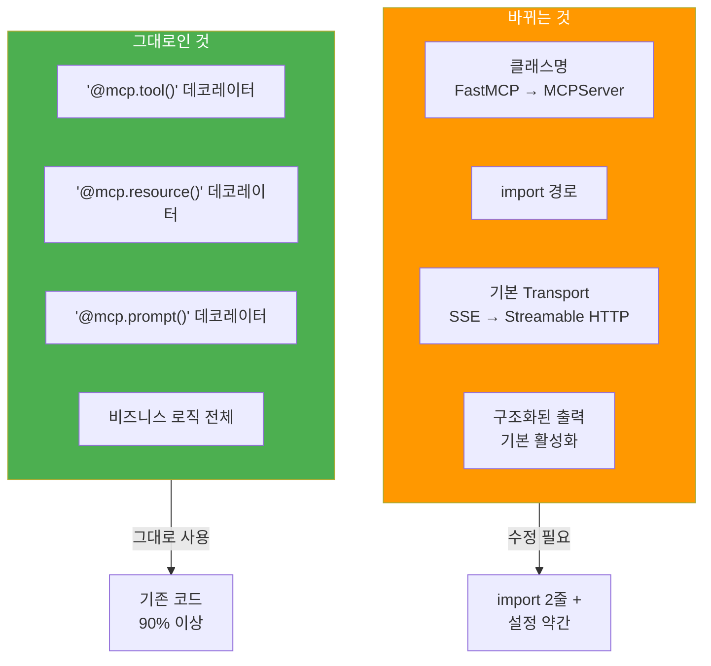
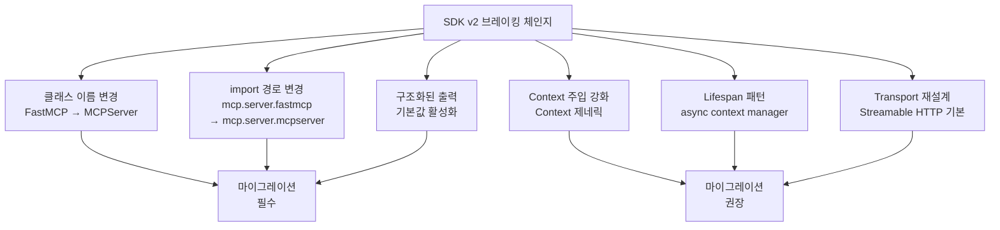
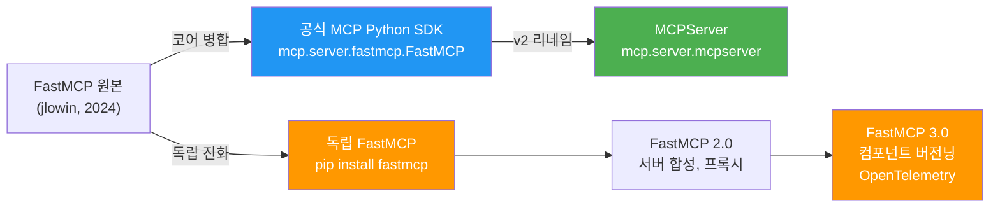
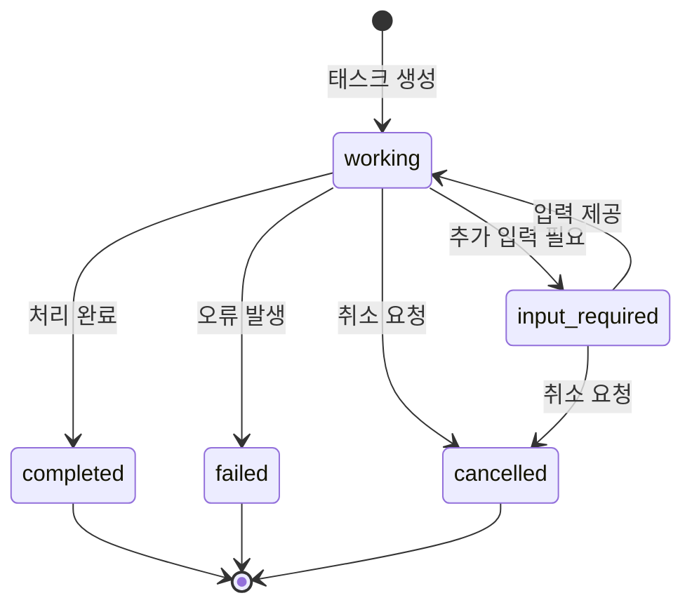

# SDK v2 마이그레이션과 미래 대비

> Python MCP SDK v1에서 v2로의 마이그레이션 전략을 단계별로 익히고, MCP 생태계의 미래 방향을 가볍게 살펴봅니다.

## 개요

이 섹션에서는 MCP Python SDK가 v1에서 v2로 전환되면서 발생하는 브레이킹 체인지를 파악하고, 프로덕션 서버를 안전하게 마이그레이션하는 전략을 학습합니다. "무엇이 바뀌었고, 어떻게 대응하면 되는지"에 집중하되, Tasks 프리미티브나 Server Cards 같은 미래 스펙은 **참고 읽기**로 분리하여 부담 없이 훑어볼 수 있도록 구성했습니다.

**선수 지식**: [Docker 컨테이너화](13-ch13-배포와-운영/01-01-docker-컨테이너화.md)에서 배운 컨테이너 기반 배포, [Streamable HTTP 서버 배포](13-ch13-배포와-운영/02-02-streamable-http-서버-배포.md)에서 다룬 Transport 레벨 배포 경험, [클라우드 배포 패턴](13-ch13-배포와-운영/03-03-클라우드-배포-패턴.md)의 프로덕션 인프라 구성, 그리고 [세션 라이프사이클](02-ch2-mcp-아키텍처와-프로토콜-구조/05-05-세션-라이프사이클과-capability-negotiation.md)의 Capability Negotiation 개념

**학습 목표**:
- Python SDK v1→v2의 주요 브레이킹 체인지를 식별하고 대응할 수 있다
- `FastMCP` → `MCPServer` 전환을 단계적으로 수행할 수 있다
- 호환 레이어를 활용해 점진적으로 마이그레이션할 수 있다
- (참고) Tasks 프리미티브와 2026 로드맵의 큰 그림을 이해한다

## 왜 알아야 할까?

소프트웨어에서 가장 두려운 순간 중 하나는 "메이저 버전 업데이트"입니다. 어제까지 잘 돌아가던 서버가 `pip install --upgrade mcp`한 순간 모든 import가 빨간색으로 변한다면? MCP Python SDK v2는 단순한 버그 수정이 아닙니다. 핵심 클래스명이 바뀌고, 구조화된 출력이 기본값이 되며, Transport 계층이 재설계됩니다.

하지만 걱정하지 마세요. 변화의 **범위**는 크지만, 실제로 여러분이 수정해야 할 **코드량**은 놀라울 정도로 적습니다. 대부분의 경우 import 경로 두 줄만 바꾸면 됩니다. 이전 섹션 [스케일링과 운영 패턴](13-ch13-배포와-운영/04-04-스케일링과-운영-패턴.md)에서 수평 확장과 모니터링을 다뤘는데, 거기서 구축한 인프라가 SDK 버전이 바뀐다고 갑자기 무너지지는 않습니다. Transport 레이어와 클래스 이름이 바뀌는 것이지, 여러분이 작성한 비즈니스 로직과 데코레이터 패턴은 그대로 살아남거든요.

문제는 "언제 마이그레이션하느냐"가 아니라 **"얼마나 준비되어 있느냐"**입니다. v1.x 브랜치는 v2 출시 후 6개월간 보안 패치만 제공됩니다. 이 섹션은 그 여정을 최대한 부드럽게 만들어 줄 지도입니다.

> 📊 **그림 1**: 마이그레이션의 전체 그림 — 무엇이 바뀌고 무엇이 남는지



## 핵심 개념

### 개념 1: 마이그레이션 전에 꼭 알아야 할 배경

> 💡 **비유**: 핸드폰 기종을 바꿀 때를 생각해 보세요. 앱 데이터는 클라우드에 그대로 남아 있고, 바뀌는 건 기기 설정과 UI뿐이죠. SDK 마이그레이션도 같습니다 — 여러분이 작성한 도구 로직(데이터)은 그대로이고, 바뀌는 건 "어디서 import하고 어떤 이름으로 서버를 만드느냐"(설정과 UI)입니다.

마이그레이션에 들어가기 전에, 지금 여러분의 서버가 어떤 상태인지 먼저 확인해 봅시다. 이전 챕터에서 배운 내용과 연결하면 이렇습니다:

| 이전에 배운 것 | v2에서 달라지는 점 |
|---------------|-------------------|
| [Docker 컨테이너화](13-ch13-배포와-운영/01-01-docker-컨테이너화.md)에서 만든 Dockerfile | `pip install mcp>=2.0,<3`으로 버전만 변경 |
| [Streamable HTTP 배포](13-ch13-배포와-운영/02-02-streamable-http-서버-배포.md)의 Transport 설정 | v2에서 Streamable HTTP가 기본값 — 이미 준비 완료! |
| [클라우드 배포](13-ch13-배포와-운영/03-03-클라우드-배포-패턴.md)의 헬스체크/LB | 엔드포인트 경로 동일, 설정 변경 최소 |
| [스케일링](13-ch13-배포와-운영/04-04-스케일링과-운영-패턴.md)의 수평 확장 패턴 | 비즈니스 로직 불변, 인프라 그대로 |

즉, **이 챕터에서 배운 인프라의 대부분은 SDK 버전이 바뀌어도 유효합니다**. 마이그레이션의 실제 작업량은 생각보다 작다는 뜻이죠.

### 개념 2: v1→v2 브레이킹 체인지 전체 지도

> 💡 **비유**: 집 리모델링을 떠올려 보세요. 벽지만 바꾸는 게 아니라 기둥 이름표가 바뀌고, 현관문 위치가 달라지는 수준입니다. 하지만 집의 "구조"—방의 개수와 목적—은 그대로입니다.

MCP Python SDK v2는 v1.25.0부터 `main` 브랜치에서 개발되고 있으며, 안정 v1은 `v1.x` 브랜치로 분리되었습니다. 핵심 변경사항을 카테고리별로 정리합니다.

> 📊 **그림 2**: v1→v2 브레이킹 체인지 카테고리 맵



**v1 vs v2 핵심 비교표:**

| 항목 | v1 (`mcp>=1.25,<2`) | v2 (`mcp>=2.0`) |
|------|---------------------|-----------------|
| **진입 클래스** | `FastMCP` | `MCPServer` |
| **import 경로** | `from mcp.server.fastmcp import FastMCP` | `from mcp.server.mcpserver import MCPServer` |
| **구조화된 출력** | 수동 opt-in | 기본 활성화 (opt-out 가능) |
| **Context 타입** | `Context` (단순) | `Context[ServerSession, None]` (제네릭) |
| **Lifespan** | 수동 관리 | `async with` 컨텍스트 매니저 |
| **기본 Transport** | stdio / SSE | stdio / Streamable HTTP |
| **데코레이터** | `@mcp.tool()` | `@mcp.tool()` (동일) |

좋은 소식은 **데코레이터 API는 거의 동일**하다는 점입니다. `@mcp.tool()`, `@mcp.resource()`, `@mcp.prompt()`의 사용법은 변하지 않습니다. 변하는 것은 "어디서 import하고, 어떤 이름으로 인스턴스를 만드느냐"뿐입니다.

Transport 재설계 부분은 [Streamable HTTP 서버 배포](13-ch13-배포와-운영/02-02-streamable-http-서버-배포.md)에서 다룬 단일 엔드포인트 구조와 직결됩니다. 이미 Streamable HTTP로 배포하고 있었다면 v2 전환이 한결 수월하죠. 반면 v1에서 SSE로 배포했던 서버가 있다면, v2 마이그레이션 시 Transport 전환도 함께 계획해야 합니다.

**버전 핀닝 — 지금 당장 해야 할 일:**

```python
# pyproject.toml 또는 requirements.txt
# v2가 갑자기 설치되는 것을 방지
mcp = ">=1.25,<2"     # pyproject.toml (PEP 508)
# mcp>=1.25,<2         # requirements.txt
```

이 한 줄이 프로덕션 서버의 생명줄입니다. v2가 PyPI에 릴리스되는 순간, 버전 핀 없이 `pip install mcp`를 실행하면 v2가 설치되고 모든 import가 깨집니다.

### 개념 3: FastMCP vs MCPServer — 이름의 혼란 정리

> 💡 **비유**: "FastMCP"라는 이름을 가진 프로젝트가 두 개 존재합니다. 마치 서울에 "강남역"이 두 개 있는 것과 비슷한 혼란이죠. 하나는 공식 SDK 안에 들어간 것이고, 다른 하나는 독립 프로젝트로 진화한 것입니다.

이 혼란의 역사를 정리해야 마이그레이션 방향을 제대로 잡을 수 있습니다.

> 📊 **그림 3**: FastMCP의 두 갈래 — 공식 SDK vs 독립 프로젝트



**두 프로젝트의 차이:**

| 구분 | 공식 SDK 내 FastMCP → MCPServer | 독립 FastMCP (`pip install fastmcp`) |
|------|------|------|
| **패키지** | `pip install mcp` | `pip install fastmcp` |
| **import** | `from mcp.server.fastmcp import FastMCP` (v1) | `from fastmcp import FastMCP` |
| **v2 변화** | `MCPServer`로 이름 변경 | 이름 유지, 독자적 기능 추가 |
| **특징** | 프로토콜 스펙 완전 준수 | 서버 합성, OpenAPI 프로바이더, 엔터프라이즈 인증 |
| **핀닝** | `mcp>=1.25,<2` | `fastmcp<3` (3.0 브레이킹 체인지) |

이 코스에서 지금까지 사용한 것은 **공식 SDK의 `FastMCP`**입니다. v2에서는 이것이 `MCPServer`로 바뀝니다.

### 개념 4: 단계별 마이그레이션 전략

> 💡 **비유**: 비행 중에 엔진을 교체하는 건 불가능하지만, "활주로에서 한 엔진씩 교체하고 테스트 비행 후 다음 엔진을 교체"하는 건 가능합니다. 마이그레이션도 같은 원리입니다.

마이그레이션은 크게 4단계로 진행합니다. 한꺼번에 다 바꾸려 하지 말고, **한 단계씩 테스트하며** 진행하는 것이 핵심입니다.

> 📊 **그림 4**: 4단계 마이그레이션 프로세스


각 단계를 차근히 살펴보겠습니다.

**1단계: 버전 핀닝과 호환 레이어 준비**

가장 먼저 해야 할 일은 현재 v1을 고정하고, v1/v2 양쪽에서 동작하는 호환 레이어를 준비하는 것입니다.

```python
# compat.py — v1/v2 호환 레이어
# NOTE: 아래 import 경로(mcp.server.mcpserver)는 v2 개발 중 기준이며,
# 정식 릴리스 시 변경될 수 있습니다. v2 RC 또는 정식 릴리스 노트를 확인하세요.
try:
    # v2 경로를 먼저 시도
    from mcp.server.mcpserver import MCPServer as ServerClass
    SDK_VERSION = 2
except ImportError:
    # v1 폴백
    from mcp.server.fastmcp import FastMCP as ServerClass
    SDK_VERSION = 1

def create_server(name: str, **kwargs) -> ServerClass:
    """SDK 버전에 관계없이 서버 인스턴스를 생성합니다."""
    return ServerClass(name, **kwargs)
```

이 패턴이 왜 유용한지 짚어볼게요. 프로덕션에서 v1을 운영하면서 개발 환경에서 v2를 테스트할 때, 서버 코드 자체는 `compat.py`만 import하면 양쪽에서 모두 동작합니다. 일종의 **어댑터 패턴**이죠.

**2단계: import 경로 전환**

호환 레이어를 테스트했다면, 이제 직접 v2 import로 전환합니다. 실제로 바뀌는 건 **딱 두 줄**입니다:

```python
# === v1 코드 (Before) ===
from mcp.server.fastmcp import FastMCP       # ← 이 줄과
mcp = FastMCP("my-server")                   # ← 이 줄만 바뀜

@mcp.tool()
async def search_db(query: str) -> str:
    """데이터베이스를 검색합니다."""
    return f"결과: {query}"


# === v2 코드 (After) ===
# 이 import 경로는 v2 개발 중 기준이며, 정식 릴리스 시 변경될 수 있습니다
from mcp.server.mcpserver import MCPServer    # ← 변경
mcp = MCPServer("my-server")                  # ← 변경

@mcp.tool()                                   # ← 동일!
async def search_db(query: str) -> str:
    """데이터베이스를 검색합니다."""
    return f"결과: {query}"                     # ← 동일!
```

보시다시피 데코레이터와 도구 함수 본문은 그대로입니다. 이 단계가 끝나면 테스트를 돌려서 모든 도구가 정상 등록되는지 확인하세요.

**3단계: 구조화된 출력 적용**

v2에서는 도구가 Pydantic 모델, TypedDict, dataclass를 반환하면 **자동으로 JSON Schema가 생성**되고 출력이 검증됩니다. 이 단계는 선택적이지만, v2의 장점을 제대로 누리려면 적용하는 것을 권장합니다.

```python
from pydantic import BaseModel
from mcp.server.mcpserver import MCPServer

mcp = MCPServer("my-server")

# v2: Pydantic 모델을 반환하면 자동으로 구조화된 출력
class SearchResult(BaseModel):
    query: str
    results: list[str]
    total_count: int

@mcp.tool()
async def search_db(query: str) -> SearchResult:
    """데이터베이스를 검색합니다."""
    results = [f"결과 {i}" for i in range(3)]
    return SearchResult(
        query=query, 
        results=results, 
        total_count=len(results)
    )

# 문자열·숫자 등 프리미티브 타입은 {"result": value}로 자동 래핑
@mcp.tool()
async def add(a: int, b: int) -> int:
    """두 수를 더합니다."""
    return a + b  # → {"result": 5}
```

기존 v1 코드에서 `str`을 반환하던 도구는 v2에서 `{"result": "..."}` 형태로 래핑됩니다. 클라이언트가 이 변경을 인지해야 하므로, 마이그레이션 전에 클라이언트 측 파싱 로직도 확인해야 합니다.

> ⚠️ **흔한 오해**: "구조화된 출력을 끌 수 없다"고 생각하는 분이 있는데, `structured_output=False` 옵션으로 비활성화할 수 있습니다. 점진적 마이그레이션 시 유용합니다.

**4단계: Transport 전환**

마지막으로 Transport를 전환합니다. [Streamable HTTP 서버 배포](13-ch13-배포와-운영/02-02-streamable-http-서버-배포.md)에서 이미 배운 내용이기 때문에 크게 어렵지 않습니다.

```python
# v1: SSE Transport
if __name__ == "__main__":
    mcp.run(transport="sse")

# v2: Streamable HTTP Transport (기본값)
if __name__ == "__main__":
    mcp.run(transport="streamable-http")
    # 또는 json_response=True로 SSE 없이 순수 JSON 응답
    # mcp.run(transport="streamable-http", json_response=True)
```

이미 Streamable HTTP를 사용 중이었다면 이 단계는 건너뛰어도 됩니다.

## 실습: 직접 해보기

v1 서버를 v2로 마이그레이션하는 전체 과정을 실습합니다. 먼저 v1 서버를 정의하고, 단계적으로 v2로 전환합니다.

**Step 1: v1 원본 서버 (`server_v1.py`)**

```python
# server_v1.py — 마이그레이션 대상 v1 서버
from mcp.server.fastmcp import FastMCP

mcp = FastMCP("weather-server")

@mcp.tool()
async def get_weather(city: str) -> str:
    """도시의 현재 날씨를 조회합니다."""
    # 시뮬레이션
    weather_data = {
        "서울": "맑음, 18°C",
        "부산": "흐림, 22°C",
        "제주": "비, 16°C"
    }
    return weather_data.get(city, f"{city}: 데이터 없음")

@mcp.resource("weather://forecast/{city}")
async def get_forecast(city: str) -> str:
    """3일 예보를 제공합니다."""
    return f"{city} 3일 예보: 맑음 → 흐림 → 비"

@mcp.prompt()
def weather_report(city: str) -> str:
    """날씨 리포트 프롬프트를 생성합니다."""
    return f"{city}의 현재 날씨와 3일 예보를 분석해서 외출 추천을 해주세요."

if __name__ == "__main__":
    mcp.run(transport="stdio")
```

**Step 2: v1/v2 호환 레이어 (`compat.py`)**

```python
# compat.py — 점진적 마이그레이션을 위한 호환 레이어
#
# 주의: 아래 v2 import 경로(mcp.server.mcpserver)는 v2 개발 중 기준입니다.
# 정식 릴리스 시 모듈 경로나 클래스명이 변경될 수 있으므로,
# v2 정식 릴리스 노트(CHANGELOG)를 반드시 확인하세요.
import sys

try:
    from mcp.server.mcpserver import MCPServer as ServerClass
    SDK_VERSION = 2
except ImportError:
    from mcp.server.fastmcp import FastMCP as ServerClass
    SDK_VERSION = 1


def create_server(name: str, **kwargs) -> ServerClass:
    """SDK 버전에 관계없이 서버 인스턴스를 생성합니다."""
    server = ServerClass(name, **kwargs)
    return server


def get_default_transport() -> str:
    """SDK 버전에 맞는 기본 Transport를 반환합니다."""
    if SDK_VERSION == 2:
        return "streamable-http"
    return "stdio"
```

```run:python
# 호환 레이어 동작 확인 (v1 환경 시뮬레이션)
SDK_VERSION = 1  # 실제로는 import 결과로 결정

if SDK_VERSION == 1:
    default_transport = "stdio"
    server_class = "FastMCP"
else:
    default_transport = "streamable-http"
    server_class = "MCPServer"

print(f"SDK Version: v{SDK_VERSION}")
print(f"Server Class: {server_class}")
print(f"Default Transport: {default_transport}")
```

```output
SDK Version: v1
Server Class: FastMCP
Default Transport: stdio
```

**Step 3: v2 마이그레이션 완료 (`server_v2.py`)**

```python
# server_v2.py — v2 마이그레이션 완료 서버
# NOTE: import 경로는 v2 개발 중 기준. 정식 릴리스 시 변경 가능.
from mcp.server.mcpserver import MCPServer
from pydantic import BaseModel

mcp = MCPServer("weather-server")

# v2: 구조화된 출력으로 전환
class WeatherResult(BaseModel):
    city: str
    condition: str
    temperature: str
    source: str = "weather-api"

class ForecastResult(BaseModel):
    city: str
    days: list[str]
    confidence: float

@mcp.tool()
async def get_weather(city: str) -> WeatherResult:
    """도시의 현재 날씨를 조회합니다."""
    weather_data = {
        "서울": ("맑음", "18°C"),
        "부산": ("흐림", "22°C"),
        "제주": ("비", "16°C")
    }
    condition, temp = weather_data.get(city, ("알 수 없음", "N/A"))
    return WeatherResult(
        city=city,
        condition=condition,
        temperature=temp
    )

@mcp.resource("weather://forecast/{city}")
async def get_forecast(city: str) -> str:
    """3일 예보를 제공합니다."""
    return f"{city} 3일 예보: 맑음 → 흐림 → 비"

@mcp.prompt()
def weather_report(city: str) -> str:
    """날씨 리포트 프롬프트를 생성합니다."""
    return f"{city}의 현재 날씨와 3일 예보를 분석해서 외출 추천을 해주세요."

if __name__ == "__main__":
    # v2: Streamable HTTP가 기본 Transport
    mcp.run(transport="streamable-http")
```

**Step 4: 마이그레이션 검증 스크립트**

```run:python
# 마이그레이션 체크리스트 자동 검증 (시뮬레이션)
v2_code = """
from mcp.server.mcpserver import MCPServer
from pydantic import BaseModel
mcp = MCPServer("weather-server")

class WeatherResult(BaseModel):
    city: str
    condition: str
    temperature: str

@mcp.tool()
async def get_weather(city: str) -> WeatherResult:
    pass

mcp.run(transport="streamable-http")
"""

checks = {
    "MCPServer import": "from mcp.server.mcpserver import MCPServer" in v2_code,
    "FastMCP 제거": "FastMCP" not in v2_code,
    "Pydantic 모델 사용": "BaseModel" in v2_code,
    "Streamable HTTP": 'transport="streamable-http"' in v2_code,
    "버전 핀닝 필요": True,  # pyproject.toml에서 확인
}

print("=== v1->v2 마이그레이션 체크리스트 ===")
all_passed = True
for check, passed in checks.items():
    status = "PASS" if passed else "FAIL"
    if not passed:
        all_passed = False
    print(f"  [{status}] {check}")

print(f"\n결과: {'모든 항목 통과!' if all_passed else '일부 항목 실패'}")
```

```output
=== v1->v2 마이그레이션 체크리스트 ===
  [PASS] MCPServer import
  [PASS] FastMCP 제거
  [PASS] Pydantic 모델 사용
  [PASS] Streamable HTTP
  [PASS] 버전 핀닝 필요

결과: 모든 항목 통과!
```

**Step 5: CI에서 v1/v2 듀얼 테스트**

```python
# test_migration.py — v1과 v2 모두에서 도구가 동작하는지 검증
import pytest
import importlib

def test_server_import():
    """서버 모듈이 정상적으로 import되는지 확인합니다."""
    try:
        # v2 경로
        mod = importlib.import_module("mcp.server.mcpserver")
        assert hasattr(mod, "MCPServer")
        print("v2 MCPServer import 성공")
    except ImportError:
        # v1 폴백
        mod = importlib.import_module("mcp.server.fastmcp")
        assert hasattr(mod, "FastMCP")
        print("v1 FastMCP import 성공 (v2 미설치)")

def test_tool_decorator_compat():
    """데코레이터 API가 양쪽에서 동일하게 동작하는지 확인합니다."""
    try:
        from mcp.server.mcpserver import MCPServer as Server
    except ImportError:
        from mcp.server.fastmcp import FastMCP as Server
    
    server = Server("test")
    
    @server.tool()
    async def echo(message: str) -> str:
        return message
    
    # 도구가 등록되었는지 확인
    # (실제 테스트에서는 server의 내부 상태를 검증)
    print("데코레이터 호환성 테스트 통과")
```

## 더 깊이 알아보기

### FastMCP의 탄생 — 커뮤니티가 만든 표준

FastMCP의 역사는 오픈소스 생태계의 아름다운 사례입니다. 2024년 초, MCP Python SDK의 저수준 API에 불만을 가진 개발자 **Jeremiah Lowin**(Prefect 창업자)이 "Pythonic하게 MCP 서버를 만들자"며 독립 라이브러리 FastMCP를 공개했습니다. 데코레이터 한 줄로 도구를 정의하는 간결한 API가 커뮤니티에서 폭발적 인기를 끌었고, Anthropic은 이 디자인을 공식 SDK에 병합하기로 결정합니다.

그런데 흥미로운 일이 벌어졌습니다. Lowin은 공식 SDK에 코어를 기여한 뒤에도 독립 FastMCP를 계속 발전시켰습니다. 서버 합성(composition), OpenAPI 프로바이더, 엔터프라이즈 인증 등 공식 SDK가 다루지 않는 영역을 개척했죠. 2026년 1월에는 FastMCP 3.0을 릴리스하며 컴포넌트 버전닝과 OpenTelemetry를 도입했습니다.

v2에서 `FastMCP`가 `MCPServer`로 이름이 바뀐 것도 이 역사와 관련이 있습니다. 같은 이름의 두 프로젝트가 서로 다른 기능을 제공하면서 혼란이 가중되자, 공식 SDK 팀이 "우리 것은 MCPServer로 명확히 구분하자"는 결정을 내린 것입니다.

### SEP 프로세스 — MCP의 "헌법 수정안"

MCP 스펙의 변경은 **SEP(Specification Enhancement Proposal)** 프로세스를 통해 이루어집니다. RFC와 유사한 이 제도는 누구나 GitHub에서 제안할 수 있지만, Working Group의 후원이 있어야 빠르게 리뷰됩니다. Tasks 프리미티브는 SEP-1686으로 제안되어 약 2개월 만에 실험적 기능으로 채택되었습니다. 현재 활발히 논의 중인 SEP-1932(DPoP — 토큰 바인딩)와 SEP-1933(Workload Identity Federation)은 엔터프라이즈 인증의 미래를 결정할 제안들입니다.

---

## 참고 읽기: MCP의 미래 — Tasks, Server Cards, 2026 로드맵

> 아래 내용은 아직 실험적이거나 로드맵 단계의 기능들입니다. 지금 당장 코드에 적용할 필요는 없지만, "MCP가 어디로 향하는지" 큰 그림을 이해하는 데 도움이 됩니다. 가볍게 읽어 두세요.

### Tasks 프리미티브 — "요청하고 나중에 가져오기"

> 💡 **비유**: 음식점에서 주문하면 "진동벨"을 받죠. 주문 즉시 음식이 나오는 게 아니라, 벨이 울리면 가져가는 겁니다. Tasks 프리미티브가 정확히 이 패턴입니다.

Tasks 프리미티브(SEP-1686)는 SDK v1.23.0에서 실험적 기능으로 추가되었으며, v2에서 정식 지원될 예정입니다. 기존 MCP 도구 호출은 **동기적**이었습니다 — 클라이언트가 `tools/call`을 보내면 서버가 결과를 돌려줄 때까지 기다려야 했죠. 하지만 대용량 데이터 처리, 외부 API 대기, 사람의 승인이 필요한 작업에는 이 모델이 맞지 않습니다.

> 📊 **그림 5**: Tasks 프리미티브 상태 머신



**Tasks의 5가지 상태:**

| 상태 | 의미 | 전이 가능 |
|------|------|----------|
| `working` | 처리 중 (초기 상태) | 모든 상태로 전이 가능 |
| `input_required` | 서버가 추가 입력을 요구 | `working`, `cancelled` |
| `completed` | 성공 (종료 상태) | — |
| `failed` | 실패 (종료 상태) | — |
| `cancelled` | 취소 (종료 상태) | — |

도구별로 Tasks 지원 수준을 선언할 수 있습니다:

```python
# taskSupport 옵션 예시 (v2 정식 지원 시)
@mcp.tool(execution={"taskSupport": "optional"})
async def generate_report(query: str) -> str:
    """대규모 리포트를 생성합니다. 오래 걸릴 수 있습니다."""
    return await _build_report(query)

@mcp.tool(execution={"taskSupport": "required"})
async def approve_expense(expense_id: str) -> str:
    """경비 승인을 요청합니다. 관리자 승인이 필요합니다."""
    return await _request_approval(expense_id)
```

- `"required"`: 반드시 Task로 실행 (인간 승인, 장시간 처리)
- `"optional"`: 클라이언트 선택에 따라 동기/비동기 (기본값: 동기)
- 미선언 (기본): Task 미지원, 동기 실행만 허용

### MCP Server Cards — `.well-known` 디스커버리

로드맵 P1에 포함된 MCP Server Cards는 서버가 자신의 메타데이터를 `.well-known/mcp.json` URL로 공개하는 표준입니다. 클라이언트가 서버에 연결하지 않고도 "이 서버가 무슨 도구를 제공하는지, 어떤 인증이 필요한지" 미리 알 수 있게 해줍니다.

### 2026 로드맵 요약

2026년 3월에 공개된 [MCP 공식 로드맵](https://blog.modelcontextprotocol.io/posts/2026-mcp-roadmap/)은 4개의 우선순위 영역으로 구성됩니다.

| 우선순위 | 영역 | 핵심 내용 |
|---------|------|----------|
| P1 | Transport 진화 | Stateless 수평 스케일링, 세션 재개/마이그레이션, MCP Server Cards |
| P2 | 에이전트 간 통신 | Tasks 프리미티브 정식화, 재시도 시맨틱스, 만료 정책 |
| P3 | 거버넌스 성숙 | 컨트리뷰터 래더, Working Group 위임, SEP 프로세스 체계화 |
| P4 | 엔터프라이즈 준비 | 감사 로그, SSO 통합, 게이트웨이 표준, 설정 이식성 |

### 미래 대비 설계 원칙

지금 당장 Tasks나 Server Cards를 구현하지 않더라도, 아래 원칙을 따르면 향후 전환이 수월해집니다:

```python
from mcp.server.mcpserver import MCPServer
from pydantic import BaseModel

mcp = MCPServer("future-ready-server")

# 원칙 1: 구조화된 출력을 기본으로 — v2 기본값에 맞춤
class ToolOutput(BaseModel):
    status: str
    data: dict
    version: str = "1.0"  # 출력 스키마 버전닝

# 원칙 2: Transport에 종속되지 않는 비즈니스 로직
async def _core_search(query: str) -> list[str]:
    """Transport와 무관한 순수 비즈니스 로직"""
    return [f"결과: {query}"]

@mcp.tool()
async def search(query: str) -> ToolOutput:
    """검색을 수행합니다."""
    results = await _core_search(query)
    return ToolOutput(status="ok", data={"results": results})

# 원칙 3: 장시간 작업은 Task 대비 메타데이터 선언
@mcp.tool(execution={"taskSupport": "optional"})
async def long_analysis(dataset: str) -> ToolOutput:
    """장시간 분석 작업. Tasks 지원 준비 완료."""
    results = await _core_search(dataset)
    return ToolOutput(status="ok", data={"results": results})
```

핵심은 **비즈니스 로직을 Transport/프레임워크에서 분리**하는 것입니다. 이렇게 하면 SDK 버전이 바뀌거나 새 프리미티브가 추가되어도 핵심 로직은 건드릴 필요가 없죠.

> 💡 **알고 계셨나요?**: MCP의 2026 로드맵은 날짜 기반이 아닌 **우선순위 기반**으로 구성됩니다. Working Group의 자발적 참여로 진행되기 때문에, 특정 날짜를 약속하면 "커뮤니티 번아웃"이 발생한다는 2024-2025년의 교훈에서 나온 결정입니다.

---

## 흔한 오해와 팁

> ⚠️ **흔한 오해**: "v2가 나오면 v1 서버가 즉시 멈춘다"고 걱정하는 분이 있습니다. 그렇지 않습니다. v1.x 브랜치는 v2 출시 후 **최소 6개월간 보안·버그 수정 패치**를 받습니다. 또한 클라이언트 측에서도 하위 호환이 고려됩니다 — Streamable HTTP 클라이언트는 서버가 구 SSE Transport만 지원할 경우 자동으로 폴백합니다.

> 🔥 **실무 팁**: 마이그레이션의 최대 리스크는 "코드 변경"이 아닌 **"의존성 충돌"**입니다. `mcp` 패키지를 업그레이드하면 `pydantic`, `httpx`, `starlette` 등 하위 의존성도 함께 올라갈 수 있습니다. 반드시 별도 가상환경에서 먼저 테스트하고, `pip freeze`로 전체 의존성 트리를 비교하세요.

> 🔥 **실무 팁**: CI 파이프라인에서 v1과 v2 **두 환경 모두 테스트**하는 매트릭스 빌드를 구성하세요. `tox`나 GitHub Actions의 `strategy.matrix`를 활용하면 됩니다. 마이그레이션 기간 동안 양쪽 호환성을 자동으로 검증할 수 있습니다.

```yaml
# .github/workflows/test.yml — 듀얼 버전 테스트
jobs:
  test:
    strategy:
      matrix:
        mcp-version: [">=1.25,<2", ">=2.0,<3"]
    steps:
      - run: pip install "mcp${{ matrix.mcp-version }}"
      - run: pytest tests/
```

## 핵심 정리

| 개념 | 설명 |
|------|------|
| v2 핵심 클래스 | `MCPServer` (`mcp.server.mcpserver`에서 import — 정식 릴리스 시 경로 변경 가능) |
| 버전 핀닝 | `mcp>=1.25,<2`로 v1 고정, v2 준비되면 `mcp>=2.0,<3` |
| 실제 변경량 | import 2줄 + 설정 약간. 데코레이터·비즈니스 로직은 동일 |
| 구조화된 출력 | v2 기본 활성화. Pydantic 모델/TypedDict 반환 시 자동 스키마 생성 |
| 독립 FastMCP | `pip install fastmcp` — 별도 프로젝트, 서버 합성·OpenAPI 등 고급 기능 |
| 마이그레이션 4단계 | 핀닝 → import 전환 → 구조화 출력 → Transport 전환 |
| 호환 레이어 | `try/except`로 v2 먼저 시도, v1 폴백 — 점진적 전환 |
| v1 지원 기간 | v2 출시 후 6개월간 보안·버그 수정 |
| Tasks (참고) | "요청하고 나중에 가져오기" — 5상태 머신, 아직 실험적 |
| 2026 로드맵 (참고) | P1: Transport 진화, P2: 에이전트 간 통신, P3: 거버넌스, P4: 엔터프라이즈 |

## 다음 섹션 미리보기

이 섹션으로 **Ch13. 배포와 운영** 챕터가 마무리됩니다. Docker 컨테이너화부터 클라우드 배포, 스케일링, 그리고 SDK v2 마이그레이션까지 — MCP 서버의 전체 운영 생명주기를 다뤘습니다. 이 코스 전체를 통해 [MCP의 탄생 배경](01-ch1-mcp의-탄생과-설계-철학/01-01-llm의-도구-연결-문제.md)에서 출발하여, 프로토콜 설계, 서버·클라이언트 개발, 보안, 테스트, 배포, 그리고 미래 대비까지의 여정을 완주했습니다. 이제 여러분은 MCP 생태계의 현재와 미래를 모두 이해하는 엔지니어입니다. 직접 MCP 서버를 만들고, 배포하고, 운영하세요!

## 참고 자료

- [MCP Python SDK — GitHub](https://github.com/modelcontextprotocol/python-sdk) - v2 개발 현황, 브랜치 전략, CHANGELOG 확인
- [MCP v1→v2 Migration — Medium](https://medium.com/the-ai-language/mcp-is-migrating-from-version-1-to-version-2-07f4cc7624fb) - v1에서 v2로의 마이그레이션 가이드와 브레이킹 체인지 정리
- [The 2026 MCP Roadmap — 공식 블로그](https://blog.modelcontextprotocol.io/posts/2026-mcp-roadmap/) - 4대 우선순위 영역과 향후 방향
- [MCP Specification 2025-11-25](https://modelcontextprotocol.io/specification/2025-11-25) - 최신 프로토콜 스펙 (Streamable HTTP, Tasks 등)
- [FastMCP — GitHub](https://github.com/jlowin/fastmcp) - 독립 FastMCP 프로젝트, v3.0 릴리스 노트
- [MCP Transport Scalability: Production Migration Guide](https://www.elegantsoftwaresolutions.com/blog/mcp-transport-scalability-production-migration-guide-2026) - SSE에서 Streamable HTTP로의 Transport 마이그레이션 실전 가이드
- [MCP Authorization Spec Update — Aaron Parecki](https://aaronparecki.com/2025/11/25/1/mcp-authorization-spec-update) - 2025-11-25 인증 스펙 변경 상세 분석

---
### 🔗 Related Sessions
- [capability negotiation](02-ch2-mcp-아키텍처와-프로토콜-구조/05-05-세션-라이프사이클과-capability-negotiation.md) (prerequisite)
- [streamable http transport](01-ch1-mcp의-탄생과-설계-철학/04-04-mcp-스펙-변천사와-2026-로드맵.md) (prerequisite)
