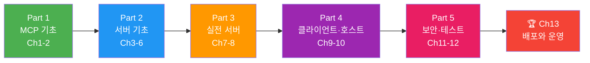

# 2026: MCP 실전 완전 정복

> Model Context Protocol의 설계 철학부터 배포·운영까지 — **13챕터 60섹션** 튜토리얼

## 학습 로드맵

> **MCP 개념 → 서버 개발 → 실전 통합 → 클라이언트/호스트 → 보안·테스트 → 배포**까지 자연스러운 흐름으로 학습합니다.

---

## Part 1: MCP 기초 (Ch1-2, 입문)

**Ch1. MCP의 탄생과 설계 철학**
- [01. LLM의 도구 연결 문제](01-ch1-mcp의-탄생과-설계-철학/01-01-llm의-도구-연결-문제.md) · [02. MCP: AI의 USB-C](01-ch1-mcp의-탄생과-설계-철학/02-02-mcp-ai의-usb-c.md) · [03. MCP 생태계 둘러보기](01-ch1-mcp의-탄생과-설계-철학/03-03-mcp-생태계-둘러보기.md) · [04. MCP 스펙 변천사와 2026 로드맵](01-ch1-mcp의-탄생과-설계-철학/04-04-mcp-스펙-변천사와-2026-로드맵.md)

**Ch2. MCP 아키텍처와 프로토콜 구조**
- [01. Host/Client/Server 3계층](02-ch2-mcp-아키텍처와-프로토콜-구조/01-01-hostclientserver-3계층.md) · [02. Transport 계층: stdio](02-ch2-mcp-아키텍처와-프로토콜-구조/02-02-transport-계층-stdio.md) · [03. Transport 계층: Streamable HTTP](02-ch2-mcp-아키텍처와-프로토콜-구조/03-03-transport-계층-streamable-http.md) · [04. JSON-RPC 2.0 메시지 포맷](02-ch2-mcp-아키텍처와-프로토콜-구조/04-04-json-rpc-20-메시지-포맷.md) · [05. 세션 라이프사이클과 Capability Negotiation](02-ch2-mcp-아키텍처와-프로토콜-구조/05-05-세션-라이프사이클과-capability-negotiation.md)

## Part 2: 서버 개발 기초 (Ch3-6, 초급)

**Ch3. 개발 환경 설정과 첫 MCP 서버**
- [01. Python SDK 설치와 프로젝트 구조](03-ch3-개발-환경-설정과-첫-mcp-서버/01-01-python-sdk-설치와-프로젝트-구조.md) · [02. Hello MCP: 첫 번째 서버 만들기](03-ch3-개발-환경-설정과-첫-mcp-서버/02-02-hello-mcp-첫-번째-서버-만들기.md) · [03. Claude Desktop 연결과 테스트](03-ch3-개발-환경-설정과-첫-mcp-서버/03-03-claude-desktop-연결과-테스트.md) · [04. MCP Inspector와 디버깅](03-ch3-개발-환경-설정과-첫-mcp-서버/04-04-mcp-inspector와-디버깅.md)

**Ch4. Tools — 함수 호출 프리미티브**
- [01. Tool 프리미티브 이해](04-ch4-tools-함수-호출-프리미티브/01-01-tool-프리미티브-이해.md) · [02. 도구 정의와 스키마 자동 생성](04-ch4-tools-함수-호출-프리미티브/02-02-도구-정의와-스키마-자동-생성.md) · [03. 입력 검증과 Pydantic 모델](04-ch4-tools-함수-호출-프리미티브/03-03-입력-검증과-pydantic-모델.md) · [04. 도구 실행 결과와 에러 처리](04-ch4-tools-함수-호출-프리미티브/04-04-도구-실행-결과와-에러-처리.md) · [05. 비동기 도구와 Context 활용](04-ch4-tools-함수-호출-프리미티브/05-05-비동기-도구와-context-활용.md)

**Ch5. Resources — 데이터 노출 프리미티브**
- [01. Resource 프리미티브 이해](05-ch5-resources-데이터-노출-프리미티브/01-01-resource-프리미티브-이해.md) · [02. 정적 리소스와 동적 리소스](05-ch5-resources-데이터-노출-프리미티브/02-02-정적-리소스와-동적-리소스.md) · [03. MIME 타입과 바이너리 리소스](05-ch5-resources-데이터-노출-프리미티브/03-03-mime-타입과-바이너리-리소스.md) · [04. 리소스 구독과 변경 알림](05-ch5-resources-데이터-노출-프리미티브/04-04-리소스-구독과-변경-알림.md)

**Ch6. Prompts와 Sampling**
- [01. Prompts: 재사용 가능한 템플릿](06-ch6-prompts와-sampling/01-01-prompts-재사용-가능한-템플릿.md) · [02. 동적 프롬프트와 인자 처리](06-ch6-prompts와-sampling/02-02-동적-프롬프트와-인자-처리.md) · [03. Sampling: 서버→LLM 역요청](06-ch6-prompts와-sampling/03-03-sampling-서버llm-역요청.md) · [04. Sampling 실전: 에이전트형 워크플로](06-ch6-prompts와-sampling/04-04-sampling-실전-에이전트형-워크플로.md)

## Part 3: 실전 서버 (Ch7-8, 중급)

**Ch7. 실전 서버 — 데이터베이스 연동**
- [01. DB 서버 설계 전략](07-ch7-실전-서버-데이터베이스-연동/01-01-db-서버-설계-전략.md) · [02. SQLite MCP 서버 구축](07-ch7-실전-서버-데이터베이스-연동/02-02-sqlite-mcp-서버-구축.md) · [03. 쿼리 안전성과 권한 제어](07-ch7-실전-서버-데이터베이스-연동/03-03-쿼리-안전성과-권한-제어.md) · [04. PostgreSQL 서버와 레퍼런스 분석](07-ch7-실전-서버-데이터베이스-연동/04-04-postgresql-서버와-레퍼런스-분석.md) · [05. E-Commerce 데이터 서버 실습](07-ch7-실전-서버-데이터베이스-연동/05-05-e-commerce-데이터-서버-실습.md)

**Ch8. 실전 서버 — REST API 래핑과 파일시스템**
- [01. REST API→MCP 매핑 전략](08-ch8-실전-서버-rest-api-래핑과-파일시스템/01-01-rest-apimcp-매핑-전략.md) · [02. GitHub API 래핑 서버 구축](08-ch8-실전-서버-rest-api-래핑과-파일시스템/02-02-github-api-래핑-서버-구축.md) · [03. FastMCP OpenAPI 프로바이더](08-ch8-실전-서버-rest-api-래핑과-파일시스템/03-03-fastmcp-openapi-프로바이더.md) · [04. 파일시스템 MCP 서버](08-ch8-실전-서버-rest-api-래핑과-파일시스템/04-04-파일시스템-mcp-서버.md) · [05. 복합 서버 — 다중 소스 통합](08-ch8-실전-서버-rest-api-래핑과-파일시스템/05-05-복합-서버-다중-소스-통합.md)

## Part 4: 클라이언트와 호스트 (Ch9-10, 중급)

**Ch9. MCP 클라이언트 개발**
- [01. ClientSession과 서버 연결](09-ch9-mcp-클라이언트-개발/01-01-clientsession과-서버-연결.md) · [02. 도구 조회와 호출](09-ch9-mcp-클라이언트-개발/02-02-도구-조회와-호출.md) · [03. 리소스 읽기와 프롬프트 활용](09-ch9-mcp-클라이언트-개발/03-03-리소스-읽기와-프롬프트-활용.md) · [04. LLM 통합 에이전트 루프](09-ch9-mcp-클라이언트-개발/04-04-llm-통합-에이전트-루프.md) · [05. Streamable HTTP 클라이언트](09-ch9-mcp-클라이언트-개발/05-05-streamable-http-클라이언트.md)

**Ch10. MCP 호스트와 멀티 서버 오케스트레이션**
- [01. Host 애플리케이션 설계](10-ch10-mcp-호스트와-멀티-서버-오케스트레이션/01-01-host-애플리케이션-설계.md) · [02. 멀티 서버 연결과 관리](10-ch10-mcp-호스트와-멀티-서버-오케스트레이션/02-02-멀티-서버-연결과-관리.md) · [03. 동적 도구 디스커버리](10-ch10-mcp-호스트와-멀티-서버-오케스트레이션/03-03-동적-도구-디스커버리.md) · [04. 도구 라우팅과 LLM 통합](10-ch10-mcp-호스트와-멀티-서버-오케스트레이션/04-04-도구-라우팅과-llm-통합.md) · [05. 세션 관리와 장애 대응](10-ch10-mcp-호스트와-멀티-서버-오케스트레이션/05-05-세션-관리와-장애-대응.md)

## Part 5: 보안과 테스트 (Ch11-12, 고급)

**Ch11. 인증과 보안**
- [01. MCP 인증 아키텍처](11-ch11-인증과-보안/01-01-mcp-인증-아키텍처.md) · [02. OAuth 2.1 + PKCE 구현](11-ch11-인증과-보안/02-02-oauth-21-pkce-구현.md) · [03. 서버 측 인증 미들웨어](11-ch11-인증과-보안/03-03-서버-측-인증-미들웨어.md) · [04. 보안 위협과 방어 전략](11-ch11-인증과-보안/04-04-보안-위협과-방어-전략.md) · [05. 엔터프라이즈 인증 통합](11-ch11-인증과-보안/05-05-엔터프라이즈-인증-통합.md)

**Ch12. 에러 처리, 로깅, 테스트**
- [01. MCP 에러 처리 체계](12-ch12-에러-처리-로깅-테스트/01-01-mcp-에러-처리-체계.md) · [02. 구조화된 로깅과 모니터링](12-ch12-에러-처리-로깅-테스트/02-02-구조화된-로깅과-모니터링.md) · [03. 단위 테스트와 통합 테스트](12-ch12-에러-처리-로깅-테스트/03-03-단위-테스트와-통합-테스트.md) · [04. MCP Inspector 자동화와 E2E 테스트](12-ch12-에러-처리-로깅-테스트/04-04-mcp-inspector-자동화와-e2e-테스트.md)

## Part 6: 배포와 운영 (Ch13, 고급)

**Ch13. 배포와 운영**
- [01. Docker 컨테이너화](13-ch13-배포와-운영/01-01-docker-컨테이너화.md) · [02. Streamable HTTP 서버 배포](13-ch13-배포와-운영/02-02-streamable-http-서버-배포.md) · [03. 클라우드 배포 패턴](13-ch13-배포와-운영/03-03-클라우드-배포-패턴.md) · [04. 스케일링과 운영 패턴](13-ch13-배포와-운영/04-04-스케일링과-운영-패턴.md) · [05. SDK v2 마이그레이션과 미래 대비](13-ch13-배포와-운영/05-05-sdk-v2-마이그레이션과-미래-대비.md)

---

**기술 스택**: Python · FastMCP · MCP Python SDK · httpx · aiosqlite · asyncpg · Pydantic · Docker

## 라이선스

GPL-3.0
